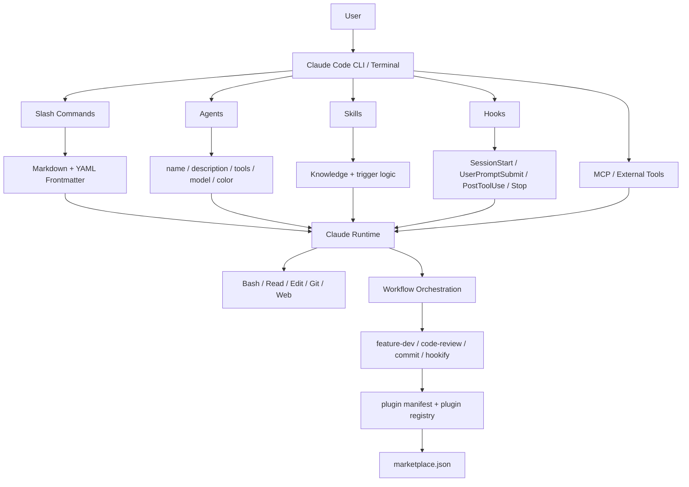
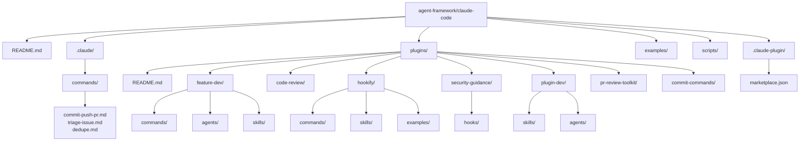
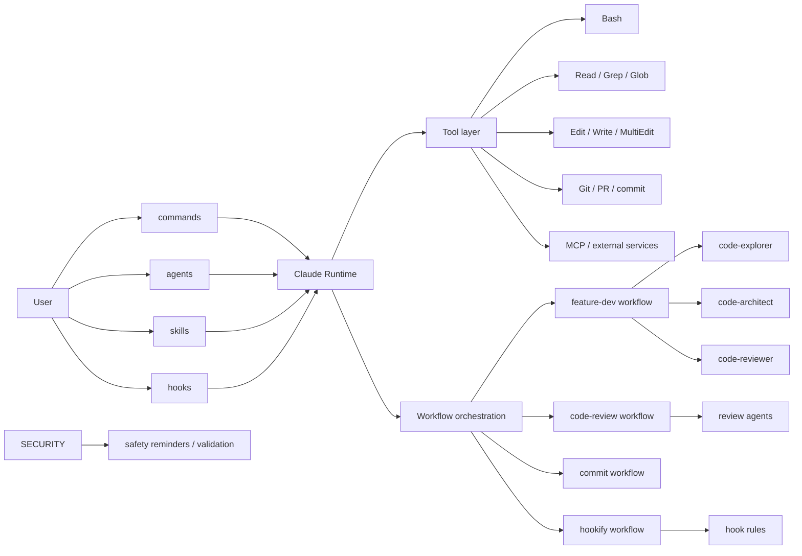
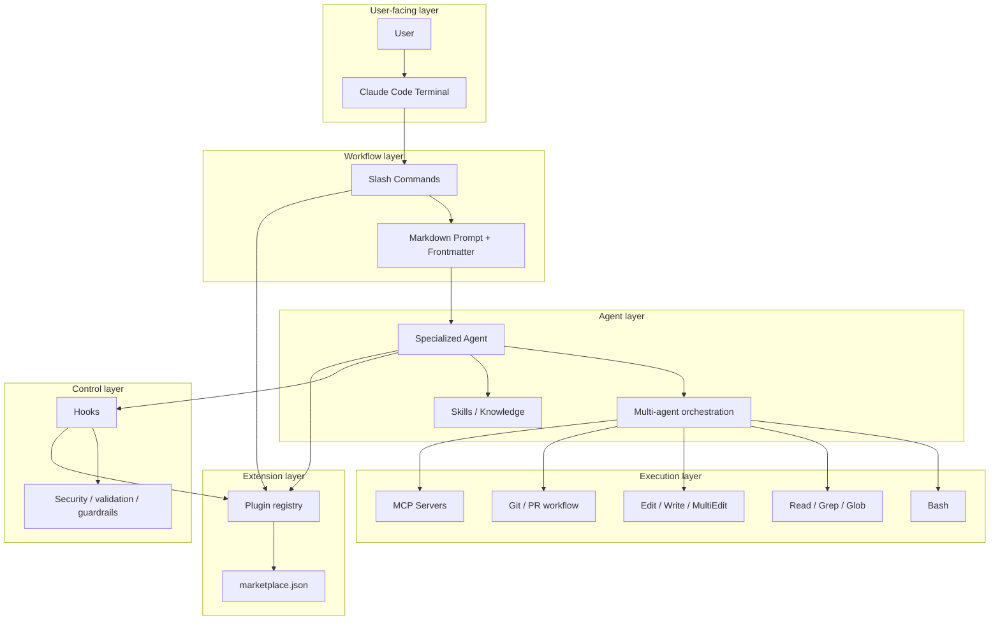

# Claude Code 架构分析：代码结构图 + 依赖关系图

## 1. 总体结论

Claude Code 不是一个单纯的聊天接口，也不是一个简化版脚本工具；它更像是一个以终端为入口、以任务工作流为核心、以插件为扩展点的 coding agent 平台。

从仓库结构看，它的核心设计可以概括为：

1. 用户入口层：终端交互，接收自然语言与命令
2. workflow / command 层：通过 slash command 组织任务流程
3. agent / skill / hook 层：将任务拆成角色化执行单元、知识库、事件约束
4. plugin ecosystem 层：通过 manifest / marketplace / 安装扩展，形成生态

它最重要的特征不是“模型能回答什么”，而是“模型如何在真实代码工程中持续执行任务，并被约束、安全化、扩展化地工作”。

相关入口：
- [agent-framework/claude-code/README.md](agent-framework/claude-code/README.md)
- [agent-framework/claude-code/plugins/README.md](agent-framework/claude-code/plugins/README.md)
- [agent-framework/claude-code/plugins/plugin-dev/README.md](agent-framework/claude-code/plugins/plugin-dev/README.md)
- [agent-framework/claude-code/.claude-plugin/marketplace.json](agent-framework/claude-code/.claude-plugin/marketplace.json)

---

## 2. 代码结构总图

这张图说明 Claude Code 的设计是“以事件和任务编排驱动 agent 行为”，而不是单一的自然语言聊天循环。

---

## 3. 目录级结构图

---

## 4. 模块依赖关系图

这个图的核心依赖关系是：

- commands 依赖 runtime
- agents / skills / hooks 都挂载到 runtime
- runtime 再调用工具和事件机制
- 各种工作流在 runtime 上拼装成任务流

所以 Claude Code 不是“单一模块主导”，而是一个“能力组合系统”。

---

## 5. 关键模块的职责

### 5.1 .claude / commands 层
入口：
- [.claude/commands/commit-push-pr.md](agent-framework/claude-code/.claude/commands/commit-push-pr.md)
- [.claude/commands/triage-issue.md](agent-framework/claude-code/.claude/commands/triage-issue.md)
- [.claude/commands/dedupe.md](agent-framework/claude-code/.claude/commands/dedupe.md)

职责：
- 组织项目内常用操作
- 通过 YAML metadata 控制模型、工具权限和描述信息
- 为用户提供可重复的工作流入口

特点：
- 本地化
- 面向任务
- 不是脚本，而是 instruction template

---

### 5.2 plugins/ 层
入口：
- [agent-framework/claude-code/plugins/README.md](agent-framework/claude-code/plugins/README.md)

职责：
- 给 Claude Code 扩展能力
- 以插件形式提供命令、agent、skill、hook
- 将能力与项目/用户/团队隔离

典型插件：
- [agent-framework/claude-code/plugins/feature-dev](agent-framework/claude-code/plugins/feature-dev)
- [agent-framework/claude-code/plugins/hookify](agent-framework/claude-code/plugins/hookify)
- [agent-framework/claude-code/plugins/security-guidance](agent-framework/claude-code/plugins/security-guidance)
- [agent-framework/claude-code/plugins/plugin-dev](agent-framework/claude-code/plugins/plugin-dev)

---

### 5.3 commands 模块
命令规范来自：
- [agent-framework/claude-code/plugins/plugin-dev/skills/command-development/SKILL.md](agent-framework/claude-code/plugins/plugin-dev/skills/command-development/SKILL.md)

命令的关键字段：
- description
- allowed-tools
- model
- argument-hint

它的本质是：
- 让工程流程可被声明式描述
- 让不同工具权限被显式控制
- 让模型在不同任务中使用不同策略

这意味着 CLI 运行时不是无限制地给模型所有能力，而是“按命令声明权限”。

---

### 5.4 agents 模块
典型文件：
- [agent-framework/claude-code/plugins/feature-dev/agents/code-explorer.md](agent-framework/claude-code/plugins/feature-dev/agents/code-explorer.md)
- [agent-framework/claude-code/plugins/pr-review-toolkit/agents/code-reviewer.md](agent-framework/claude-code/plugins/pr-review-toolkit/agents/code-reviewer.md)

它们的配置字段：
- name
- description
- tools
- model
- color

这说明 agent 是“角色化执行单元”：
- 具有任务边界
- 具有工具权限
- 具有模型选择
- 具有视觉/调度标识

它非常像多智能体协作中的 sub-agent。 

---

### 5.5 skills 模块
典型文件：
- [agent-framework/claude-code/plugins/plugin-dev/skills/command-development/SKILL.md](agent-framework/claude-code/plugins/plugin-dev/skills/command-development/SKILL.md)
- [agent-framework/claude-code/plugins/hookify/skills/writing-rules/SKILL.md](agent-framework/claude-code/plugins/hookify/skills/writing-rules/SKILL.md)

职责：
- 提供知识与方法论
- 通过关键短语触发使用
- 支持知识分层展示
- 让 agent 的行为更稳定、更可复用

技能的作用并不是直接发工具，而是“提高 Agent 的判断和执行质量”。

---

### 5.6 hooks 模块
典型文件：
- [agent-framework/claude-code/plugins/security-guidance/hooks/hooks.json](agent-framework/claude-code/plugins/security-guidance/hooks/hooks.json)

职责：
- 在会话生命周期中插入行为
- 在工具调用前后进行监管
- 在 stop / session start / user submit 触发策略

这是非常关键的一个模块：
- 让 agent 不只做任务
- 还要遵守安全策略、工作流规则和环境约束

可以把 hooks 理解为“运行时策略层”。

---

## 6. 代码结构中的核心设计规律

### 6.1 结构化 prompt 取代传统脚本
Claude Code 的很多能力并不是直接写成脚本，而是写成 Markdown + YAML frontmatter。这样做的优点是：

- 更容易共享
- 更容易迭代
- 更符合 agent/LLM 的执行模型
- 更适合 plugin 机制

所以它并不是传统命令行程序，而是“人类可读、模型可执行”的工作流声明。

---

### 6.2 从单 Agent 走向 multi-agent workflow
典型例子是 feature-dev：

- code-explorer：探索代码
- code-architect：设计方案
- code-reviewer：审查质量

这说明 Claude Code 不追求单一智能体解决全部问题，而是追求去中心化的任务分工。

这和现代 agent system 的趋势基本一致：

- 先分工
- 再编排
- 再汇总
- 再执行验证

---

### 6.3 runtime 是“事件驱动的 orchestration 层”
hooks 与 commands 的组合说明，Claude Code 的核心不是从输入到输出一条线，而是：

- 进入 session
- 用户发 prompt
- 触发 command / agent
- 允许工具执行
- 事件钩子介入
- 输出最终结果

它是一种 agent lifecycle 管理模型。

---

## 7. 一个更接近真实实现的合成架构图

这张图呈现的就是 Claude Code 的真实架构气质：

- 接口层：terminal
- 编排层：commands + workflow
- 执行层：agent & tools
- 控制层：hooks & policy
- 扩展层：plugins & marketplace

---

## 8. 总结

Claude Code 的整体实现不是“一个简单的单体聊天程序”，而是：

- 以命令为入口的工作流系统
- 以 agent 为执行单元的多角色协作框架
- 以 skill 为知识与策略增强层
- 以 hook 为运行时约束层
- 以 plugin 为生态扩展层

从设计思想上，它和 Pi 一样，都是把 LLM 从“文本生成器”提升为“可执行任务协作者”。

区别在于：

- Pi 更偏底层 runtime / session / agent engine
- Claude Code 更偏 productized terminal workflow + 扩展生态

如果把它放进一个一句话里：

> Claude Code 是一个“终端内的声明式 coding agent 平台”，其核心不是回答，而是让 AI 在工程任务中持续、有边界、有约束地执行工作流。

---

## 9. 参考文件索引

- [agent-framework/claude-code/README.md](agent-framework/claude-code/README.md)
- [agent-framework/claude-code/plugins/README.md](agent-framework/claude-code/plugins/README.md)
- [agent-framework/claude-code/plugins/plugin-dev/README.md](agent-framework/claude-code/plugins/plugin-dev/README.md)
- [agent-framework/claude-code/plugins/plugin-dev/skills/command-development/SKILL.md](agent-framework/claude-code/plugins/plugin-dev/skills/command-development/SKILL.md)
- [agent-framework/claude-code/plugins/feature-dev/commands/feature-dev.md](agent-framework/claude-code/plugins/feature-dev/commands/feature-dev.md)
- [agent-framework/claude-code/plugins/feature-dev/agents/code-explorer.md](agent-framework/claude-code/plugins/feature-dev/agents/code-explorer.md)
- [agent-framework/claude-code/plugins/security-guidance/hooks/hooks.json](agent-framework/claude-code/plugins/security-guidance/hooks/hooks.json)
- [agent-framework/claude-code/plugins/hookify/README.md](agent-framework/claude-code/plugins/hookify/README.md)
- [agent-framework/claude-code/.claude-plugin/marketplace.json](agent-framework/claude-code/.claude-plugin/marketplace.json)
