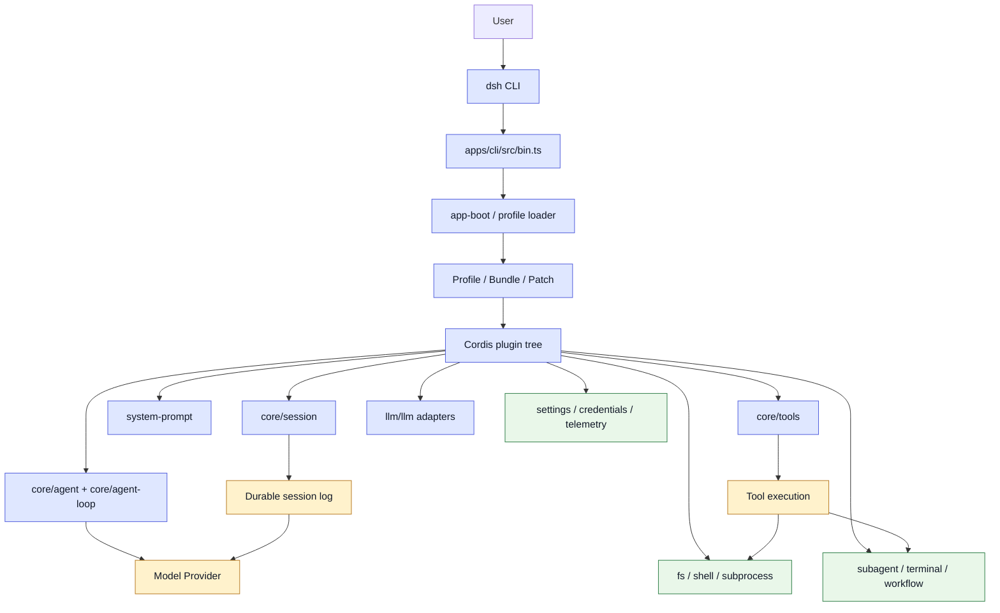
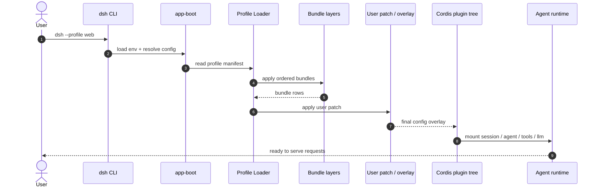
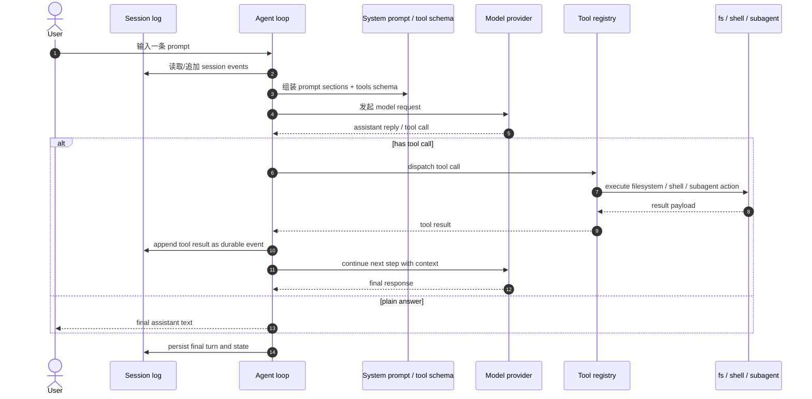

# DeepSeek Harness 架构调查与与 Pi 的对比

## 1. 结论先行

DeepSeek Harness（dsh）不是一个单体的聊天机器人运行时，而是一个基于 Cordis 的插件式 agent harness。它把系统拆成可组合的能力层：agent runtime、session runtime、tools、llm provider、filesystem、terminal、subagent、settings、credentials、telemetry 等，全部通过共享上下文挂载到同一棵插件树中。

这和 [analysis-pi.md](analysis-pi.md) 中对 Pi 的抽象非常接近，但表达方式不一样：

- Pi 更偏“运行时设计图”和“调用链说明”
- dsh 更偏“工程实现”和“插件组合架构”
- Pi 在概念层描述 agent 的状态机、session 与 tool loop
- dsh 则在工程层把这些能力拆成可替换的 Cordis 服务与事件

两者的共识非常一致：agent 不是单纯的模型调用，而是一个长生命周期的、状态化、可扩展、可恢复的工作流系统。

---

## 2. DeepSeek Harness 的总体架构

dsh 的关键文档为：

- [deepseek-harness/README.md](deepseek-harness/README.md)
- [deepseek-harness/docs/architecture.md](deepseek-harness/docs/architecture.md)
- [deepseek-harness/AGENTS.md](deepseek-harness/AGENTS.md)

它的核心设计口号非常明确：

- “Everything is a plugin”
- “There is no privileged core to patch”
- “You extend dsh by mounting a plugin beside the others”

也就是说，dsh 的架构不是“一个大内核里塞所有功能”，而是“一个统一运行时 + 一组插件树”。

### 2.1 启动结构

启动入口在：

- [deepseek-harness/apps/cli/src/bin.ts](deepseek-harness/apps/cli/src/bin.ts)
- [deepseek-harness/packages/boot/app-boot/src/index.ts](deepseek-harness/packages/boot/app-boot/src/index.ts)
- [deepseek-harness/packages/boot/app-boot/src/profile.ts](deepseek-harness/packages/boot/app-boot/src/profile.ts)

它并不是直接 new 一个大 Agent。相反，启动流程是：

1. 解析 CLI 参数与 profile
2. 加载 .env 和运行时环境
3. 解析 bundle / profile / user patch
4. 组装 Cordis 配置树
5. 让插件树在共享 context 中完成注册与装配

这说明 dsh 的工程实践是“组合装配”，而不是“硬编码系统”。

### 2.2 Profile / Bundle / Patch

dsh 的架构文档中，最关键的概念是：

- Profile：一个命名组合，描述当前运行的是哪种产品形态
- Bundle：一组 Cordis config rows 和代码分发单位
- Patch：在已装配树上继续覆盖、替换或插入配置

也就是说，dsh 的系统不是固定死的，而是允许通过层级叠加构造出不同运行态。这个思路非常像真实的 agent 平台：

- web profile
- headless profile
- custom profile
- 用户自己的 patch overlay

都可以被组合装配，而不需要去改动核心代码。

### 2.3 一个更实际的启动与装配时序

这说明：dsh 的启动链路不是“直接跑一个 Agent”，而是“先构造一棵 Cordis tree，再由 tree 产出运行时能力”。

---

## 3. Cordis 是什么

Cordis 是一个“可组合的运行时框架”，它把系统拆成：

- 共享 context
- 插件注册
- 服务定义
- 事件触发
- 副作用的生命周期管理

在 dsh 的语境里，它的价值是：

- 模型能力、工具能力、文件系统能力、终端能力、settings 能力、credentials 能力等，都可以注册到同一个上下文中
- 不需要单一权威 core 去维护所有功能
- 插件可以被替换、组合、卸载

所以 Cordis 的本质不是“某个库”，而是一种“如何构造复杂系统”的框架范式。

### 3.1 Cordis 对 agent 的适配性

Agent 系统通常会遇到这些问题：

- 模型 provider 要换
- tool registry 要扩展
- 文件系统能力可能要换实现
- 终端、sandbox、权限策略要可替换
- session / history / telemetry 要被持久化
- 不同入口（CLI / web / headless / ACP）要组合不同插件

这些都正是 Cordis 擅长的场景：

- 组件注册到共享上下文
- 事件流驱动控制
- 能力在配置层被拼装
- layers 允许覆盖和增量扩展

---

## 4. dsh 中的能力 seam

dsh 的文档中也非常强调“capability seam”这种概念：

- Service Definition
- Service Provider
- Consumer

例如：

- llm/llm
- core/tools
- fs
- shell
- subprocess
- terminal
- subagent
- settings
- credentials

这些能力都不是单独的大对象，而是分别在 ctx 上注册和消费的一组服务与事件。换句话说：

- 你不去“改核心替换工具实现”
- 你去注册一个新的 provider 或 event consumer
- 所有依赖它的地方自然就能利用它

这和传统的“单体 agent”架构完全不同：传统实现常常把工具、模型、权限、session、日志 都塞进一个大类；Cordis 则把它们拆成可插拔 seam。

---

## 5. dsh 的一次工作流时序：从输入到工具循环

这个时序图和 Pi 的 agent loop 非常接近：

- 用户输入进入 agent
- agent 把上下文和工具 schema 收集起来
- 模型做生成
- 需要工具时，工具执行并把结果写回上下文
- 再进入下一轮模型调用

不过 dsh 把这套动作做成了更强的 durable event 模型：session log 是事实来源，model-visible payload 必须可从日志重建。

---

## 6. dsh 与 Pi 的对比

### 6.1 相同点

两者都把 agent 视为一个更复杂的系统，而不是单纯的 LLM wrapper。

Pi 的文档中明确把它拆成三层：

1. Agent runtime
2. Session runtime
3. Extensions / skills / templates

而 dsh 的架构中也能映射出等价层次：

- Agent runtime ≈ core/agent + core/agent-loop
- Session runtime ≈ core/session + system-prompt + durable event log
- Extension layer ≈ plugins / bundles / profile / patch

这两者在“概念抽象”上是相同的：

- 状态化 agent
- session/history-driven context
- tools + model + events 组合循环
- 可扩展行为注入

### 6.2 差异点

#### 1) Pi 更偏“运行时设计图”

[analysis-pi.md](analysis-pi.md) 主要是解释：

- 一次 prompt 的调用链
- AgentSession 如何准备上下文
- AgentLoop 如何驱动 LLM + tools
- session manager 与 compaction 的职责

它更偏逻辑说明和运行时叙述。

#### 2) dsh 更偏“工程实现”

dsh 更关注：

- plugin tree 是怎么组装的
- profile 如何加载 bundles
- patch如何覆盖配置
- event 如何承载 system prompt、turn、step、session facts
- capabilities 如何通过 ctx 注册和消费

它更像真实产品工程，强调组合与扩展机制。

#### 3) Pi 更像“设计抽象”，dsh 更像“落地架构”

从文档阅读感受上看：

- Pi：看起来像一个高级架构模型，帮助理解 agent 的设计思想
- dsh：更像工程实践，告诉你这个系统怎么真正被构建成工具平台

---

## 7. 关键理解：为什么 dsh 会强调“模型可见 = 已记录”

在 [deepseek-harness/docs/architecture.md](deepseek-harness/docs/architecture.md) 里，dsh 有一个非常重要的原则：

- “Model-visible means logged.”

它的意思是：

- 任何进入模型的上下文，都必须能够从 session log 中重建出来
- 对 session log 的设计和 event modeling 很严格

这意味着：

- 它不是简单聊天系统
- 它的 actor 语义非常强
- session event 不只是 UI 数据，而是真正的事实来源

这和 Pi 里 Session runtime 的定位完全一致：session 是状态与历史管理的核心。

---

## 8. dsh 的工程价值

dsh 采用 Cordis 的深层价值在于，它把工程复杂性从“单体代码”转移到了“配置与组合”层：

- 加能力，注册新 plugin
- 换 provider，换实现而不动主 loop
- 换 profile，改装配层而不改核心代码
- 调整权限与安全边界，挂上新 policy provider
- 把不同入口共享同一套能力系统

这正是 agent 平台最难的部分：

- 不是能不能生成文本
- 而是能不能在一个可扩展、可恢复、可观测的系统中持续工作

dsh 的设计目标，显然就是把这件事做成一个真正的工程平台，而不是一次性脚本。

---

## 9. 一句话总结

如果说 Pi 是“agent 运行时的设计抽象”，那么 dsh 是“基于 Cordis 的真实 agent 工程实现”。

Cordis 之所以被 dsh 采用，是因为 agent 这种系统天然需要：

- 插件化
- 事件驱动
- 能力 seam
- profile/bundle 组合
- 可热插拔与可替换能力
- 可恢复的 session state 与 durable log

这些恰好都是 Cordis 最擅长解决的问题。

在本质上：

- Pi 解释了“为什么 agent 需要这种架构”
- dsh 说明了“如何用 Cordis 把它实现成真正能工作的系统”

这两者相互印证，形成了对 agent 平台最完整的理解。
