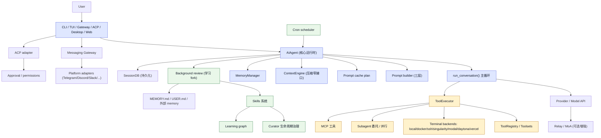
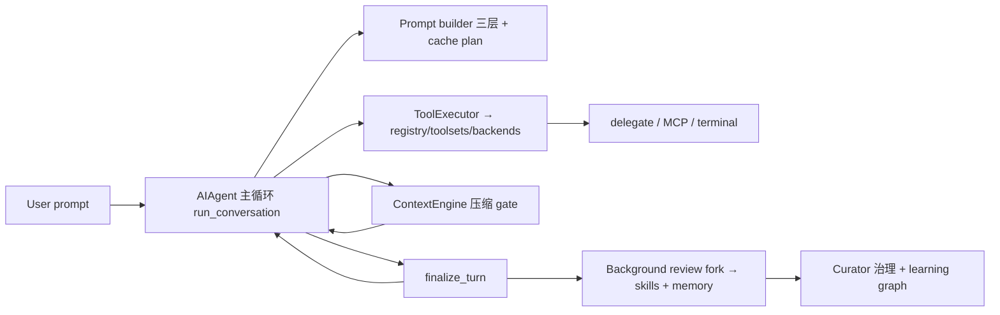

# Hermes Agent 架构与实现分析

## 1. 总体结论

Hermes 不是“一个聊天程序”，而是一个**自带学习回路的个人 AI agent 平台**（Nous Research 出品）。它的核心是一个 Python 写的 agent 运行时（`AIAgent` + `run_conversation()`），同一份 core 被**多个界面复用**：CLI、TUI、覆盖约 20 个平台的 messaging gateway（Telegram/Discord/Slack…）、Electron 桌面端、以及面向编辑器集成的 ACP 服务器。

它的差异化能力在于三层“学习/记忆”系统：

1. **Agent runtime**：一个长生命周期的对话循环，负责上下文组装、LLM 调用、工具执行、重试/降级、压缩触发
2. **Context engineering**：把“prompt caching 字节稳定”当作最高原则——system prompt 会话内只构建一次，易变内容全部注入 user message
3. **Self-improving loop**：每轮结束 fork 一个后台 review agent，把经验固化为 skills（过程性记忆）和 MEMORY.md/USER.md（声明性记忆），并用 curator 做 skill 生命周期治理

它由两个设计原则贯穿始终（来自其 AGENTS.md）：**per-conversation prompt caching is sacred**（缓存神圣不可侵犯）和 **core is a narrow waist; capability lives at the edges**（核心窄腰、能力在边缘）。

相关源码入口：

- [hermes-agent/README.md](hermes-agent/README.md)
- [hermes-agent/AGENTS.md](hermes-agent/AGENTS.md)
- [hermes-agent/run_agent.py](hermes-agent/run_agent.py)（`AIAgent`）
- [hermes-agent/agent/conversation_loop.py](hermes-agent/agent/conversation_loop.py)（`run_conversation()`）
- [hermes-agent/agent/turn_context.py](hermes-agent/agent/turn_context.py)（每轮 prologue）
- [hermes-agent/agent/turn_finalizer.py](hermes-agent/agent/turn_finalizer.py)（每轮收尾 + 学习触发）
- [hermes-agent/agent/system_prompt.py](hermes-agent/agent/system_prompt.py)（system prompt 三层构建）
- [hermes-agent/agent/context_engine.py](hermes-agent/agent/context_engine.py)（压缩窄接口）
- [hermes-agent/tools/registry.py](hermes-agent/tools/registry.py)（工具注册表）
- [hermes-agent/gateway/run.py](hermes-agent/gateway/run.py)（messaging gateway）
- [hermes-agent/acp_adapter/server.py](hermes-agent/acp_adapter/server.py)（ACP 服务器）
- [hermes-agent/providers/base.py](hermes-agent/providers/base.py)（ProviderProfile 声明式基类）

---

## 2. 整体架构图



---

## 3. 一次 prompt 的完整调用链

从“用户输入”到“模型回复 + 工具执行 + 学习触发”的完整链路：

```mermaid
sequenceDiagram
    autonumber
    actor User
    participant UI as "CLI / Gateway / TUI / ACP"
    participant Agent as "AIAgent"
    participant Prologue as "build_turn_context"
    participant Loop as "run_conversation()"
    participant LLM as "Model API"
    participant Tools as "ToolExecutor"
    participant Ctx as "ContextEngine"
    participant Review as "Background review"

    User->>UI: 输入 prompt
    UI->>Agent: agent.prompt(text) / run_conversation
    Agent->>Prologue: 每轮前置 (stdio 加固/消毒/恢复 system prompt/preflight 压缩/外部 memory 预取)

    Prologue->>Loop: 进入主循环
    Loop->>Loop: 结构性克隆历史消息 (防别名写透) + 回放 api_content 字节
    Loop->>LLM: 构建 api_kwargs → 流式请求
    LLM-->>Loop: assistant response / tool_calls

    alt 模型发出 tool_calls
        Loop->>Tools: finish_reason=tool_calls → 分段规划 (并行段 + 顺序屏障)
        Tools->>Tools: 并行段 ThreadPoolExecutor / 顺序段逐条
        Tools->>LLM: (可选) delegate_task 生成子代理
        Tools-->>Loop: tool results (先持久化再回喂)
        Loop->>Ctx: 压缩 gate (pre-API / post-tool)
        Loop->>LLM: 下一轮 (带工具结果)
        LLM-->>Loop: assistant response
    else 纯文本回复
        Loop-->>Agent: 最终响应 (stop)
    end

    Loop->>Agent: finalize_turn (预算总结 / 持久化)
    Agent->>Review: 计数达阈值 → fork 后台 review agent (只允许 memory/skills 工具)
    Review-->>Skills: 创建/改进 skill
    Review-->>Mem: 写入 MEMORY.md / 外部 provider
    Agent-->>User: 流式输出工具进度与最终回复
```

### 3.1 细化到源码层级

实际调用链经过的关键文件：

1. [hermes-agent/hermes_cli/main.py](hermes-agent/hermes_cli/main.py) — `main()` 用 argparse 分发子命令；`hermes_cli/subcommands/*` 提供 `build_<cmd>_parser`
2. [hermes-agent/cli.py](hermes-agent/cli.py) — 交互式 CLI 循环，构造 `AIAgent`
3. [hermes-agent/run_agent.py](hermes-agent/run_agent.py) — `AIAgent` 类（~8000 行），持有 model/provider/tools/memory/compression/checkpoints
4. [hermes-agent/agent/conversation_loop.py](hermes-agent/agent/conversation_loop.py) — `run_conversation()`（~7000 行）真正驱动主循环
5. [hermes-agent/agent/turn_context.py](hermes-agent/agent/turn_context.py) — `build_turn_context()`：每轮 prologue
6. [hermes-agent/agent/turn_finalizer.py](hermes-agent/agent/turn_finalizer.py) — `finalize_turn()`：每轮收尾 + 学习触发判定
7. [hermes-agent/agent/chat_completion_helpers.py](hermes-agent/agent/chat_completion_helpers.py) — `interruptible_streaming_api_call()`、fallback
8. [hermes-agent/agent/tool_executor.py](hermes-agent/agent/tool_executor.py) — `execute_tool_calls_*()`
9. [hermes-agent/agent/background_review.py](hermes-agent/agent/background_review.py) — 学习 fork

### 3.2 关键观测点

- `AIAgent` 是长生命周期对象，`run_conversation` 是每轮调用的主循环；两者都在几千行级别
- 消息组装用**结构性克隆**（`_clone_message_for_send`），防止引擎/插件把内部字段写透到持久化 transcript
- tool 调用先持久化再执行，防“破坏性工具中途杀掉进程”丢状态
- 每轮收尾后可能 fork 后台 review agent——学习不是主循环的一部分，而是旁路
- 所有易变内容（memory 预取、MoA 上下文、插件上下文）注入**用户消息**而非 system prompt，只为保住 cache 前缀

---

## 4. Agent runtime：run_conversation 主循环

对应代码：

- [hermes-agent/run_agent.py](hermes-agent/run_agent.py)（`AIAgent`）
- [hermes-agent/agent/conversation_loop.py](hermes-agent/agent/conversation_loop.py)
- [hermes-agent/agent/turn_context.py](hermes-agent/agent/turn_context.py)
- [hermes-agent/agent/turn_finalizer.py](hermes-agent/agent/turn_finalizer.py)

### 4.1 每轮流程（prologue → loop → finalize）

1. **Prologue（`build_turn_context`）**：一次性完成 stdio 加固、重试计数复位、用户消息消毒、todo/nudge 注入、system prompt 恢复或构建、preflight 压缩检查、外部 memory 预取、崩溃恢复持久化；同时取消上一轮仍在跑的 background review fork。
2. **消息组装**：对持久化 history 逐条做结构性克隆，剥除内部字段（`api_content`/`display_kind`/`_row_id` 等），精确回放 `api_content` 字节（保证 cache 前缀稳定）。
3. **API 调用**：构建 `api_kwargs` → LLM 请求中间件 → 默认走流式（即使无消费端，也为了健康检查）→ `interruptible_streaming_api_call`。
4. **重试/降级**：外层 `while retry_count < max_retries`，处理超时、429/524 等，指数退避（5s 基、120s 上限）；空/畸形响应时急切切换 fallback provider，成功后重建消息并清零重试。
5. **finish_reason 分派**：`content_filter`（安全拒绝，确定性不重试）→ `length`（截断重试或 continuation 拼接）→ `tool_calls` → `stop`。
6. **Tool 处理**：tool 名验证（3 次 strike 上限、自动修复）、JSON 参数校验、去重/封顶、**执行前先持久化** assistant tool-call 块 → `_execute_tool_calls` → 追加 tool 结果。
7. **继续/停止**：有 tool_calls → 回主循环；无 → 最终响应 break。主循环由 `max_iterations` + 共享 `iteration_budget` 约束。
8. **收尾（`finalize_turn`）**：预算耗尽时用一次无工具调用让模型写总结；触发 `_spawn_background_review`（学习回路）。

### 4.2 三个压缩触发点

- turn prologue 的 preflight
- 每次 API 调用前的 **pre-API pressure gate**（用请求 token 估算，防“巨大 tool result 刚追加、API 上报滞后”的盲区）
- 每次 tool 执行后的 **post-tool gate**（用 API 真实 `last_prompt_tokens`）

### 4.3 关键不变量

- **Prompt-cache 字节稳定**：system prompt 会话内只建一次，一切易变内容注入 user message；压缩是唯一被许可的 cache break
- **Role-alternation**：发送前修复消息序列、清理孤儿 tool、剔除 thinking-only assistant，防严格 provider 400
- **流式单写者**：被取代的流不得把自己的 token 穿插进当前 turn
- **Fail-open**：插件钩子、中间件、context engine 钩子异常一律吞掉回退默认路径

---

## 5. Context engineering：system prompt + prompt caching + compaction

对应代码：

- [hermes-agent/agent/system_prompt.py](hermes-agent/agent/system_prompt.py)
- [hermes-agent/agent/prompt_builder.py](hermes-agent/agent/prompt_builder.py)
- [hermes-agent/agent/prompt_caching.py](hermes-agent/agent/prompt_caching.py)
- [hermes-agent/agent/prompt_cache_boundary.py](hermes-agent/agent/prompt_cache_boundary.py)
- [hermes-agent/agent/context_engine.py](hermes-agent/agent/context_engine.py)
- [hermes-agent/agent/context_compressor.py](hermes-agent/agent/context_compressor.py)
- [hermes-agent/agent/conversation_compression.py](hermes-agent/agent/conversation_compression.py)
- [hermes-agent/agent/native_compaction.py](hermes-agent/agent/native_compaction.py)

### 5.1 System prompt 三层结构

- **stable**：SOUL.md/身份 → 帮助指引 → 任务完成指引 → 并行工具指引 → 各工具行为指引 → computer-use → 订阅 → 工具使用强制。会话内字节不变。
- **context**：workspace 快照（`coding_context`）+ 会话稳定指引 + 调用方 system_message + 项目上下文文件（`.hermes.md` > `AGENTS.md` 链 > `CLAUDE.md` > `.cursorrules`，只取一种，按 git root→cwd 合并）。
- **volatile**：skills 索引、built-in memory 块、USER.md、外部 memory provider 块、插件段、日期行（只到天精度）。

所有上下文文件进入 system prompt 前先过 **prompt injection 威胁扫描**（`threat_patterns.py`），命中即整块 BLOCK。

### 5.2 Cache 机制

- `build_prompt_cache_plan()` 在**所有消息变更之后最后运行**：system 静态前缀 + 末尾 2~3 条可缓存消息打 `cache_control` 标记（Anthropic native），或 implicit longest-prefix 布局；TTL 按 provider 钳制。
- `prompt_cache_boundary.py`：skill/webhook/cron builder 拼接“大静态 + 小易变尾巴”时，**只在 builder 知道的确切字节处**注册稳定前缀，请求期 planner 据此切块——刻意避免用分隔符启发式重解析。
- skills 索引放在 volatile 带前端（而非 stable 带）：技能运行时易变，重建时只从索引处失效，让稳定 scaffold 留在可复用前缀里。

### 5.3 Compaction（窄接口 + 可插拔）

- `ContextEngine(ABC)` 是整个压缩子系统的**窄腰**：`should_compress` / `compress` / `prune_tool_results_only` / `select_context` / `on_turn_complete`。
- 默认实现 `ContextCompressor`：阈值约 50% context window，用 **aux summarizer LLM**（独立于主模型的 auxiliary provider，可 `focus_topic` 引导）把旧 turn 序列化成带 `_summary_prefix` 的压缩块，保留最近 N 条用户消息。
- `compress_context()` 编排：session 级压缩锁（state.db 原子锁，防 parent 与 background-review fork 竞争）→ 默认 **in-place 压缩**（重写消息、保持同一 session_id）或旧式会话旋转 → 超时 fence 防止迟到 worker 继续写状态。
- **原生压缩**：gpt-5.6 + 直连 OpenAI 时把 `context_management=[{"type":"compaction"...}]` 塞进 `/v1/responses`，让服务端做不透明加密 compaction；本地压缩保持武装作兜底。

设计要点：压缩失败原样返回、拿不到锁就 no-op 让位、原生压缩是“服务端先手、本地兜底”。

---

## 6. 工具系统：registry / toolsets / executor / terminal backends

对应代码：

- [hermes-agent/tools/registry.py](hermes-agent/tools/registry.py)
- [hermes-agent/toolsets.py](hermes-agent/toolsets.py)
- [hermes-agent/model_tools.py](hermes-agent/model_tools.py)
- [hermes-agent/agent/tool_executor.py](hermes-agent/agent/tool_executor.py)
- [hermes-agent/tools/terminal_tool.py](hermes-agent/tools/terminal_tool.py)
- [hermes-agent/tools/environments/base.py](hermes-agent/tools/environments/base.py)

### 6.1 注册与 toolset

- 每个工具文件在模块级调用 `registry.register(name, toolset, schema, handler, check_fn, ...)` 自注册。
- `discover_builtin_tools()` 用 **AST 预扫描** `tools/*.py` 中是否有顶层 `registry.register()`，命中才 `importlib` 导入（结果按 mtime/size 落盘缓存）——避免维护手工工具清单。
- toolset 是工具分组命名空间（web/terminal/file/coding/hermes-cli…），可 includes 组合；`model_tools.get_tool_definitions()` 按 `enabled_toolsets`/`disabled_toolsets` 解析。
- `check_fn` 决定工具在当前环境是否可用，结果 30s TTL 缓存 + “最近一次成功”60s 宽限窗口（防偶发探测剥掉整组工具）。

### 6.2 执行

- `_plan_tool_batch_segments()`：把批次切成**最大连续可并行段**（只读工具、非重叠文件目标、opt-in MCP）与**顺序屏障**（交互式、不安全、未识别）交替。
- 并行段走 `ThreadPoolExecutor` fan-out（≤8 worker），worker 用 `_begin_in_order()` 门按提交顺序串行化“开始”动作（保证展示/授权顺序）但执行本身并行。
- 每条工具调用走“中间件洋葱”：Relay 改写 → Hermes 策略 → 插件 `pre_tool_call` 阻塞 → guardrail → `_authorized_dispatch`（恰好一次）→ 真正 handler。
- 工具异常 → 生成 tool error result 回灌模型（保持 role-alternation，模型下一轮自纠正）；未识别工具 3 次 strike 终止。

### 6.3 终端后端（7 种）

- `BaseEnvironment(ABC)` 统一执行流：`init_session()` 把登录 shell 环境快照到临时文件 → 每条命令 `bash -c` 前先 source 快照 → CWD 持久化 → 超时/中断/输出截断（`_BoundedOutputCollector`）。
- 子类只实现 `_run_bash()`（返回类 Popen handle）与 `cleanup()`：`LocalEnvironment`、`DockerEnvironment`、`SSHEnvironment`、`SingularityEnvironment`、`ModalEnvironment`/`ManagedModalEnvironment`、`DaytonaEnvironment`、`VercelSandboxEnvironment`。
- SDK 云沙箱没有真子进程，用 `_ThreadedProcessHandle` 包装轮询/取消。
- 环境按 `task_id` 缓存复用，后台线程按 `lifetime_seconds`（默认 300s）回收不活动沙箱。

### 6.4 委托与并行

- `delegate_task` 支持单任务与 batch；深度限制（默认 2）、批量质量门、per-task `output_schema`。
- 每个子代理是独立 `AIAgent`：全新对话、独立 task_id、继承父工具集但剥掉危险工具（`DELEGATE_BLOCKED_TOOLS`）。
- `role='leaf'` 禁止再委托，`role='orchestrator'` 可再 spawn worker（深度受控）。
- `background=true` 时整批 fan-out 作为“一个后台单元”派到持久 daemon executor，完成时合并为一条事件返回。
- `SubagentLifecycleService` 给插件一个不可变契约 API（launch/wait/cancel/status），不含 `AIAgent` 对象。

---

## 7. 学习回路：skills + memory + curator

对应代码：

- [hermes-agent/agent/background_review.py](hermes-agent/agent/background_review.py)
- [hermes-agent/agent/turn_finalizer.py](hermes-agent/agent/turn_finalizer.py)
- [hermes-agent/agent/learn_prompt.py](hermes-agent/agent/learn_prompt.py)
- [hermes-agent/agent/curator.py](hermes-agent/agent/curator.py)
- [hermes-agent/agent/learning_graph.py](hermes-agent/agent/learning_graph.py)
- [hermes-agent/agent/memory_manager.py](hermes-agent/agent/memory_manager.py)
- [hermes-agent/tools/skill_manager_tool.py](hermes-agent/tools/skill_manager_tool.py)
- [hermes-agent/tools/skills_hub.py](hermes-agent/tools/skills_hub.py)

### 7.1 Skills 系统

- Skill 是含 YAML frontmatter 的 `SKILL.md`（agentskills.io 标准字段）+ 可选 `references/`、`templates/`、`scripts/`、`assets/`。
- **渐进式披露**：`skills_list` 只给 name/description 元数据（索引注入 system prompt，description 截断 60 字符用于路由），`skill_view` 才加载全文与链接文件——大 skill 库可放系统提示的前提。
- `skill_manage` 让 agent 把成功经验固化为可复用过程性知识（“procedural memory”，区别于 MEMORY.md 的声明性记忆）。
- `skills_hub.py` 从任意 GitHub 仓库或官方 `optional-skills/` 安装 skill，HubLock + quarantine + `skills_guard` 内容哈希做安全防护。

### 7.2 后台学习回路

- **Nudge 触发**：每轮 `finalize_turn` 后检查计数器——工具迭代数达 `_skill_nudge_interval`（默认 10）且 `skill_manage` 在工具集中 → 置 review 标志；用户轮数触发记忆回顾。
- **Fork**：daemon 线程 fork 一个全新 `AIAgent`，`_persist_disabled=True`（防审查 prompt 写进用户真实会话）、`compression_enabled=False`（防竞争压缩旋转父 session）、继承父的缓存 system prompt（复用 warm cache 前缀），喂入 `_SKILL_REVIEW_PROMPT` / `_MEMORY_REVIEW_PROMPT`，只允许 memory/skills 工具。
- 新的 live turn 启动时主动 interrupt 仍在跑的 review fork（防并发 API 调用造成 token 重复记账）。

### 7.3 Curator 与学习图谱

- 规则层：按 idle/时长的 active→stale→archived 状态转移（纯函数，无 LLM），pinned 与 cron 引用的 skill 豁免，built-in skill 只归档不删除。
- LLM 层（可选）：fork aux agent 做归档/合并/重命名（umbrella building），dry-run 只报告。
- `learning_graph` 把 agent 创建/使用过的 skills + memory cards 建成节点/边，供桌面“学习面板”可视化。

### 7.4 Memory

- built-in memory 存于 `_memory_store`（MEMORY.md/USER.md，作为 system prompt volatile 带）；外部 provider（honcho/mem0/supermemory…）经 `MemoryManager.add_provider` 注册。
- **Prefetch**：每轮把剥离了 skill scaffolding 的用户文本并行发给各 provider（独立超时线程），`recall_status` 生成确定性指示行；写入异步后台，`flush_pending` 关停前落盘。

---

## 8. 界面层：一个 core，多 surface

对应代码：

- [hermes-agent/hermes_cli/main.py](hermes-agent/hermes_cli/main.py)（argparse 子命令分发）
- [hermes-agent/cli.py](hermes-agent/cli.py)（交互式 CLI 循环）
- [hermes-agent/gateway/run.py](hermes-agent/gateway/run.py)（messaging gateway）
- [hermes-agent/gateway/platforms/base.py](hermes-agent/gateway/platforms/base.py)（平台适配器基类）
- [hermes-agent/acp_adapter/server.py](hermes-agent/acp_adapter/server.py)（ACP 服务器）
- [hermes-agent/providers/base.py](hermes-agent/providers/base.py)（ProviderProfile）
- [hermes-agent/hermes_cli/curses_ui.py](hermes-agent/hermes_cli/curses_ui.py)（TUI）

### 8.1 CLI

- `hermes_cli/main.py` 的 `main()` 用 argparse 组装顶层 parser + `hermes_cli/subcommands/*` 各 `build_<cmd>_parser`（model/tools/gateway/setup/cron/acp/…）。
- 交互式会话走 `cmd_chat` → `cli.py` 的循环，构造 `AIAgent`；slash 命令（/model /tools /compress /skills…）由 `hermes_cli/slash_exec.py` 分发。
- `providers/base.py` 的 `ProviderProfile` 是**声明式**配置：auth、endpoints、client quirks、request-time quirks 一次声明，transport 读取而不是接 20+ 布尔参数。

### 8.2 Messaging Gateway

- `gateway/run.py` 的 `GatewayRunner` 管理全部平台适配器；平台在 `gateway/platforms/`（telegram/discord/slack/whatsapp/signal/weixin/yuanbao/qqbot…），全部继承 `BasePlatformAdapter`（`gateway/platforms/base.py`）。
- 网关按会话缓存 `AIAgent` 实例（LRU + idle TTL，128 上限 / 1h 空闲驱逐 + 内存压力阀 `agent_cache_pressure.py`），每个对话复用同一个 core。
- 会话上下文、reset 策略、system prompt 注入由 `gateway/session.py` 处理；还有 delivery ledger、turn lease、shutdown watchdog、scale_to_zero 等运维设施。

### 8.3 ACP（Agent Client Protocol）

- `acp_adapter/server.py` 基于官方 `acp` 包实现标准 ACP 服务器，把 Hermes 暴露给外部编辑器客户端（VS Code/Copilot 等）。
- `session.py`（SessionManager，list/resume/fork session）、`tools.py`（tool start/complete 事件）、`permissions.py`（approval callback）、`events.py`（message/step/thinking/plan update）、`auth.py`、`provenance.py`。
- 通过它，Hermes 既是一个独立 agent，也是一个可嵌入的 agent 后端。

### 8.4 其它

- **TUI**：`hermes_cli/curses_ui.py` + `console_engine.py` + `pty_bridge.py`/`pty_session.py`（PTY 交互）。
- **研究管线**：`batch_runner.py` + `trajectory_compressor.py` + `mini_swe_runner.py` 共享同一 Hermes 轨迹 XML 格式，构成“生成→压缩→训练”数据管线，用于训练下一代 tool-calling 模型。

---

## 9. 三层如何协同 + 设计原则



高层关系可以概括为：

- **一个窄腰 core**（AIAgent + run_conversation）被所有界面复用
- **prompt caching 是最高约束**，驱动 system prompt 构建、易变内容注入位置、压缩时机等几乎所有决策
- **学习是旁路而非主路**：后台 fork + 间隔计数，绝不抢占用户任务注意力
- **能力在边缘**：新能力优先走 CLI command + skill、service-gated tool、plugin、MCP，而不是往核心加 model tool

---

## 10. 与 Pi 的 A/B 对比

按 AGENTS.md 的 A/B 框架做初步对照（Pi 详见 analysis-pi.md）：

### A 线：架构与工程设计

| 维度 | Pi (TypeScript) | Hermes (Python) |
|---|---|---|
| 运行时核心 | `agent.ts` + `agent-loop.ts`（事件驱动状态机 + queue） | `run_agent.py` `AIAgent` + `conversation_loop.py` `run_conversation()`（巨型函数 + turn_context/finalizer 切分） |
| 核心抽象 | Agent runtime / Session runtime / Extension 三层 | AIAgent / ContextEngine 窄接口 / 后台学习回路 |
| 上下文管理 | `_checkCompaction()` / `_rebuildSystemPrompt()` / summarization | 三层 system prompt + prompt cache plan + ContextEngine 可插拔压缩 + native compaction |
| 最高原则 | 未显式声明的工程化 | **prompt caching 字节稳定神圣不可侵犯**（写在 AGENTS.md 里并贯穿代码） |
| 工具系统 | Tool registry + beforeToolCall/afterToolCall hooks | ToolRegistry 自注册 + toolset 分组 + check_fn 门控 + 分段并行执行 |
| 扩展机制 | ExtensionRunner + skills/templates | 插件 + skills（agentskills.io 兼容）+ MCP + CLI command |
| 学习能力 | 无内置学习回路 | **内置学习回路**（background review + curator + learning graph） |

### B 线：产品与使用体验

| 维度 | Pi | Hermes |
|---|---|---|
| 定位 | 面向开发任务的 coding agent 平台 | 个人 AI agent / 自改进 agent（coding 只是其中一种 profile） |
| 用户 | 开发者（CLI/TUI/RPC/SDK） | 开发者 + 普通用户（Telegram/Discord/桌面，甚至 VPS/云端） |
| 部署 | 本地/进程内 | 本地 + 7 种终端后端（docker/ssh/modal/daytona/vercel…）+ serverless 休眠 |
| 多界面 | CLI / TUI / RPC / SDK | CLI / TUI / Gateway(~20 平台) / ACP / 桌面 / Web |
| 生态 | 官方扩展/skill/template | OpenClaw 迁移 + agentskills.io 开放标准 + Skills Hub + 插件市场 |
| 研究能力 | 无 | 批量轨迹生成 + 压缩（为训练数据） |

### 设计启发

1. **学习回路可以旁路实现**：Hermes 把“记忆/技能”做成后台 fork + 间隔 nudge，不与主循环耦合——这是它区别于 Pi 最明显的地方。
2. **缓存约束是强设计压力**：Hermes 把“prompt cache 稳定”当作架构决策的仲裁者，值得任何长会话 agent 借鉴。
3. **一个 core 多 surface**：Pi 和 Hermes 都坚持“核心窄、界面薄”，但 Hermes 的 surface 更广（网关/ACP/桌面），进一步验证“把 agent 做成可复用后端”的可行性。
4. **能力边缘化**：两家都倾向“少加核心 model tool”，但 Hermes 的 Footprint Ladder（extend → CLI+skill → service-gated → plugin → MCP → core tool）把它显式规则化了。

---

## 11. 一句话总结

Hermes 的整体设计可以概括为：

- **一个窄腰 core**（AIAgent + run_conversation）负责“怎么跑”
- **Context engineering**（三层 system prompt + prompt cache + 可插拔压缩）负责“在什么上下文里跑且跑得便宜”
- **自学习回路**（background review + skills + memory + curator）负责“跑一次就变得更强”

它把“个人 agent”做成了**一个可复用后端 + 多界面 + 自带学习闭环**的产品：既能当 coding agent，也能住在 Telegram/桌面里长期陪伴，还会从每次任务中沉淀技能——这正是它和纯 coding agent 平台 Pi 的本质差异。
