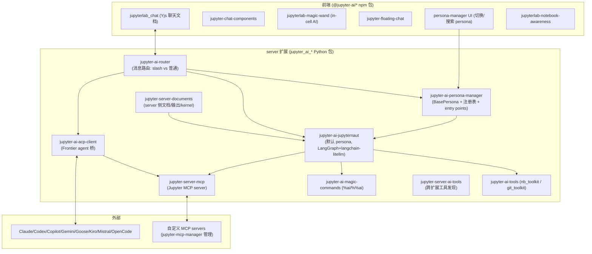
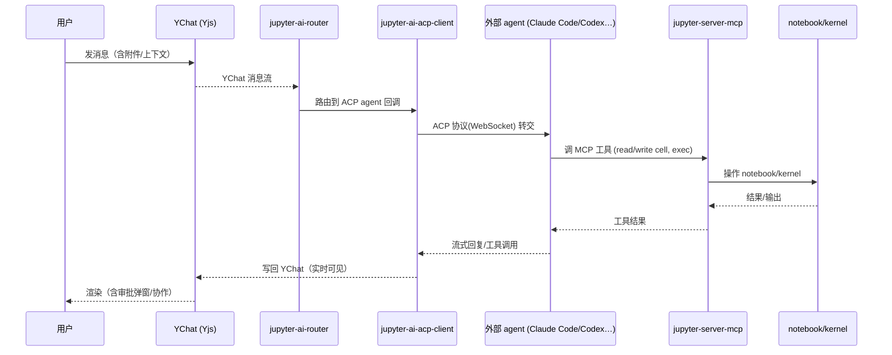

# Jupyter AI（jupyterlab/jupyter-ai）架构与实现分析

> 调研日期：2026-08-19 ｜ 对象：**jupyterlab/jupyter-ai**（官方，v3.1.3，~4.4k★，JupyterLab org 孵化）+ 拆包后的 **jupyter-ai-contrib** 组织（29 个仓库）。
> 本文聚焦 v3 的具体架构：metapackage 拆分、两条 agent 路径（ACP frontier agents + Jupyternaut persona）、Yjs 驱动的聊天/RTC、MCP 与工具层。

---

## 1. 总体结论

Jupyter AI v3 从"单一扩展"重构为 **metapackage + 子包矩阵**：

- **`jupyterlab/jupyter-ai` 变成薄壳**（metapackage，`jupyter_ai/` + docs + submodules），真正的代码按功能拆到 **jupyter-ai-contrib** 组织的 29 个仓库（Python server 包 + npm 前端包 + Rust CLI）。
- **定位变了**：v2 是"内置 AI 聊天（Jupyternaut，LangGraph 引擎）"；**v3 主打"接外部 frontier agent（经 ACP）+ 开放标准（ACP/MCP）避免锁定"**，同时保留 Jupyternaut 作为内置 persona。
- **聊天底层是 Yjs CRDT**（`jupyterlab_chat` + `jupyter-ai-router` + `jupyter-server-documents`）：聊天文档即协同文档，天然支持多用户/多 agent 实时协作。
- **两条 agent 路径并存**：
  1. **Frontier Agents（ACP）**——Claude / Codex / GitHub Copilot / Gemini / Goose / Kiro / Mistral Vibe / OpenCode，装依赖即自动发现；通过内置 **Jupyter MCP server**（`jupyter-server-mcp`）操作 notebook；**权限系统（guardrails）**：写文件/跑命令前请求批准。
  2. **Jupyternaut（内置 persona）**——基于 **LangChain/LangGraph**（`langchain-litellm` + `langchain-mcp-adapters`），会话持久化用 `langgraph-checkpoint-sqlite`（可选 `[persistence]`）。

---

## 2. 整体架构图

---

## 3. 关键子包详解

### 3.1 jupyter-ai-router —— 消息路由层（"聊天的中枢神经"）

`jupyter_ai_router`：核心消息路由。聊天不是直连 agent，而是：

1. **自动发现新 chat**：监听 chat room 初始化（Yjs `YChat` 文档）
2. **挂 observer 到 YChat 消息流**
3. **按类型路由**：slash 命令（`/xxx`，支持正则匹配）vs 普通消息
4. **回调给扩展**：`observe_chat_init` / `observe_chat_reset`（需 `jupyter_server_documents`）/ `observe_slash_cmd_msg`（正则）/ `observe_chat_msg`

> 获取方式：`self.serverapp.web_app.settings.get("jupyter-ai", {}).get("router")`——其它扩展通过 settings 拿 router 注册回调，不用管聊天生命周期。**这是"聊天即事件总线"的设计**，与 Datalayer jupyter-ai-agents（聊天直接走 Vercel AI 协议）完全不同。

### 3.2 jupyter-ai-persona-manager —— persona 注册表（"bots"系统）

- `BasePersona` 抽象类：`defaults`（name/description/avatar_path/system_prompt）+ `process_message(message)` + `send_message()` + `event_loop` 属性。
- `PersonaManager`：注册表 + 生命周期；`PersonaAwareness`：多用户聊天的 awareness 集成。
- **Entry points 自动发现**：`[project.entry-points."jupyter_ai.personas"] my-custom = "pkg.personas:MyPersona"`。
- 也支持 `.jupyter/personas/*.py` 本地加载 + `/refresh-personas` 热重载。
- persona 可 `@-mention`，多个 persona 共存于同一聊天环境，各自有模型/能力/头像。

### 3.3 jupyter-ai-jupyternaut —— 默认内置 persona（LangChain 系）

- server 包 `jupyter_ai_jupyternaut` + npm `@jupyter-ai/jupyternaut`。
- 已迁移到 persona-manager 的模型 API（"Migrate Jupyternaut onto the persona-manager model API"）。
- **依赖证据（近期 commit）**：`langchain-litellm`（模型抽象）、`langchain-mcp-adapters`（MCP→LangChain tools）、`langgraph-checkpoint-sqlite`（持久化）。
- 会话记忆：默认内存；可选 `[persistence]` 用 **SQLite + langgraph-checkpoint-sqlite** 跨重启持久化。

### 3.4 jupyter-ai-acp-client —— Frontier agent 桥（v3 主打）

- 实现 **ACP（Agent Client Protocol）**：把 JupyterLab 变成外部编码 agent 的"宿主"。
- 支持的 agent：Claude、Codex、GitHub Copilot、Gemini、Goose、Kiro、Mistral Vibe、OpenCode——**装对应依赖后自动检测**。
- agent 经内置 **Jupyter MCP server**（`jupyter-server-mcp`）读写文件、跑终端命令、操作 notebook。
- **权限系统（guardrails）**：agent 写文件 / 跑命令前需批准（默认防护）。
- 另有 `jupyter-ai-claude-code`（Claude Code persona）等专门适配包。

### 3.5 工具与 notebook 集成

- `jupyter-ai-tools`：`nb_toolkit`（read_notebook / read_cell / add_cell / insert_cell / delete_cell / edit_cell / get_cell_id_from_index / create_notebook）+ `git_toolkit`；兼容 OpenAI function-calling / MCP schema；`collaborative_tool` 装饰器提供 RTC 感知。
- `jupyter-ai-magic-commands`：`%ai` / `%%ai` magic（生成代码、修复错误、docstring、翻译）。
- `jupyter-server-mcp`：**Jupyter Server 的 MCP 接口/扩展**（Datalayer jupyter-mcp-server 的官方同类物）。
- `jupyter-server-ai-tools`：跨扩展发现/暴露工具给 agent。
- `jupyter-mcp-manager`（TS）：UI 管理 MCP servers。
- `nb-cli`（Rust）：CLI-first 的 AI agent 操作 notebook 接口。

### 3.6 前端 UX 组件（可单独复用）

`jupyter-chat-components`、`jupyterlab-magic-wand`（cell 内 AI 助手）、`jupyter-floating-chat`（悬浮聊天输入）、`jupyterlab-ai-commands`、`jupyterlab-commands-toolkit`（命令→AI 工具）、`jupyterlab-notebook-awareness`（当前 notebook/cell 跟踪）、`jupyterlab-cell-input-footer`、`jupyterlab-diff`（cell/文件 diff）、`jupyterlab-live-content`、`jupyterlab-document-collaborators`。

---

## 4. 一条消息的完整链路（Frontier agent 场景）

---

## 5. 与 Datalayer jupyter-ai-agents 的对比（对你最关键）

| 维度       | **Jupyter AI (官方 v3)**                                                         | **Datalayer jupyter-ai-agents**                  |
| ---------- | -------------------------------------------------------------------------------------- | ------------------------------------------------------ |
| agent 路径 | ① ACP 接外部 frontier agent（Claude/Codex/Copilot…）② 内置 Jupyternaut（LangGraph） | 内置 Pydantic AI agent + MCP tools + skills            |
| 聊天协议   | **Yjs CRDT 聊天文档**（`jupyterlab_chat`，天然多用户 RTC）                     | **Vercel AI SDK 流式协议**（单前端 Chat 面板）   |
| 消息路由   | `jupyter-ai-router` 事件总线（slash/普通/正则）                                      | 直接 POST`/api/chat`                                 |
| MCP        | `jupyter-server-mcp`（官方）+ `jupyter-mcp-manager`                                | `jupyter-mcp-server`（同进程 server 扩展，工具最全） |
| 模型抽象   | `langchain-litellm`（LangChain 生态）                                                | pydantic-ai 自带 provider 适配（9 家）                 |
| 持久化     | `langgraph-checkpoint-sqlite`（可选）                                                | 内存（Datalayer 托管侧走 durable execution）           |
| **审批**  | **guardrails：写文件/跑命令前批准**                                              | 无（MCP 工具直接执行）                                 |
| 扩展点     | persona entry points + MCP servers + router 回调                                       | agent 工厂 + MCP toolset                               |
| 生态位置   | Jupyter 官方、BSD-3、开源标准（ACP/MCP）                                               | 商业公司开源 + 托管 SaaS                               |

**一句话**：官方走"**外部 agent 进 Jupyter**"（ACP 宿主 + 审批 + Yjs 协同聊天），Datalayer 走"**内置 agent 长在 Jupyter 里**"（Pydantic AI + MCP + Vercel 流式）。两者互补，且都证明了"Jupyter 生态里 agent 必须经 MCP 拿 notebook 能力"这一共识。

---

## 6. 对你项目（hosted JupyterLab 扩展）的启示

1. **用哪个聊天底座**：官方证明 **Yjs 聊天文档 + router 事件总线** 适合"多用户/多 agent 协同"；Datalayer 证明 **Vercel AI 流式协议** 适合"单前端聊天面板 + 快速落地"。你的 hosted 场景若要多用户协同，官方这套（jupyterlab_chat + jupyter-ai-router）比自研 Vercel 流式更省事——但**它绑定 LangChain/LangGraph 生态**。
2. **两条 agent 路径可选其一或兼得**：`jupyter-ai-acp-client` 让你"免费接上 Claude/Codex/Copilot"（但那是别人的 loop）；`jupyter-ai-jupyternaut` 是"内置 LangGraph loop"（与你已选的 Pydantic AI 路线冲突，二选一）。
3. **可直接复用的组件**（不必用整个 jupyter-ai）：`jupyter-ai-tools`（nb_toolkit，已评估过 ✅）、`jupyterlab-notebook-awareness`（当前 cell 上下文，正是你 @notebook 引用要的）、`jupyterlab-diff`（checkpoint 变更管理 UI）、`jupyter-chat-components`。
4. **审批是官方默认、Datalayer 没有**：你的 US4 若要"工具/命令审批"，官方 guardrails 模型（写文件/跑命令前批准）是现成参考，别从零设计。
5. **架构取舍提醒**：jupyter-ai v3 是 29 个仓库的矩阵，接口演进快（v3.1.x 仍在拆），若要依赖其子包需盯紧版本（与 `jupyter-ai-extension-plan.md` 第三节结论一致：工具层 nb_toolkit 接口简单、风险低；persona/router 层依赖风险高）。

---

## 参考

- 主仓库：github.com/jupyterlab/jupyter-ai（metapackage，v3.1.3，docs: jupyter-ai.readthedocs.io）
- 子包组织：github.com/orgs/jupyter-ai-contrib/repositories（29 仓库）
- 深看子包：jupyter-ai-router / jupyter-ai-persona-manager / jupyter-ai-jupyternaut / jupyter-ai-acp-client / jupyter-server-mcp / jupyter-ai-tools / nb-cli
- 相关：`../jupyter-ai.md`（生态速查）｜ `../jupyter-ai-extension-plan.md`（复用评估，第三节）｜ `../datalayter-components/datalayer-products-research.md`（Datalayer 对比）
