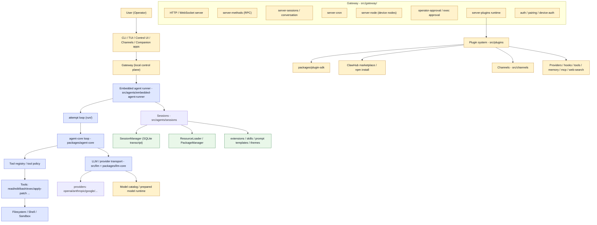
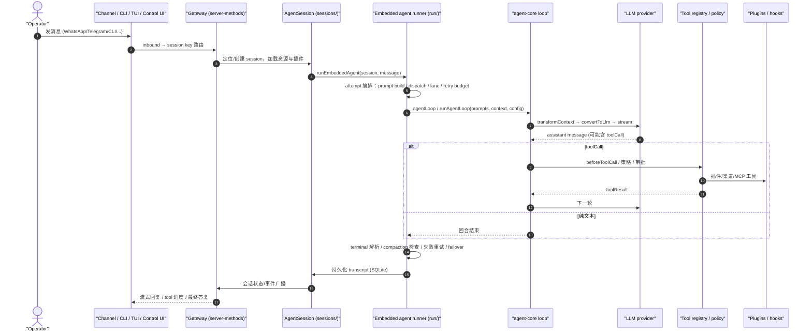

# OpenClaw 架构与实现分析（与 Pi 对比）

## 1. 总体结论

OpenClaw 不是 Pi 的替代品，而是 **Pi 的直系后代 + 一次范式升级**。

- 内核血缘：OpenClaw 直接继承了 Pi（`@earendil-works/pi-agent-core`）的 agent 运行时，改名成 `@openclaw/agent-core`，并做了大量加固。README 明确致谢 Mario Zechner（Pi 作者），`docs/agent-runtime-architecture.md` 里 legacy alias `pi` 直接 normalize 到 `openclaw`。
- 定位差异：Pi 是"单机、终端优先、面向开发任务的 coding agent 平台"；OpenClaw 是"运行在你设备上、接入你现有聊天渠道、可常驻的**个人 AI 助手平台**"。
- 一句话：**OpenClaw 把 Pi 的 coding agent 内核（agent loop + session）保留下来作为"嵌入式运行时"，外面包了一层 Gateway 控制平面 + 多渠道接入 + npm 插件生态 + 设备/伴生应用。**

对应三层（与 analysis-pi.md 的三层对比）：

| Pi（analysis-pi.md） | OpenClaw 对应物 | 变化 |
|---|---|---|
| Agent runtime（`packages/agent/`） | `packages/agent-core/`（`@openclaw/agent-core`） | 同源改名 + 加固 |
| Session runtime（`packages/coding-agent/`） | `src/agents/embedded-agent-runner/` + `src/agents/sessions/` | 拆成两层并大幅强化 |
| Extensions / skills / templates | `packages/plugin-sdk/` + `src/plugins/` + `src/agents/sessions/{extensions,skills,prompt-templates,themes}` | 从进程内扩展升级为 npm 插件市场 |
| （无） | `src/gateway/` + `src/channels/` + `apps/` + `ui/` | **全新**：控制平面 + 渠道 + 客户端 |

相关源码入口：

- [openclaw/packages/agent-core/src/agent.ts](openclaw/packages/agent-core/src/agent.ts)
- [openclaw/packages/agent-core/src/agent-loop.ts](openclaw/packages/agent-core/src/agent-loop.ts)
- [openclaw/src/agents/embedded-agent-runner/run.ts](openclaw/src/agents/embedded-agent-runner/run.ts)
- [openclaw/src/agents/sessions/agent-session.ts](openclaw/src/agents/sessions/agent-session.ts)
- [openclaw/src/agents/sessions/session-manager.ts](openclaw/src/agents/sessions/session-manager.ts)
- [openclaw/src/gateway/server.ts](openclaw/src/gateway/server.ts)
- [openclaw/src/plugins/loader.ts](openclaw/src/plugins/loader.ts)
- [openclaw/packages/plugin-sdk/src/core.ts](openclaw/packages/plugin-sdk/src/core.ts)

---

## 2. 整体架构图

---

## 3. 血缘：Pi → OpenClaw 的包映射

| Pi 包 | OpenClaw 包 / 目录 | 说明 |
|---|---|---|
| `@earendil-works/pi-agent-core`（`packages/agent/`） | `@openclaw/agent-core`（`packages/agent-core/`） | 同一套 agent loop，改 import + 加固 |
| `@earendil-works/pi-ai`（`packages/ai/`） | `@openclaw/llm-core` + `@openclaw/ai` + `normalization-core` + `model-catalog-core` 等 | 拆成多个更细的包 |
| `packages/coding-agent/`（sdk / agent-session / session-manager / extensions / tools / modes） | `src/agents/embedded-agent-runner/` + `src/agents/sessions/` | 从独立包拆进 `src/`，并大量重构 |
| `packages/tui/` + `@earendil-works/pi-tui` 依赖 | `src/tui/` + 仍然依赖 `@earendil-works/pi-tui` | TUI 组件库仍是第三方依赖 |
| （无） | `packages/gateway-protocol/`、`packages/gateway-client/`、`packages/plugin-sdk/` | 全新 |

关键证据：

- `packages/agent-core/src/agent.ts` 与 `pi/packages/agent/src/agent.ts` 结构几乎逐字相同：同样的 `AgentState`、`createMutableAgentState`、`DEFAULT_MODEL`、`defaultConvertToLlm`，只是 import 从 `@earendil-works/pi-ai` 换成 `@openclaw/llm-core`。
- `src/agents/sessions/agent-session.ts` 的类注释与 Pi 的 `coding-agent/src/core/agent-session.ts` 几乎一致："Core abstraction for agent lifecycle and session management. Shared by interactive, print, and RPC modes"。
- `packages/agent-core/package.json` 的 exports 里保留了 `./agent`、`./agent-loop`、`./types` 等与 Pi 完全对应的子路径。

---

## 4. 核心 agent loop：同源内核 + 加固

### 4.1 与 Pi 相同的设计

`packages/agent-core/src/agent.ts` + `agent-loop.ts` 是 OpenClaw 的运行时心脏，设计与 Pi 的 `packages/agent/` 同源：

- **有状态 Agent**：`AgentState`（messages / tools / model / systemPrompt / thinkingLevel）
- **事件驱动**：`agent_start` / `turn_start` / `message_start` / `message_update` / `turn_end` / `agent_end`
- **工具驱动循环**：LLM → toolCall → beforeToolCall → 执行 → afterToolCall → toolResult → 下一轮
- **队列注入**：`PendingMessageQueue` + `QueueMode`（`all` / `one-at-a-time`），支持 steering（模型回复前插入）和 followUp（回合后注入）
- **hook 体系**：`beforeToolCall` / `afterToolCall` / `shouldStopAfterTurn` / `prepareNextTurn`（可换 model/thinkingLevel）
- **消息转换**：`convertToLlm`（AgentMessage[] → Message[]）+ `transformContext`（AgentMessage[] → AgentMessage[]）

### 4.2 OpenClaw 新增的加固模块

Pi 的 `packages/agent/src/` 只有 `agent.ts / agent-loop.ts / stream-fn.ts / proxy.ts / search/ / harness/`。OpenClaw 的 `agent-core` 新增了一批 Pi 没有的模块：

- `turn-interruption.ts`：abort / 中断回合处理，`turnTainted` 机制（回合被污染则持久化 aborted 结果，防止后续 compaction 或从 toolUse 消息继续）
- `internal-hooks.ts`：内部 before-tool-batch 准入（`InternalBeforeToolBatchContext`）+ 同步 steering getter
- `tool-execution-context.ts`：`runWithAgentToolExecutionContext`，工具执行上下文
- `reasoning.ts`：thinking level → provider reasoning 映射（`resolveAgentReasoningOption`）
- `validation.ts`：`validateToolArguments` 参数校验
- `tool-loop-recovery`：`ToolLoopIntervention`（"critical-tool-loop"）——检测模型陷入循环调用同一工具时介入并终止 run
- `harness/` 内还扩展了 compaction / branch-summarization / session / prompt-templates

也就是说：**内核循环仍是一个"状态机 + 事件源 + 工具循环 + 上下文驱动器"，但 OpenClaw 在它周围加了生产级健壮性（中断语义、循环检测、参数校验、推理模式映射）。**

---

## 5. 编排层：attempt loop（Pi coding-agent 的超级强化版）

Pi 的 Session runtime（`coding-agent/src/core/agent-session.ts`）承担了：状态访问、事件订阅+持久化、model/thinking 管理、compaction、bash 执行、session 切换与分支、extension 生命周期。

OpenClaw 把这层拆成两个目录，并且规模膨胀了一个数量级：

### 5.1 `src/agents/embedded-agent-runner/`（编排/执行）

- `run.ts` / `run/`：**attempt loop**，一次用户请求 = 一次 run，run 内部按 attempt 拆分：
  - `attempt-prompt-build.ts` / `attempt-prompt-phase.ts` / `attempt-dispatch-preparation.ts` / `attempt-stream-*` / `attempt-settle.ts` / `attempt-finalize.ts` / `attempt-recovery.ts`
  - `terminal-*`：terminal outcome / resolution / timeout（回合如何"收尾"是一等公民）
  - `failover-*`：跨 provider 故障切换（`failover-policy.ts`、`failover-retry-controller.ts`）
  - `lane-*`：`LaneController`（同 agent 内并发 run 的分组/串行）
  - `retry-budget.ts` / `retry-limit.ts` / `incomplete-turn-*` / `empty-response-retry`：重试预算与空响应恢复
  - `compaction-*`：preemptive compaction、compaction-timeout、overflow-context-recovery
  - `turn-taint-state.ts` / `usage-accumulator.ts` / `idle-timeout-breaker.ts`
- 模型层：`model.ts`、`model.provider-normalization.ts`、`model-resolution.ts`、`extra-params.*`（按 provider 调整请求参数）、`model.static-catalog.ts`、`prepared-model-runtime.*`（**prepared model runtime generations**：启动时按 agent 生成一份"auth + model registry + catalog"的原子快照，run 从快照 fork）
- 会话接线：`embedded-agent-subscribe.*`（流式回复、tool result、媒体交付）、`transcript-*`、`history.ts`

### 5.2 `src/agents/sessions/`（会话/资源）

- `session-manager.ts`：SQLite 转录标识 + 分支（`session-manager-branching.ts`、`session-manager-codec.ts`）
- `agent-session.ts`：Pi 的 `AgentSession` 直系后代，拆成 `agent-session-tree.ts` / `-compaction.ts` / `-execution.ts` / `-extensions.ts` / `-models.ts` / `-prompting.ts`
- `resource-loader.ts` / `package-manager.ts`：资源发现（package.json 里 `openclaw` manifest 声明 extensions/skills/prompts/themes，或约定目录兜底）
- `extensions/`、`prompt-templates.ts`、`skills/`、`themes/`
- `compaction/`、`model-registry.ts`、`model-resolver.ts`、`system-prompt.ts`、`slash-commands.ts`

**对比要点**：Pi 的 compaction 是 session 内部函数；OpenClaw 的 compaction 有独立的 checkpoint、planning worker、preemptive（预防式）、overflow 恢复、post-compaction loop guard，是一套完整的子系统。

---

## 6. Gateway 控制平面（Pi 没有的东西，OpenClaw 的"大脑"）

Pi 没有一个常驻服务；用户跑一次 CLI，进程内完成一切。OpenClaw 的核心是 **Gateway**：一个本地控制平面，统一管理 sessions、tools、events、channel 连接。`src/gateway/` 规模很大，关键模块：

- `server*.ts`：HTTP + WebSocket 服务器、lazy handler、in-process dispatch、插件运行时
- `server-methods/`：RPC 方法注册与鉴权（`server-methods.ts`、`server-methods-list.ts`）
- `server-chat.ts` / `conversation-*`：会话收发、chat state、stream text merge
- `server-cron*`：cron 任务（heartbeat、reconciled、notifications、webhook）
- `server-node-*`：**设备节点**（手机/桌面/其他设备通过 node 协议接入，远端执行工具）
- `server-plugins*`：gateway 内运行插件、插件子代理、插件生命周期
- `operator-approval*` / `exec-approval-*`：审批流（工具执行需要 operator 批准）
- `auth.ts` / `pairing/` / `device-auth.ts` / `control-ui*`：鉴权、配对、Control UI
- `session-*`：session 创建/重置/归档/共享/观察者（`session-observer*`）

配套协议：

- `packages/gateway-protocol/`：网关与客户端之间的 wire protocol（schema、frames、RPC contracts）
- `packages/gateway-client/`：客户端 SDK

**对比要点**：Pi 的 `coding-agent/src/server/` 只是简单的 mode 之一；OpenClaw 的 Gateway 是面向"多客户端、多渠道、常驻运行、可热重载、可远程访问"的服务端。

---

## 7. Channels 渠道层（Pi 没有）

`src/channels/` 让模型/agent 出现在用户已经在用的聊天里：WhatsApp、Telegram、Slack、Discord、Signal、iMessage 等。每个渠道以插件形式实现 adapter：

- 类型：`ChannelMessagingAdapter`、`ChannelThreadingAdapter`、`ChannelPairingAdapter`、`ChannelSecurityAdapter`、`ChannelConfigSchema`
- 能力：配对（pairing）、DM 安全策略、线程绑定、流式回复（typing/streaming）、会话 key 路由、回复前缀、mention gating、status reactions
- 渠道插件注册表：`registry.ts`、`bundled-channel-catalog-read.ts`

Pi 完全没有这一层，这是 OpenClaw 从"开发工具"变成"个人助手"的关键差异之一。

---

## 8. 插件系统：从 Pi 的 extensions 到 npm 插件市场

Pi 的扩展是**进程内 TS 扩展**（`coding-agent/src/core/extensions/`：loader + runner，装配 `ExtensionRuntime`，分发生命周期事件）。OpenClaw 的 `src/plugins/` 是一个完整的**插件包管理器**：

- **安装/卸载/更新**：`install*.ts`（npm install、git install、managed npm、uninstall、update），基于 npm 包 + 本地加载
- **manifest**：package.json 的 `openclaw` 字段声明 extensions/skills/prompts/themes/commands/providers/channels/tools
- **ClawHub**：`clawhub.ts`、`marketplace.ts` 市场与官方发布者、provenance、安全审查
- **安全**：`install-security-scan.ts`（安装前安全扫描）、`npm-install-security-scan.ts`、native module 检查
- **能力类型**：provider 插件（模型/认证）、channel 插件、tool 插件、hook（`hooks.ts`、`host-hooks.ts`）、command、memory 插件、web-search 插件、MCP 插件、embedding provider、media 插件
- **两种风格**（VISION.md 明确）：code 插件（运行时扩展）+ bundle 风格插件（skills/MCP/config 等稳定外部面，优先推荐）
- **核心瘦身原则**：核心每个 tool/prompt/config 行都向每个 operator 每轮请求收税，所以新增功能优先做成插件。

**对比要点**：Pi 的 extension = 代码注入点；OpenClaw 的 plugin = 可分发、可安装、可治理的生态单元（与 VS Code 扩展模式类似）。

---

## 9. LLM / Model 层

- `src/llm/`：model/provider registry、`stream.ts` 传输、`providers/`（openai/anthropic/google 等流实现）、OAuth、env API keys
- `packages/llm-core/`：类型契约（`Model`、`Message`、`Transport`、`StreamFn`）+ model-contracts + validation
- `packages/ai/`：EventStream、transports、providers 传输层
- **prepared model runtime**（`src/agents/embedded-agent-runner/` 与 `src/agents/model-catalog*`）：按 agent 构建原子快照（auth template + model registry + catalog），run 从快照 fork；失败/过期快照绝不被 serve。

对比：Pi 的 `packages/ai/` 是单包；OpenClaw 拆成 `llm-core`（契约）+ `ai`（传输）+ 若干 `-core` 包，并引入"模型运行时代"（generation）这个概念来保证多 agent 场景下 model/auth 的一致性。

---

## 10. 持久化与状态

| 项 | Pi | OpenClaw |
|---|---|---|
| 状态目录 | `~/.pi/agent`（JSON：auth.json、models.json、sessions/ 下的 JSON session 文件） | `~/.openclaw`（openclaw.json + SQLite） |
| 会话存储 | JSON transcript 文件 + `SessionManager` | SQLite：`state/openclaw.sqlite`（共享状态）+ `agents/<id>/agent/openclaw-agent.sqlite`（每 agent auth profile + runtime state + session 行） |
| 认证 | auth.json（单一 profile） | per-agent auth profile store（API key + OAuth）+ `credentials/` |
| 迁移 | 少量 migrations | `openclaw doctor --fix` 统一迁移（legacy auth-profiles.json 导入 SQLite） |

---

## 11. 一次 prompt 的完整调用链（OpenClaw 视角）

与 Pi 调用链（analysis-pi.md 第 3 节）相比，差异点是：

1. Pi 的入口是 CLI→`createAgentSession()`；OpenClaw 的入口几乎都是 **Gateway**（渠道/CLI/UI 都连 Gateway）。
2. Pi 的 `AgentSession.prompt()` 是"预处理→extension→loop"；OpenClaw 的 `runEmbeddedAgent()` 在 loop 外面包了一层 **attempt 编排**（重试、failover、lane、terminal、compaction 时机）。
3. 工具执行多了一条 **审批/策略管线**（operator approval、tool policy、before-tool-call adapter），这在 Pi 里很轻。
4. 回复投递多了一层 **渠道投递/流式渲染**（draft streaming、typing、message-action）。

---

## 12. 对比表

| 维度 | Pi | OpenClaw |
|---|---|---|
| 定位 | 单用户 coding agent 平台 | 个人 AI 助手平台（常驻、多渠道、多设备） |
| 内核 | `packages/agent/`（agent.ts + agent-loop.ts） | `packages/agent-core/`（同源 + 加固） |
| 会话层 | `packages/coding-agent/`（sdk + agent-session + session-manager） | `src/agents/sessions/` + `src/agents/embedded-agent-runner/` |
| 入口 | CLI / TUI / RPC / SDK（进程内） | CLI / TUI / Control UI / Channels / Companion apps（都连 Gateway） |
| 控制平面 | 无 | **Gateway**（HTTP/WS、RPC、cron、nodes、plugins、approvals） |
| 渠道 | 无 | WhatsApp / Telegram / Slack / Discord / Signal / iMessage … |
| 扩展 | 进程内 extension（loader + runner + hooks） | npm 插件 + ClawHub 市场 + 安全扫描 + 两种插件风格 |
| 多 agent | 单 session（支持分支/resume/fork） | 多 agent（`agents/<id>`），subagent / sessions-spawn / swarm |
| 持久化 | JSON（`~/.pi/agent`） | SQLite（`state/openclaw.sqlite` + per-agent sqlite）+ doctor 迁移 |
| 编排健壮性 | 简单 retry | attempt loop + failover + lane + retry budget + terminal resolution + preemptive compaction |
| 工具安全 | project trust + 基础 gate | tool policy / exec approval / operator approval / sandbox / pairing |
| MCP | 无 | MCP 客户端 + 服务器（`src/mcp/`） |
| 设备/应用 | 无 | `apps/`（macOS/iOS/Android/Linux）+ nodes + companion |
| 媒体/语音 | 无 | TTS、image/video/music generation、voice、realtime transcription |
| 规模 | 几个包，源码量中等 | 20+ 包 + 数百 src 模块 + extensions + apps + ui |

---

## 13. 一句话总结

Pi 的公式是：**Agent runtime（怎么跑）→ Session runtime（在什么上下文里跑）→ Extensions/skills/templates（怎么定制）**，做的是一个开发任务执行器。

OpenClaw 保留了这条内核，但把它**降级为一个组件**，套进了更大的公式：

> **OpenClaw =（同源的 agent-core 循环）+（attempt/session 编排层）+（Gateway 控制平面）+（多渠道接入 + 插件生态 + 多设备/客户端）**

也就是：Pi 是"一个能写代码的聊天 CLI"；OpenClaw 是"一个住在你的聊天软件里、由统一 Gateway 指挥、可以写代码、可以控设备、可以跑定时任务、可以通过插件无限扩展的个人 AI 助手操作系统"。
