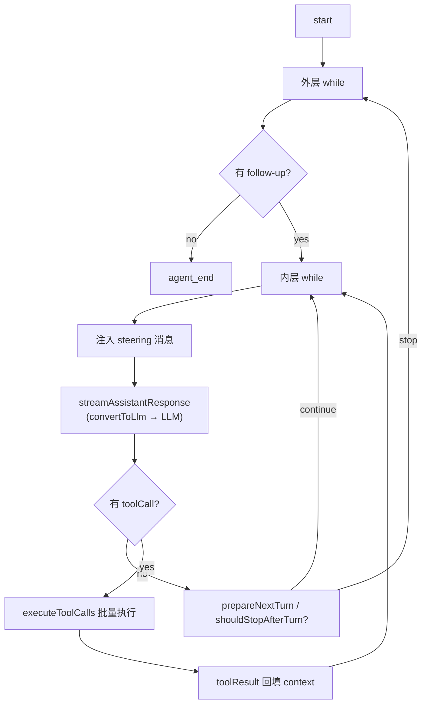
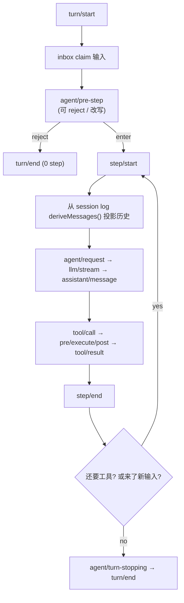

# Agent 编排方法对比：Pi / DeepSeek Harness / Claude Code

> 调研日期：2026-08-19 ｜ 范围：`agent-framework/` 下各 agent 的**编排方法**（agent loop / 状态模型 / 工具执行 / 扩展方式）。
> 深看：**Pi**（TypeScript，源码可见）、**DeepSeek Harness**（TypeScript，源码可见）、**Claude Code**（闭源核心，仓库=文档/插件镜像）。
> 顺带：OpenClaw / Hermes 已分析过（见 repo 记忆），本节只给一句话定位。

---

## 0. 全家桶速览（一句话编排方法）

| Agent | 语言/许可 | 编排方法（一句话） |
|---|---|---|
| **Pi** | TS / MIT | 单 agent 工具循环（双层 while）+ steering/follow-up 队列 + 事件流可观测 —— "最小 agent 运行时" |
| **OpenClaw** | TS / 自定义 | Pi 直系后代：attempt-loop（lane/failover/retry-budget/preemptive compaction）+ Gateway 控制平面 + channels |
| **Hermes Agent** | Python / MIT | 巨型函数对话循环（`AIAgent` + `run_conversation`）+ 后台 review-agent 学习回路 + tools registry/environments |
| **Claude Code** | 闭源 / 无 OSS 许可 | 终端 agentic 循环（读→想→做）+ Plan/Act 双模式 + subagent 扇出 + hooks/skills/MCP（文档可见，源码闭源） |
| **DeepSeek Harness** | TS / MIT | **一切皆插件**（Cordis）事件驱动 harness + 持久化 session log 为事实源 + turn/step 两级驱动 + inbox 队列 |
| **Prime Agent** | TS / MIT | **与 Pi 同源**（fork）：同一套 `packages/agent` 循环 + 升级 session runtime（RLM 把 IPython 当执行环境 + continual harness 自改进 + daemon/worker/supervisor 后台存活） |

> **血缘关系（源码核实）**：`pi` → `prime-agent`（fork：RLM/continual harness/daemon 层）与 `pi` → `openclaw`（fork：Gateway/channels/attempt-loop）是同一族的两条分支，三者 `packages/agent/src/agent-loop.ts` 结构逐字相近。

---

## 1. Pi —— 事件流 + 双层 while 的"最小 agent 运行时"

### 1.1 循环结构（`packages/agent/src/agent-loop.ts` 的 `runLoop()`）

- **外层 while**：当 agent 本要停止时，检查 `getFollowUpMessages()` 有无排队消息 → 有则续跑。
- **内层 while**：处理 tool calls + steering 消息，直到 `hasMoreToolCalls=false` 且无 pending。
- **事件流**（`EventStream`，agent_start → turn_start → message_start/end → turn_end → agent_end）——整个循环是"可订阅的事件流"，不是裸 while。
- **钩子（config 注入）**：`getSteeringMessages()`（用户等待时插话）、`getFollowUpMessages()`、`prepareNextTurn()`（可换模型/推理档位）、`shouldStopAfterTurn()`、`transformContext()`、`convertToLlm()`（**唯一**的 LLM 边界，AgentMessage[] → Message[]）、`streamFn()`。

### 1.2 工具执行

- 每 turn 收集 `toolCall` → `executeToolCalls()` 批量执行 → `toolResult` 回填 context。
- 特殊处理：`stopReason === "length"`（token 截断）时**整批判废**，防止执行参数被截断的工具调用。
- 支持 retry/continue（`agentLoopContinue`，从当前 context 续跑不重复添加消息）。

### 1.3 定位

- Pi 是 **agent runtime**（可组合的循环原语 + 事件可观测），不是 full harness；上层 `packages/coding-agent`（编码 CLI）、`packages/server`（HTTP/WS）、`packages/tui` 复用同一循环。
- 血缘：OpenClaw 继承此循环并升级为 attempt-loop（lane/超时/预压缩），见 repo 记忆。

### 1.4 血缘：Pi ↔ Prime Agent 同源（源码核实，重要补充）

源码比对结论：**Prime Agent 的 `packages/agent` 是 Pi `packages/agent` 的直接 fork**。

- **同一底层**：两者都 `import "@earendil-works/pi-ai"`；`Agent` 类 / `PendingMessageQueue` / `runAgentLoop` / `runAgentLoopContinue` 结构一致（Prime 的 README 直接链接 `badlogic/pi-mono`）。
- **同一 `coding-agent/core` 骨架**：`sdk.ts` / `agent-session.ts` / `agent-session-runtime.ts` / `session-manager.ts` / `compaction/` / `extensions/` / `skills.ts` / `slash-commands.ts` / `system-prompt.ts` / `tools/` 两仓库几乎同名同构。
- **loop 差异（Prime 的改动）**：
  - 新增 `shouldStopBeforeTurn()` 与 `getContinuationMessages()`（turn 边界/续跑更细）；Pi 用 `prepareNextTurn()` / `prepareNextTurnWithContext()`（可换模型/推理档位）。
  - state 新增 `serviceTier`。
  - **去掉了** Pi 的 `stopReason==="length"` 整批判废逻辑（Pi 用 `failToolCallsFromTruncatedMessage` 防截断参数，Prime 直接执行）。
- **上层差异（Prime 的增量）**：`coding-agent/core` 新增 `rlm-runtime.ts` / `kernel/` / `refinement/`（continual harness）/ `goals.ts` / `autonomous.ts` / `cron-jobs.ts` / `mcp/` / `agent-observe.ts` 等——即“RLM 把 IPython 当执行环境 + 自改进 harness + 后台存活”这三层是 Prime 相对 Pi 的核心增量。
- **结论修正**：我之前把 Prime 列为“待分析”不准确；它和 Pi 属于**同一编排家族**（同一个 loop，Prime 更偏“长期运行的 agent OS”）。详见 `analysis-prime.md` 与 `prime-agent/` 源码。

---

## 2. DeepSeek Harness —— 一切皆插件 + 会话日志驱动

### 2.1 总体架构（官方架构文档确认）

- **Cordis 插件树**：无特权核心；模型 adapter、工具注册表、会话日志、**甚至 agent loop 本身**都是插件，可替换、可 patch（profile/bundle 组合）。
- **核心 spine（`packages/core/`）**：

| 包 | 负责 | 相当于 |
|---|---|---|
| `core/session` | **append-only SessionEvent 日志** + 内存 store | 事实源（source of truth） |
| `core/system-prompt` | prompt section + 工具 schema 组装 | 上下文装配 |
| `core/tools` | 作用域工具注册表 + 受控执行管线 | 工具层 |
| `core/agent` | Agent 接口 + 活注册表 + `agent/*` 事件 | 编排接口 |
| `core/agent-loop` | **默认驱动 = `ReactLoopAgent`** | 默认循环实现（可换） |
| `core/scope` | 按 agent 隔离的注册原语 | 插件隔离 |
| `llm/llm` | 消息/流词汇 + adapter seam | 模型抽象 |

### 2.2 turn/step 两级驱动（`agent-loop/src/agent.ts`）

- **step** = 一次模型请求 + 它调用的工具；**turn** = 0..n 个 step。
- 流程：`turn/start` → 从 inbox claim 输入 → 组装 prompt → `agent/pre-step`（可 reject）→ `step/start` → 从 session log `deriveMessages()` 投影模型历史 → `agent/request` → `llm/stream` → `assistant/message` → `tool/call` → `tools/pre-execute → execute → post-execute` → `tool/result` → `step/end` →（仍需工具或来了新输入则 claim 下一 step）→ `agent/turn-stopping` → `turn/end`。
- **输入经单一 inbox**：`steer()`（下一 step）、`inject()`（等待）、`followup()`（下一 turn）、`wakeDriver()`；phase 机：`idle / maintenance / running`，支持 cancel（保/清 inbox）。
- **不变量**："model-visible means logged" —— 一切进模型的东西必须能从日志重建；fork/resume/回放/遥测都从这条 log 派生。

### 2.3 工具执行（`tool-calls.ts`）

- `executeToolCalls` 调度器：**exclusive 调用形成屏障**（一次一个），**parallel 调用用有界滚动池**；abort 时补合成结果保证 replay 有效。

### 2.4 编排=平台

- 能力都以"Service Definition + Provider + Consumer"三件套出现（fs/shell/subprocess/terminal/lsp/sandbox/web/skill/subagent/workflow/todo/plan/guard/compaction/context…）。
- 有 `hooks` 包：**Claude Code / Codex hook 桥接**；`acp`：ACP 自动化 server；`sdk`：JSON-RPC 协议 + TS/Python 客户端；`interaction`：审批/权限/ask-user。
- **与你的关系**：这是"可换循环"的 harness —— 你要的"断连续跑/回放/多 surface"在它这里是**默认设计**（session log + turn/step + durable session 包）。

---

## 3. Claude Code —— 闭源核心 + 文档/插件可见的编排

### 3.1 编排模型（据官方文档，非源码）

- **终端 agentic 循环**：读代码库 → 思考 → 行动（`Edit` / `Bash` / `Read` / `Grep` / `Glob` …），本质上也是 ReAct 式 while 循环，但**核心闭源**。
- **Plan / Act 双模式**：Plan 模式先研究出计划（todo list）并请求批准，再切换执行——"计划与执行解耦"。
- **Subagent 扇出**：专门子 agent 只带受限工具集，通过 task 工具 / Agent SDK 派发（如 explore / code-review 的并行分析 agent）。
- **Hooks（事件缝）**：`SessionStart` / `PreToolUse` / `PostToolUse` / `Stop` 等，是它的主要扩展机制。
- **Agent Skills（SKILL.md 渐进披露）** + **斜杠命令** + **MCP servers**（外部工具）。
- **Checkpoint / 权限模式 / 沙箱**：变更可回滚、命令逐个审批、敏感操作受限。
- **Agent SDK**：编程化控制 harness（底层同样是闭源 agent loop）。

### 3.2 仓库（镜像）能看到什么

- `plugins/` 展示了"编排的扩展形态"，能反推它的编排缝：
  - `code-review`：**5 个并行 subagent**（CLAUDE.md 合规/查 bug/历史/PR 评论）+ 置信度打分过滤误报。
  - `feature-dev`：**7 阶段 workflow** + 角色 agent（code-explorer / code-architect / code-reviewer）。
  - `ralph-wiggum`：用 **Stop hook 拦截退出**实现"自我引用迭代循环"。
  - `hookify` / `security-guidance`：`PreToolUse` 拦截不安全行为。
- 结构约定：`.claude-plugin/plugin.json` + `commands/` + `agents/` + `skills/` + `hooks/` + `.mcp.json`。

> 结论：Claude Code 编排 = **专有 ReAct 循环 + Plan/Act 模式 + subagent 扇出 + hooks/skills/MCP 扩展**。要借鉴的是它的"模式与扩展缝"，而非代码。

---

## 4. 横向对比表

| 维度 | **Pi** | **DeepSeek Harness** | **Claude Code** |
|---|---|---|---|
| 编排范式 | 单 agent 工具循环 + 事件流 | 插件化 harness + turn/step 状态机 | 专有 ReAct + Plan/Act + subagent |
| 核心抽象 | `agentLoop()` + `AgentEvent` + config 钩子 | `ReactLoopAgent` + SessionEvent 日志 + Inbox + phase | 闭源循环 + 文档化扩展点 |
| 状态与持久化 | context 内存态（会话后端可换） | **append-only session log**（可回放/续跑/派生一切） | checkpoint（快照式变更管理） |
| 工具执行 | 批量执行；`length` 截断整批判废 | exclusive 屏障 + parallel 有界池；abort 补合成结果 | 逐个执行 + 审批（权限模式） |
| 用户打断 | steering / follow-up 队列 | steer(step)/inject/followup(turn) + wake | 可中断，Plan 审批 |
| 扩展方式 | 函数/config 钩子 + npm 包 | **一切皆插件**（连 loop 都可换） | hooks + skills + 命令 + MCP + 插件 |
| 多 agent | 无内建（靠上层） | subagent 能力包 | subagent 扇出（task/SDK） |
| 源码 | 全开源 | 全开源（developer preview） | 闭源（仓库=文档/插件） |
| 语言 | TypeScript | TypeScript（+Python SDK） | 闭源（CLI 安装） |

---

## 5. 对你（hosted JupyterLab 扩展）的借鉴

1. **Pi → 聊天面板的"边跑边插话"**：`steering / follow-up` 队列 + 事件流，正是聊天 UI 里"用户打字时 agent 仍在跑、消息插到下一 turn"的标准做法——可以借鉴到 `/api/chat` 的请求模型。
2. **DeepSeek Harness → 断连续跑/多 surface**：**session log 为唯一事实源 + turn/step 边界 + inbox**，是"notebook/会话常驻服务端、前端只是渲染面"的天然实现；也回应了你 DESIGN.md 里的 US5（断连续跑）。它甚至自带 `hooks`（桥接 Claude Code/Codex）和 `interaction`（审批）。
3. **Claude Code → 审批与多 agent 分层**：Plan/Act 解耦 + subagent 受限工具集 + PreToolUse 拦截，对应你的"工具审批 / guardrails"设计（US4）。
4. **注意**：三者都是 TypeScript/闭源或大工程，你已选定 Pydantic AI（Python）+ MCP 路线——**借鉴的是编排范式**（事件流、日志事实源、turn/step、steering、审批缝），不是直接搬代码。若将来要"断点续跑"，DeepSeek Harness 的 session-log 思路比 LangGraph checkpointer 更"Jupyter 友好"（都是可回放的日志）。

---

## 参考

- Pi：`agent-framework/pi/packages/agent/src/agent-loop.ts`、`agent.ts`
- DeepSeek Harness：`agent-framework/deepseek-harness/docs/architecture.md`、`packages/core/agent-loop/src/agent.ts`、`packages/core/agent-loop/src/tool-calls.ts`、`packages/core/agent/src/dispatch.ts`
- Claude Code：`agent-framework/claude-code/README.md`、`plugins/README.md`（官方文档 code.claude.com）
- Prime Agent：`agent-framework/prime-agent/packages/agent/src/agent.ts`、`agent-loop.ts`、`packages/coding-agent/src/core/`（sdk / agent-session / agent-session-runtime / rlm-runtime / refinement）＋ `analysis-prime.md`
- DeepSeek Harness hooks 桥接：`packages/hooks/`（hook-protocol + hooks-claude-code + hooks-codex）
- 既有分析（repo 记忆）：Pi / OpenClaw / Hermes 关键事实
