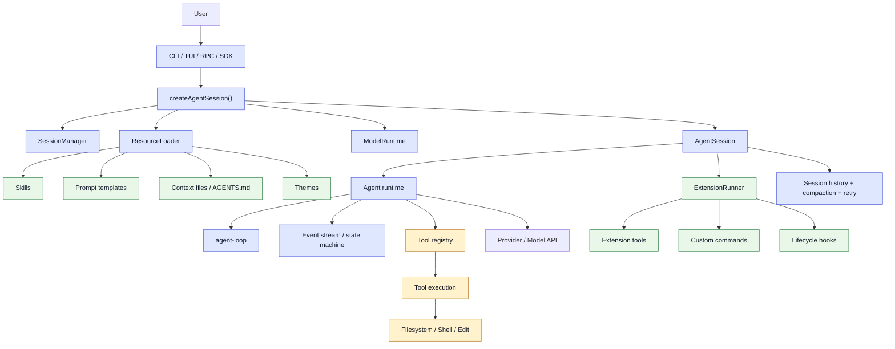
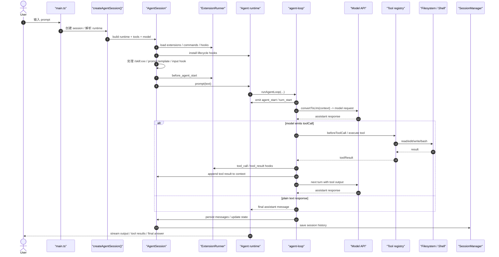
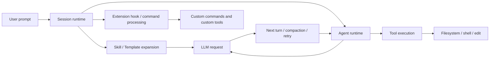

# Pi 架构与一次 prompt 的完整调用链

## 1. 总体结论

Pi 不是一个“单纯聊天接口”，而是一个面向开发任务的工程化 coding agent 平台。它把能力拆成三层：

1. Agent runtime：负责状态、事件、LLM 工程和工具调用循环
2. Session runtime：负责开发上下文、历史、compaction、model 管理和 session 生命周期
3. Extensions / skills / templates：负责增强与定制工作流

这三层共同构成了 Pi 的核心架构。

相关源码入口：

- [pi/README.md](pi/README.md)
- [pi/packages/agent/src/agent.ts](pi/packages/agent/src/agent.ts)
- [pi/packages/agent/src/agent-loop.ts](pi/packages/agent/src/agent-loop.ts)
- [pi/packages/coding-agent/src/core/sdk.ts](pi/packages/coding-agent/src/core/sdk.ts)
- [pi/packages/coding-agent/src/core/agent-session.ts](pi/packages/coding-agent/src/core/agent-session.ts)
- [pi/packages/coding-agent/src/core/extensions/index.ts](pi/packages/coding-agent/src/core/extensions/index.ts)

---

## 2. 整体架构图

---

## 3. 一次 prompt 的完整调用链

下面是一条从“用户输入文本”到“模型真正回复 + 可能执行工具 + 下一轮继续”的完整链路。

### 3.1 细化到源码层级

实际调用链会经过这些关键文件：

1. [pi/packages/coding-agent/src/main.ts](pi/packages/coding-agent/src/main.ts) 负责启动 CLI / TUI / RPC / JSON 入口
2. [pi/packages/coding-agent/src/core/sdk.ts](pi/packages/coding-agent/src/core/sdk.ts) 创建 AgentSession
3. [pi/packages/coding-agent/src/core/agent-session.ts](pi/packages/coding-agent/src/core/agent-session.ts) 处理：
   - 扩展命令
   - skill expansion
   - prompt template expansion
   - auth/model validation
   - before_agent_start hook
   - session save
4. [pi/packages/agent/src/agent.ts](pi/packages/agent/src/agent.ts) 创建 Agent，并维护 state + listeners + queues
5. [pi/packages/agent/src/agent-loop.ts](pi/packages/agent/src/agent-loop.ts) 真正驱动：
   - turn_start / turn_end
   - stream response
   - tool execution
   - continue loop until stop
6. LLM provider 负责返回 assistant message / tool call
7. 真正的工具实现来自 [pi/packages/coding-agent/src/core/tools/index.ts](pi/packages/coding-agent/src/core/tools/index.ts)

### 3.2 关键观测点

这条链路上的关键点包括：

- `AgentSession.prompt()` 并不直接发 LLM，而是先做预处理和扩展
- `convertToLlm()` 在底层 agent loop 中把应用消息转成模型识别消息
- `beforeToolCall` / `afterToolCall` 让工具调用具备“安全拦截”和“结果后处理”能力
- `SessionManager` 负责持久化任务历史，确保长期任务可恢复
- `ExtensionRunner` 能在请求前后注入行为，不只是工具能力

---

## 4. Agent runtime：负责状态 + event + tool cycle

对应代码：

- [pi/packages/agent/src/agent.ts](pi/packages/agent/src/agent.ts)
- [pi/packages/agent/src/agent-loop.ts](pi/packages/agent/src/agent-loop.ts)
- [pi/packages/agent/src/types.ts](pi/packages/agent/src/types.ts)

### 4.1 它的职责

Agent runtime 是 Pi 的通用执行引擎，负责：

- 维护 state：messages / tools / model / systemPrompt / thinkingLevel
- 维护 event flow：agent_start / turn_start / message_update / turn_end / agent_end
- 维护 queue：steering / followUp
- 负责 tool 调用循环：LLM -> 工具 -> 结果 -> 再发起下一轮
- 提供 hooks：beforeToolCall / afterToolCall / shouldStopAfterTurn / prepareNextTurn

### 4.2 设计特点

- Stateful：Agent 不是一次性调用，而是长生命周期对象
- Event-driven：UI 和扩展都可以订阅事件流，不需要轮询状态
- Tool-using loop：不是纯文本生成，而是“工具驱动工作流”
- Queue-aware：允许中途插入新的 steering / follow-up prompt

### 4.3 为什么这是关键层

这个层决定了 Pi 是否能像“真正的 agent”，而不只是“聪明聊天机器人”。

它把 agent 抽象成：

- 一个状态机
- 一个事件源
- 一个工具执行循环
- 一个上下文驱动器

这也是 Pi 最核心的运行时抽象。

---

## 5. Session runtime：负责开发任务上下文 + 历史 + compaction + model 管理

对应代码：

- [pi/packages/coding-agent/src/core/agent-session.ts](pi/packages/coding-agent/src/core/agent-session.ts)
- [pi/packages/coding-agent/src/core/sdk.ts](pi/packages/coding-agent/src/core/sdk.ts)
- [pi/packages/coding-agent/src/core/session-manager.ts](pi/packages/coding-agent/src/core/session-manager.ts)

### 5.1 它的职责

Session runtime 是更贴近“开发任务”的那层，它负责：

- 维护 session 的完整历史
- 处理 branch / resume / fork / clone
- 处理 compaction 和 summarization
- 管理 model / thinking level / auth state
- 生成系统提示词
- 注册并管理工具集合
- 绑定 extension lifecycle

### 5.2 这是“开发型 agent”而不是“聊天型 agent”的关键层

在应用中，用户并不只是聊天，而是在做较长周期的工作：

- 查代码
- 看历史
- 修改文件
- 运行测试
- 继续迭代

这样的任务需要：

- 可恢复上下文
- 可压缩上下文
- 可分支回溯
- 可持久化 session

这正是 Session runtime 的设计目标。

### 5.3 compaction 与上下文管理

在 [pi/packages/coding-agent/src/core/agent-session.ts](pi/packages/coding-agent/src/core/agent-session.ts) 中，可以看到 session 会主动处理：

- `_checkCompaction()`
- `_rebuildSystemPrompt()`
- `shouldCompact`, `prepareCompaction`
- 自动重试和 summarization

它不是简单把所有消息塞给模型，而是会根据上下文长度和任务状态做压缩与重建。

这正是“工程性 agent”的一个明显特征。

---

## 6. Extensions / skills / templates：负责增强和定制工作流

对应代码：

- [pi/packages/coding-agent/src/core/extensions/index.ts](pi/packages/coding-agent/src/core/extensions/index.ts)
- [pi/packages/coding-agent/src/core/extensions/loader.ts](pi/packages/coding-agent/src/core/extensions/loader.ts)
- [pi/packages/coding-agent/src/core/extensions/runner.ts](pi/packages/coding-agent/src/core/extensions/runner.ts)
- [pi/packages/coding-agent/src/core/prompt-templates.ts](pi/packages/coding-agent/src/core/prompt-templates.ts)
- [pi/packages/coding-agent/src/core/system-prompt.ts](pi/packages/coding-agent/src/core/system-prompt.ts)

### 6.1 Extension

Extension 不是“附加功能”这么简单，它实际上是 agent 的扩展点系统。

可以扩展：

- 自定义命令
- 至核心生命周期的钩子
- 自定义 tool
- UI / 输入处理
- session 生命周期事件
- project trust / model / prompt 等逻辑

在 [pi/packages/coding-agent/src/core/extensions/loader.ts](pi/packages/coding-agent/src/core/extensions/loader.ts) 中，扩展在加载时被装配成 `ExtensionRuntime`，并通过 `ExtensionRunner` 统一分发事件。

这让 Pi 可以像平台一样扩展，而不是封死在固定功能里。

### 6.2 Skill

Skill 的作用不是“运行一段逻辑”，而是“注入知识与任务模板”。

在 [pi/packages/coding-agent/src/core/agent-session.ts](pi/packages/coding-agent/src/core/agent-session.ts) 的 `_expandSkillCommand()` 中：

- 用户输入 `/skill:name ...`
- 读取对应 skill 文件
- 把内容包装成 `<skill ...>` 块
- 追加到当前 prompt

因此 skill 更像是“带结构的提示增强”，并不直接执行逻辑。

### 6.3 Prompt template

Prompt template 在 [pi/packages/coding-agent/src/core/prompt-templates.ts](pi/packages/coding-agent/src/core/prompt-templates.ts) 里，它会通过模板语法将文本进行替换/展开。

这属于“文本层增强”，适合：

- 通用开发模板
- 常见任务模板
- 规范约束模板

### 6.4 它们的关系

可以把三者理解为：

- Extension：扩展执行环境和生命周期
- Tool：扩展可执行能力
- Skill / template：扩展 prompt 内容和工作流约束

它们最终都汇聚到同一个 AgentSession 上，再进入同一个 agent loop。

---

## 7. 三层架构如何协同

Pi 的精髓不是某一层功能多强，而是三层协同：

高层关系可以概括为：

- 用户输入先由 Session runtime 处理上下文和工作流
- 再交给 Agent runtime 做 LLM/tool 循环
- 扩展和 skills/template 在这中间插入行为和提示增强

这就是 Pi 能够胜任复杂开发任务的关键：不是单一的模型调用，而是“工作流驱动的 agent 执行器”。

---

## 8. 一句话总结

Pi 的整体设计可以概括为：

- Agent runtime 负责“怎么跑”
- Session runtime 负责“在什么上下文里跑”
- Extension / skill / template 负责“怎么定制和增强跑法”

它做成了一个既有强工具能力，又有长期任务管理和扩展接口的 coding agent 平台。
