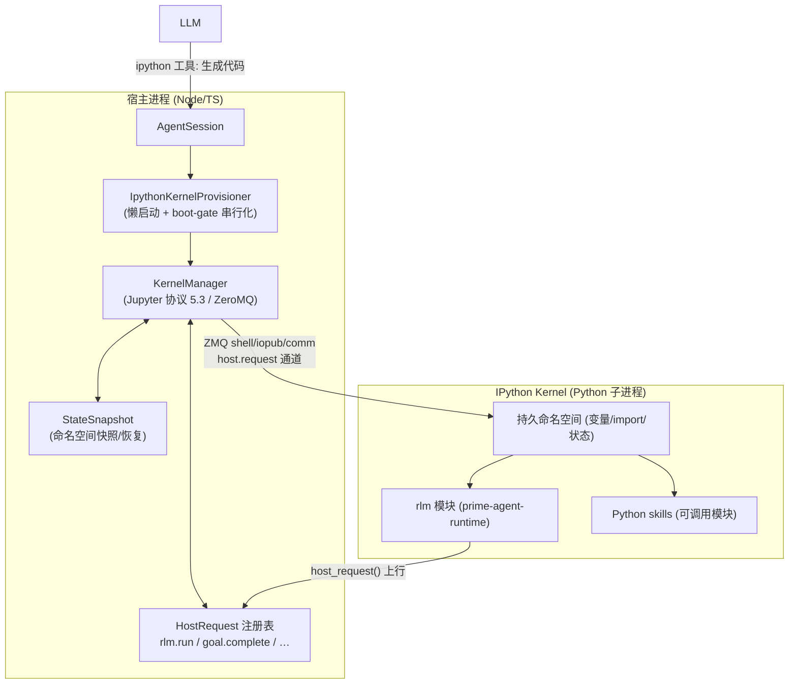

# Prime Agent 的 RLM 执行环境深挖 + 为什么 agent 都不用 LangGraph

> 日期：2026-08-19 ｜ 源码：`agent-framework/prime-agent/packages/coding-agent/src/core/{kernel, rlm-runtime.ts, tools/ipython.ts}`
> 配套：`analysis-prime.md` ｜ 编排对比：`analysis-orchestration-pi-dsh-claude.md`

---

## 一、RLM 执行环境是怎么工作的（代码级）

### 1.1 一句话

**RLM = 一个真实、持久的 IPython kernel 作为 agent 的"手"**：模型不调用"开闭式工具"，而是写 Python 代码在 kernel 里执行；代码通过一条 **kernel↔host 的 ZeroMQ comm 桥** 向宿主请求特权操作（spawn 子 agent、完成 goal 等）。子 agent 也是函数式递归（`rlm.run(prompt)`）。

### 1.2 分层结构

### 1.3 关键机制（对应源码）

| 机制 | 文件 | 说明 |
|---|---|---|
| **真实 Jupyter kernel** | `kernel/index.ts` | `KernelManager` 用 `spawn("python")` 起 `ipykernel`，按 Jupyter 消息协议 5.3（ZeroMQ，`<IDS\|MSG>`）通信；**持久 REPL**，变量/import 跨 turn 保留（源码 TODO：RLM-1 权重落地后再评估是否可改回无状态 `python -c`） |
| **启动 bootstrap** | `tools/ipython.ts` `buildRlmBootstrapCode()` | 内核启动时注入 `rlm` 模块 + 把 Python skills 包装成可调用模块进命名空间；缺 `prime-agent-runtime` 时注入带提示的 shim |
| **kernel↔host 桥** | `kernel/index.ts` `HOST_COMM_TARGET="host.request"` | Python 代码 `rlm.host_request(payload)` → comm 上行 → 宿主按 `type`（`rlm.run`/`goal.complete`…）分发到注册的 handler；handler 带 `HostRequestContext`（`requestId`/`generation`/`AbortSignal`/`isCurrent()`）做授权与吊销 |
| **模型侧工具** | `tools/ipython.ts` `ipython` tool | 模型的主要"手"：在 kernel 里执行 Python scratchpad / `%%bash` cell，返回 stdout/结果/diff/附件 |
| **递归子 agent** | `rlm-runtime.ts` | `rlm.run(prompt, **kwargs)` 由宿主 spawn 一个**真实子 agent session**（`RlmSpawnHandle`: `rlm_child_id/name/session_dir/model`），结果以返回值形式给回调用方；另提供 `list_subagents/delete_subagent/find_models` |
| **状态快照/恢复** | `kernel/state-snapshot.ts` | 每会话 artifact 目录存 kernel 命名空间快照，重启后 revive；`KernelDiffDisplay`/`KernelAttachment` 记录差异与附件 |
| **快速起 kernel** | `kernel/fork-server.ts` | Linux 上用 **fork 预烘好的 python 模板进程** 来起 kernel（比冷启动 `ipykernel_launcher` 快）；macOS 默认关，失败自动降级直接 spawn |
| **busy kernel 处理** | `tools/ipython.ts` | 中断后内核仍忙时，让用户选"等待保状态"或"杀 kernel 重启"（重启会丢内存态并通知模型） |

### 1.4 RLM 与传统工具调用的本质区别

| | 传统工具调用（bash/edit/search） | RLM（Prime） |
|---|---|---|
| 模型输出 | 结构化 tool call（JSON schema） | **直接生成 Python 代码** |
| 执行环境 | 每次独立、无状态 | **持久 IPython REPL**，变量/import 跨 turn 保留 |
| 上下文 | 由宿主拼接 | **context 即变量**（prompt-as-a-variable），代码可读写 |
| 子任务 | 宿主调度 | `rlm.run()` = **函数式递归**子 agent，返回结果给调用方 |
| 特权操作 | 宿主内建 | 代码经 `host_request` 桥请求，宿主授权（可吊销） |

> 一句话：Prime 把"agent 执行"做成了 **Jupyter kernel 当执行环境 + 代码即工具 + 递归子 agent 即函数调用** 的模型。对你的 hosted JupyterLab 扩展，这是"kernel 作为 agent 之手"最完整的参考实现（比"把 MCP 工具暴露给 agent"更进一步：kernel 本身就是 agent 的 REPL）。

---

## 二、为什么这些 agent 都不用 LangGraph？（它有问题吗）

### 2.1 先纠正一个前提

**不是"LangGraph 有问题"，而是"它解决的问题不在这些产品的核心层"**。事实上：

- `agent-framework/` 里 Pi / Prime / OpenClaw / Hermes / Claude Code / DeepSeek Harness **都没用 LangGraph**——它们要么手写 loop（Pi/Prime/Hermes/Claude），要么用**通用插件框架**而非 agent 框架（DeepSeek 用 Cordis，是个事件/插件框架，不是 agent 编排框架）。
- 但**官方 Jupyter AI（jupyter-ai-jupyternaut）的 agent 引擎就是 LangGraph**。所以 LangGraph 完全可用，这是"合不合适"的选择问题，不是"能不能用"。

### 2.2 真正的原因（按权重）

1. **agent loop 就是产品本身，不是插件**。对这些工具，循环（流式事件、steering 队列、工具执行语义、abort、LLM 边界转换）是核心卖点。手写约 300 行就能完全掌控；用 LangGraph 等于把自己的产品塞进它的"图/状态机"模型，处处要适配。
2. **它们需要的 loop 是简单的 ReAct，复杂在"边界"不在"图形"**。单 agent 线性循环就一个 `while(有tool_call)`；LangGraph 的 State/node/edge/reducer/checkpointer 是为**复杂分叉、多 agent、显式状态**设计的——对线性循环是纯负担。Pi/Prime 真正花功夫的是：流式事件、steering/follow-up 队列、thinking budget、convertToLlm、abort 语义——这些 LangGraph 都不直接给。
3. **事件/流式模型不同**。它们的 UI 订阅 `agent_start/turn_start/message_*/turn_end/agent_end` 并流式渲染 token/tool 事件；LangGraph 的 `astream_events` 事件模型不同，还是要自己写适配器。
4. **steering 语义 ≠ LangGraph 的 interrupt**。Pi/Prime 的 steering = "用户等待时插话，注入下一 turn 边界"（队列问题）；LangGraph 的 `interrupt()` = 人机协同断点（暂停等审批再恢复）。相关但不同，手写才能拿到精确语义。
5. **依赖与生态哲学**。这些项目都追求最小依赖/自控（Pi 自己写了 `pi-ai` 做模型抽象；DeepSeek 一切皆插件；Hermes 手搓）。LangGraph 会拉进整个 LangChain 生态——对想掌控 loop 的产品是"大而多约束"的包袱。
6. **执行环境超出 LangGraph 的工具模型**。Prime 的 RLM（持久 kernel + 递归子 agent）、DeepSeek 的"session log 为事实源 + 回放/fork"、Hermes 的 per-conversation 缓存——这些是运行时/持久化关注点，不是"图里的 tool node"。
7. **LangGraph 的头牌功能（持久化断点续跑）它们已经自己做了**。DeepSeek 用 append-only session log（回放/time-travel/fork 比 checkpointer 更强）；Prime 有 transcript+artifacts+命名空间快照；Hermes 有会话缓存。所以"为什么选 LangGraph"的最大理由（durable checkpoint）被它们的自研机制覆盖了。
8. **历史/血缘**。Pi→Prime/OpenClaw 共享一套代码库，loop 早就写好并持续投入；换成 LangGraph = 重写核心 + 失去控制 + 加依赖，收益却不明显。

### 2.3 什么时候 LangGraph 才是对的（平衡视角）

- **图形化控制流**：多 agent supervisor/swarm、条件分支、显式状态机、复杂循环。
- **要 durable checkpoint + time-travel + 人机审批，且不想自建**（`interrupt()` + checkpointer 白送）。
- **已经深度在 LangChain 生态里**（jupyter-ai 就是这样）。
- 团队更看重**迭代速度 > 对 loop 的完全掌控**，能接受其抽象。

### 2.4 对你的项目（hosted JupyterLab 扩展）

- 你的聊天面板 agent 就是 **Pi/Prime 的形状**：单 agent + MCP 工具 + 流式 + steering。用 Pydantic AI（Datalayer 同款，也是"自己写 loop"）合理。
- **LangGraph 唯一真正能加分的地方 = M4 的"断点续跑 + 审批"**（US4/US5）。届时二选一：LangGraph（checkpointer/interrupt 白送）或 Pydantic AI + 自建 session 持久化（可借鉴 DeepSeek 的 session-log 思路）。
- **RLM 是另一条路**：如果你的 agent 要长期"活在 kernel 里"（像 Prime 那样把 IPython 当 REPL），那 MCP 工具层 + RLM 式 kernel 执行是互补的——MCP 提供"受控工具"，kernel REPL 提供"自由执行"。二者可叠加，不冲突。

---

## 参考

- Prime RLM：`prime-agent/packages/coding-agent/src/core/kernel/{index.ts, bootstrap.ts, fork-server.ts, state-snapshot.ts}`、`rlm-runtime.ts`、`tools/ipython.ts`
- 编排对比：`analysis-orchestration-pi-dsh-claude.md` ｜ 设计文档：`jupyterlab-sidebar-poc/DESIGN.md`
