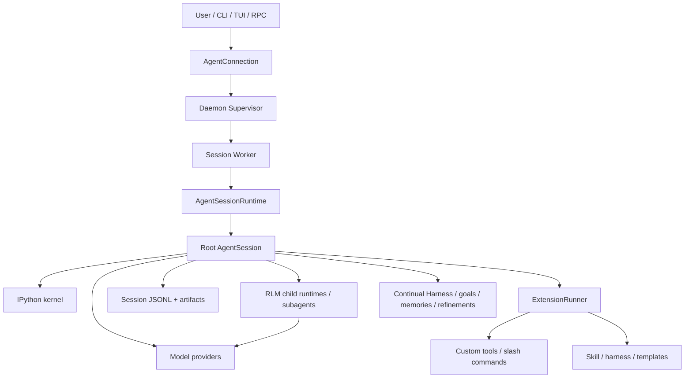
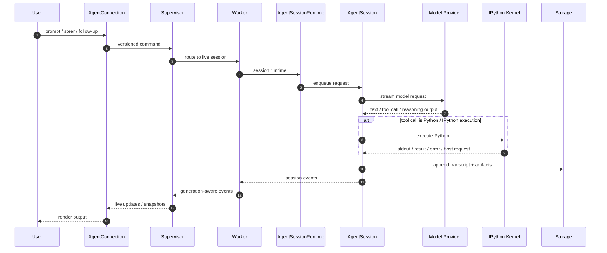
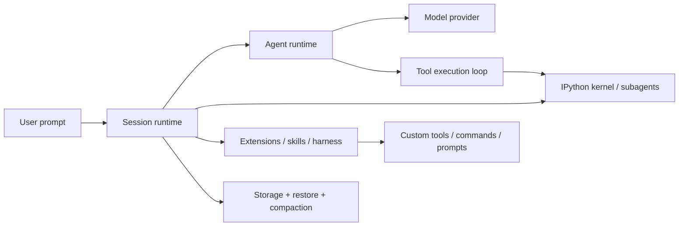

# Prime Agent 架构与实现分析

## 1. 总体结论

Prime Agent 不是一个“单纯聊天接口”，而是一个面向长期开发任务与研究工作的 agent 平台。它把能力拆成多个层次：

1. Agent runtime：负责状态、事件、tool 调用循环和 LLM 交互
2. Session runtime：负责长期任务上下文、历史、compaction、model 管理和 session 生命周期
3. RLM / kernel：把 Python / IPython 当作模型执行环境
4. Daemon / worker / supervisor：负责后台运行、恢复、重连和生命周期管理
5. Extensions / skills / harness：负责定制工作流、工具与持续改进

这几层共同构成了 Prime Agent 的核心架构。

相关源码入口：

- [agent-framework/prime-agent/README.md](prime-agent/README.md)
- [agent-framework/prime-agent/packages/agent/src/agent.ts](prime-agent/packages/agent/src/agent.ts)
- [agent-framework/prime-agent/packages/agent/src/agent-loop.ts](prime-agent/packages/agent/src/agent-loop.ts)
- [agent-framework/prime-agent/packages/coding-agent/src/core/sdk.ts](prime-agent/packages/coding-agent/src/core/sdk.ts)
- [agent-framework/prime-agent/packages/coding-agent/src/core/agent-session.ts](prime-agent/packages/coding-agent/src/core/agent-session.ts)
- [agent-framework/prime-agent/packages/coding-agent/src/core/agent-session-runtime.ts](prime-agent/packages/coding-agent/src/core/agent-session-runtime.ts)
- [agent-framework/prime-agent/packages/coding-agent/docs/architecture.md](prime-agent/packages/coding-agent/docs/architecture.md)
- [agent-framework/prime-agent/packages/coding-agent/src/core/extensions/index.ts](prime-agent/packages/coding-agent/src/core/extensions/index.ts)

---

## 2. 整体架构图

这张图体现了 Prime Agent 的核心特点：

- client 负责 UI，不负责真正执行
- supervisor 负责发现、路由、重连和恢复
- worker 负责运行一个 root runtime
- runtime 持有 session / scheduler / kernel / 子 agent
- model provider 只负责做模型调用；真正的“任务执行”在 session 和 runtime 里完成

---

## 3. 一次 prompt 的完整调用链

下面是一条从“用户输入文本”到“模型真正回复 + 可能执行工具 + 下一轮继续”的完整链路。

### 3.1 细化到源码层级

实际调用链会经过这些关键文件：

1. [agent-framework/prime-agent/packages/coding-agent/src/core/sdk.ts](prime-agent/packages/coding-agent/src/core/sdk.ts) 负责创建 AgentSession，装配 model registry、resource loader、工具和设置
2. [agent-framework/prime-agent/packages/coding-agent/src/core/agent-session-runtime.ts](prime-agent/packages/coding-agent/src/core/agent-session-runtime.ts) 负责 runtime lifecycle：replacement、shutdown、subagent host、session rebuild
3. [agent-framework/prime-agent/packages/coding-agent/src/core/agent-session.ts](prime-agent/packages/coding-agent/src/core/agent-session.ts) 处理：
   - session 转换与上下文
   - prompt 处理
   - model / thinking / service tier 管理
   - compaction / goals / autonomous / heartbeat
   - 扩展命令和 tool 接入
   - transcript 保存与恢复
4. [agent-framework/prime-agent/packages/agent/src/agent.ts](prime-agent/packages/agent/src/agent.ts) 创建 Agent，并维护 state + listeners + queue
5. [agent-framework/prime-agent/packages/agent/src/agent-loop.ts](prime-agent/packages/agent/src/agent-loop.ts) 真正驱动：
   - turn_start / turn_end
   - assistant message streaming
   - tool call validation
   - tool execution
   - continue / retry
6. Model provider 层负责返回 assistant message / tool call / reasoning stream
7. 真正的工具实现来自 [agent-framework/prime-agent/packages/coding-agent/src/core/tools](prime-agent/packages/coding-agent/src/core/tools)

### 3.2 关键观测点

这条链路上的关键点包括：

- `AgentSession` 不直接等于“单回合模型调用”，而是更接近“任务管理对象”
- `Agent` 和 `agent-loop` 是通用 runtime，低层做模型 + 工具循环
- `AgentSession` 在其上添加 persistent history、goals、compaction、harness、child agent 等能力
- `IPython kernel` 让工具调用可以不仅仅是 JSON schema，它可以是代码执行环境
- `supervisor + worker` 让 session 可以在后台持续运行并支持 attach / resume

---

## 4. Agent runtime：负责状态 + event + tool cycle

对应代码：

- [agent-framework/prime-agent/packages/agent/src/agent.ts](prime-agent/packages/agent/src/agent.ts)
- [agent-framework/prime-agent/packages/agent/src/agent-loop.ts](prime-agent/packages/agent/src/agent-loop.ts)
- [agent-framework/prime-agent/packages/agent/src/types.ts](prime-agent/packages/agent/src/types.ts)

### 4.1 它的职责

Agent runtime 是 Prime Agent 的通用执行引擎，负责：

- 维护 state：messages / tools / model / systemPrompt / thinkingLevel
- 维护 event flow：agent_start / turn_start / message_update / tool_execution_* / turn_end / agent_end
- 维护 queue：steering / followUp
- 负责 tool 调用循环：LLM -> 工具 -> 结果 -> 再发起下一轮
- 提供 hooks：beforeToolCall / afterToolCall / shouldStopAfterTurn / getContinuationMessages
- 允许多轮与中途插队 steering / follow-up

### 4.2 设计特点

- Stateful：Agent 是长生命周期对象，而不是一次性调用
- Event-driven：UI、扩展和外部宿主都可以订阅事件流，而不需要轮询状态
- Tool-using loop：不是纯文本生成，而是“工具驱动工作流”
- Queue-aware：允许在中途插入 steer 或 follow-up prompt
- Support for parallel / sequential execution：工具调用可以按不同模式执行

### 4.3 为什么这是关键层

这个层决定了 Prime Agent 是否是“真正的 agent”，而不只是“聪明聊天机器人”。

它把 agent 抽象成：

- 一个状态机
- 一个事件源
- 一个工具执行循环
- 一个上下文驱动器

这也是它最核心的运行时抽象。

---

## 5. Session runtime：负责开发任务上下文 + 长期历史 + compaction + model 管理

对应代码：

- [agent-framework/prime-agent/packages/coding-agent/src/core/agent-session.ts](prime-agent/packages/coding-agent/src/core/agent-session.ts)
- [agent-framework/prime-agent/packages/coding-agent/src/core/agent-session-runtime.ts](prime-agent/packages/coding-agent/src/core/agent-session-runtime.ts)
- [agent-framework/prime-agent/packages/coding-agent/src/core/sdk.ts](prime-agent/packages/coding-agent/src/core/sdk.ts)
- [agent-framework/prime-agent/packages/coding-agent/src/core/session-manager.ts](prime-agent/packages/coding-agent/src/core/session-manager.ts)

### 5.1 它的职责

Session runtime 是更贴近“开发任务”的那层，它负责：

- 维护 session 完整历史
- 处理 switch / resume / fork / branch / clone
- 处理 compaction 和 summarization
- 管理 model、thinking level、service tier
- 生成系统提示词
- 注册并管理工具集合
- 绑定 extension lifecycle
- 管理 goals、autonomous mode、heartbeat、schedules
- 持久化任务 state 和 artifacts

### 5.2 这是“开发型 agent”而不是“聊天型 agent”的关键层

在应用中，用户不只是聊天，而是在做较长周期的工作：

- 查代码
- 看历史
- 修改文件
- 运行测试
- 继续迭代
- 让多个任务在后台持续运行

这样的任务需要：

- 可恢复上下文
- 可压缩上下文
- 可分支回溯
- 可持久化 session
- 可脱离终端持续运行

这正是 Session runtime 的设计目标。

### 5.3 compaction 与上下文管理

Prime Agent 的 compaction 逻辑体现在 [agent-framework/prime-agent/packages/coding-agent/src/core/agent-session.ts](prime-agent/packages/coding-agent/src/core/agent-session.ts) 中，且它与 session 管理和 summary 机制结合得更紧密。可以看到它强调：

- `shouldCompact`
- `prepareCompaction`
- compaction summary
- session history rewrite / branch summary
- context window awareness

这说明 Prime Agent 不会简单把所有消息塞给模型，而会根据上下文长度、任务状态和工作流做压缩和重建。它具有更强的工程感。

### 5.4 为什么它比 Pi 更偏“长期工作流”

Pi 也有 session runtime 和 compaction，但 Prime Agent 在多个方向上更进一步：

- worker / supervisor / daemon 模式
- IPython persistent REPL
- goals / heartbeats / autonomous
- continual harness / refinement
- session tree / detached subagents

也就是说，Prime Agent 的 session runtime 不仅仅是上下文管理器，它更像长期工作的状态机器。

---

## 6. RLM / kernel：把 Python 变成执行环境

README 中对 Prime Agent 的定位非常明确：

- “Everything is programmatic”
- “persistent IPython is the built-in model tool”
- “file operations, shell commands, tool use, subagents, and context management happen through code”

这说明它的模型调用不是只生成文本，而是：

- 生成 Python 代码
- 在 kernel 中执行
- 返回结果/错误/stdout
- 通过 host request 获取“宿主操作”能力
- 调用子 agent 或继续工作流

### 6.1 为什么这很关键

传统聊天型 agent 的工具往往是“开闭式工具调用”：模型说“调用 bash / edit / search”。

Prime Agent 把环境做成了更强的代码执行抽象：

- 模型在一个重用的 Python REPL 中持续工作
- 代码产生 tool-like 语义
- 代码可以直接读取/写入状态和上下文
- 子 agent 可作为函数调用式递归能力被调度

这让它不仅能够写代码，还能做“程序化任务编排”。

### 6.2 它和传统 tool 的区别

在 Prime Agent 中，工具和“代码执行环境”是更紧耦合的：

- execution not just command call
- context is variables / state / prompt-as-variable
- subagents are built as first-class runtime objects

这几乎是一种“agent-as-programming-environment”的设计。

---

## 7. Daemon / worker / supervisor：后台与恢复能力

Prime Agent 的架构文档非常强调 process boundary：

- interaction client owns rendering and UI preferences
- supervisor owns discovery, routing, attachment, recovery
- each worker owns one root runtime, scheduler, kernels, descendants
- storage persists session JSONL and artifacts

这是它和典型“本地单进程” agent 最大区别之一。

### 7.1 它解决了什么问题

它让 Prime Agent 能：

- 在终端退出后保持任务继续
- attach/re-attach 到已有 session
- 恢复 live state
- 让多个 session 共享一个 daemon/service boundary
- 分离 UI 和 execution

### 7.2 为什么这很重要

很多 agent 只是单次交互式 shell；Prime Agent 真正把 agent 当作“后台进程/长任务系统”来设计。对于研究和工程任务，这种设计非常关键，因为任务往往不是 1 分钟内完成，而是“可持续推进”的工作流。

---

## 8. Extensions / skills / harness：负责增强和定制工作流

对应代码：

- [agent-framework/prime-agent/packages/coding-agent/src/core/extensions/index.ts](prime-agent/packages/coding-agent/src/core/extensions/index.ts)
- [agent-framework/prime-agent/packages/coding-agent/src/core/skills.ts](prime-agent/packages/coding-agent/src/core/skills.ts)
- [agent-framework/prime-agent/packages/coding-agent/src/core/refinement/index.ts](prime-agent/packages/coding-agent/src/core/refinement/index.ts)

### 8.1 Extension

Extension 不是“附加功能”，而是完整的扩展点系统。

Prime Agent 中扩展能接入：

- lifecycle events
- commands
- custom tools
- UI rendering
- session lifecycle hooks
- message routing / input handling

`ExtensionRunner` 统一分发事件，说明扩展能力是平台化的，而不是孤立工具。

### 8.2 Skill

README 明确说 skills 可以是可执行 Python package，而且可以从 recurring workflow 提炼成 reusable skills。

这说明两点：

- skill 不仅是 prompt template
- skill 是“可复用工作过程”的具体化

这和 Pi 的 skill 设计类似，但 Prime Agent 把它提升到了“可执行、可工程化的 package”层面。

### 8.3 Continual Harness

这是 Prime Agent 最独特的部分之一。

它把 supplemental prompts、memory、skill descriptions、reusable subagent specifications 作为 durable state 持久化，并允许通过 `/refine` 对其进行小规模、证据驱动的更新。关键特征：

- 不改写 base system prompt
- 更新记录可 review / rollback
- 提升的是“学习和记忆”，而不是直接覆盖核心原则

这让它从单次 agent 调用，变成了长期自我改进的工作流系统。

---

## 9. 三层架构如何协同

Prime Agent 的精髓不是单一功能，而是多层协同：

高层关系可以概括为：

- 用户输入先由 Session runtime 处理上下文与工作流
- 再交给 Agent runtime 做 LLM/tool 执行循环
- RLM / kernel 提供更强的代码执行环境
- extensions / skills / harness 在中间加入持久化增强和自定义行为
- daemon / worker / supervisor 保证任务可长期存活和恢复

这就是 Prime Agent 能够胜任复杂开发任务和长期研究任务的关键：

它不是单一的模型调用，而是“工作流驱动的 agent 执行器 + 持久化任务系统”。

---

## 10. 模块关系：从源码到系统的理解方式

可以把 Prime Agent 拆成三个明显层次：

### 10.1 低层：Agent runtime

- [agent-framework/prime-agent/packages/agent/src/agent.ts](prime-agent/packages/agent/src/agent.ts)
- [agent-framework/prime-agent/packages/agent/src/agent-loop.ts](prime-agent/packages/agent/src/agent-loop.ts)
- [agent-framework/prime-agent/packages/agent/src/types.ts](prime-agent/packages/agent/src/types.ts)

职责：

- 统一消息状态
- 事件流
- 工具执行
- LLM loop

### 10.2 中层：coding-agent / session runtime

- [agent-framework/prime-agent/packages/coding-agent/src/core/sdk.ts](prime-agent/packages/coding-agent/src/core/sdk.ts)
- [agent-framework/prime-agent/packages/coding-agent/src/core/agent-session.ts](prime-agent/packages/coding-agent/src/core/agent-session.ts)
- [agent-framework/prime-agent/packages/coding-agent/src/core/agent-session-runtime.ts](prime-agent/packages/coding-agent/src/core/agent-session-runtime.ts)
- [agent-framework/prime-agent/packages/coding-agent/src/core/session-manager.ts](prime-agent/packages/coding-agent/src/core/session-manager.ts)

职责：

- session 创建与恢复
- model 和工具注册
- long-running task lifecycle
- compaction / summary / persistence
- extension integration

### 10.3 上层：provider / execution / UI / daemon

- [agent-framework/prime-agent/packages/ai/src/index.ts](prime-agent/packages/ai/src/index.ts)
- [agent-framework/prime-agent/packages/coding-agent/src/core/extensions/index.ts](prime-agent/packages/coding-agent/src/core/extensions/index.ts)
- [agent-framework/prime-agent/packages/coding-agent/docs/architecture.md](prime-agent/packages/coding-agent/docs/architecture.md)

职责：

- provider 层负责 LLM 访问
- extension 层负责 command / tool / hooks
- daemon + worker 层负责后台存活和恢复
- UI 层负责交互渲染

---

## 11. 一句话总结

Prime Agent 的整体设计可以概括为：

- Agent runtime 负责“怎么跑”
- Session runtime 负责“在什么上下文里跑、跑多久、怎么恢复”
- RLM / kernel 负责“用代码和 Python 作为可执行环境”
- Extension / skill / harness 负责“怎么定制和增强跑法”
- Daemon / worker / supervisor 负责“怎么持续生存和重新附着”

它做成了一个既有强工具能力，又有长期任务管理、工程化 context 管理和后台存活能力的 coding research agent 平台。

如果把它和 Pi 做比较，最准确的说法是：

- Pi 更像“通用 agent runtime + coding session runtime”
- Prime Agent 更像“长期运行的 agent operating system”

它把 session、kernel、子 agent、persistent harness 和恢复能力一起纳入了一个更完整、更工程化的框架。
