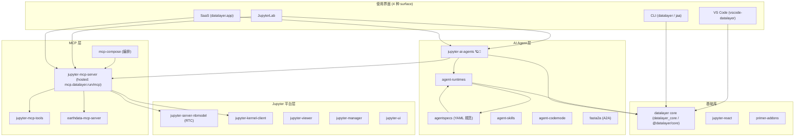

# Datalayer 产品调研报告

> 调研日期：2026-08-19 ｜ 范围：datalayer 开源组织（github.com/datalayer）下的产品，重点深挖 **jupyter-ai-agents**
> 数据来源：datalayer.ai 官网、GitHub org 仓库列表（44 个 repo）、各 repo README / 源码（本地镜像：`agent-framework/jupyter-ai-agents`、`agent-framework/jupyter-mcp-server`）

---

## 一、公司定位与商业模式

**一句话定位**：*"Make Jupyter the best place for AI to work with Data"* —— 把 Jupyter 变成 AI 处理数据的"主场"，让编码 agent 升级为数据 agent。

**商业模式：开源核心（local）+ 托管 SaaS（hosted）双轨**

- **开源侧**：BSD-3-Clause 开放全部组件，`jupyter-mcp-server` 可直接本地对接自有 Jupyter，无账号、免费。
- **托管侧**（datalayer.ai / datalayer.app）：
  - **Hosted Jupyter MCP endpoint**：`https://mcp.datalayer.run/mcp`，无需自己跑进程；OAuth 2.1 浏览器授权，agent 拿到的 token 按 scope（`notebooks:read` / `notebooks:write` / `code:execute` / `data:read`）授权，可单独吊销某个 agent。
  - **Always-on Notebook**：notebook 状态在服务器端，断连不丢，Durable Cells & Outputs 支持长任务。
  - **GPU / CPU Code Sandbox**：可切到 Datalayer 托管算力或自带算力（自建 / Kaggle / Google Colab / Modal 等）。
  - **Datalayer Agent Workers**：托管 agent 运行（"Cheaper, faster, trusted, no lock-in"）。

**核心团队**：Eric Charles（echarles，主创始人/主程）、Eléonore Charles、Frédéric Collonval（fcollonval，Jupyter 生态知名贡献者）、Rômulo Rosa。

---

## 二、产品矩阵全景（GitHub 44 个 repo 分类）

> 星数为 2026-08 查询 GitHub API 的近似实时值。

### 2.1 AI Agent 层（核心赛道）

| 项目                        | 一句话说明                                                                                                                          | License | ★   | 链接                                   |
| --------------------------- | ----------------------------------------------------------------------------------------------------------------------------------- | ------- | ---- | -------------------------------------- |
| **jupyter-ai-agents** | JupyterLab 内的 AI agents + MCP tools + skills，与 notebook 聊天并执行代码                                                          | BSD-3   | ~159 | github.com/datalayer/jupyter-ai-agents |
| **agent-runtimes**    | 统一多协议 agent 部署库（ACP / Vercel AI SDK / AG-UI / MCP-UI / A2A），Python server + React 组件                                   | BSD-3   | ~21  | github.com/datalayer/agent-runtimes    |
| **agentspecs**        | YAML 声明式 agent 规范（agents / teams / mcp-servers / skills / guardrails / evals…），编译成 Python/TS 目录供 Agent Runtimes 消费 | BSD-3   | ~5   | github.com/datalayer/agentspecs        |
| **agent-skills**      | 可复用 code-based tool 组合（skills）的创建/管理/执行                                                                               | BSD-3   | ~14  | github.com/datalayer/agent-skills      |
| **agent-codemode**    | 从 MCP servers 和 skills 生成程序化工具（codemode）                                                                                 | BSD-3   | ~4   | github.com/datalayer/agent-codemode    |
| **fasta2a**           | 把一个 AI agent 转成 A2A server                                                                                                     | MIT     | ~217 | github.com/datalayer/fasta2a           |
| codeai                      | CLI 数据分析 agent（走 AG-UI + ACP），**已归档**                                                                              | BSD-3   | ~3   | github.com/datalayer/codeai            |

### 2.2 MCP 层（基础设施）

| 项目                           | 一句话说明                                                                                                                       | License | ★    | 链接                                          |
| ------------------------------ | -------------------------------------------------------------------------------------------------------------------------------- | ------- | ----- | --------------------------------------------- |
| **jupyter-mcp-server**   | 最主流的 Jupyter MCP server：让任意 MCP 客户端读写/执行 notebook，支持多种 sandbox 后端                                          | BSD-3   | ~1.2k | github.com/datalayer/jupyter-mcp-server       |
| **jupyter-mcp-tools**    | MCP tools 集合（被 jupyter-mcp-server / jupyter-ai-agents 复用）                                                                 | BSD-3   | ~10   | github.com/datalayer/jupyter-mcp-tools        |
| **mcp-compose**          | "Docker Compose 版" MCP 编排：多 server 管理、协议翻译（STDIO↔SSE/HTTP）、REST API(32 端点) + React Web UI + Prometheus/Grafana | BSD-3   | ~9    | github.com/datalayer/mcp-compose              |
| **earthdata-mcp-server** | NASA Earthdata MCP server（科学数据场景）                                                                                        | BSD-3   | —    | github.com/datalayer/earthdata-mcp-server     |
| datalayer-mcp-server           | 给任意 MCP 客户端加代码解释能力                                                                                                  | —      | ~1    | github.com/datalayer/datalayer-mcp-server     |
| langchain-mcp-client           | LangChain MCP client                                                                                                             | Other   | ~10   | github.com/datalayer/langchain-mcp-client     |
| jupyter-earth-mcp-server       | 早期地球科学 MCP（**已归档**）                                                                                             | BSD-3   | —    | github.com/datalayer/jupyter-earth-mcp-server |

### 2.3 Jupyter 平台 / notebook 基础设施

| 项目                             | 一句话说明                                                               | License | ★  |
| -------------------------------- | ------------------------------------------------------------------------ | ------- | --- |
| **jupyter-server-nbmodel** | Server-side Notebook（nbmodel，RTC 底座，Yjs/CRDT）                      | BSD-3   | ~44 |
| jupyter-nbmodel-client           | NbModel 客户端                                                           | BSD-3   | ~16 |
| jupyter-kernel-client            | 经 HTTP/WebSocket 的 kernel client（支持 Kaggle / Colab 等远端 sandbox） | BSD-3   | —  |
| jupyter-server-client            | Jupyter Server client                                                    | BSD-3   | ~3  |
| jupyter-viewer                   | 纯 React 的 serverless notebook viewer（NbViewer 风格）                  | BSD-3   | ~24 |
| jupyter-ui                       | 100% 兼容 Jupyter 的 React 组件                                          | BSD-3   | —  |
| jupyter-dashboard                | Jupyter Dashboard WYSIWYG                                                | BSD-3   | ~16 |
| jupyter-manager                  | Jupyter 平台管理 UI（devops/MLOps）                                      | Other   | ~17 |
| jupyter-mimetypes                | 输出表示代理（mimetype 扩展）                                            | BSD-3   | ~4  |
| jupyter-rtc-test                 | Jupyter RTC 压力测试（**已归档**）                                 | BSD-3   | —  |

### 2.4 前端 / 基础库（支撑组件）

| 项目                        | 一句话说明                                                                                             | License       |
| --------------------------- | ------------------------------------------------------------------------------------------------------ | ------------- |
| **core**              | `datalayer_core`（Python）+ `@datalayer/core`（TS/React）：统一认证、CLI、runtime 抽象、React 组件 | BSD-3         |
| jupyter-react               | Jupyter + React 集成层                                                                                 | BSD-3         |
| primer-addons / primer-rjsf | Primer React 的补充组件 / JSON Schema Form                                                             | BSD-3 / Other |
| icons                       | React + JupyterLab 图标库（数据产品）                                                                  | BSD-3         |
| reactor                     | 可扩展 Python + React.js 应用的插件框架                                                                | BSD-3         |
| lexical-loro                | Lexical 富文本协同插件（Loro CRDT）                                                                    | BSD-3         |

### 2.5 部署 / 云 / 工程

| 项目                                                                                             | 一句话说明                                                   |
| ------------------------------------------------------------------------------------------------ | ------------------------------------------------------------ |
| vscode-datalayer                                                                                 | VS Code 扩展（data/AI/GPU/runtimes）                         |
| desktop                                                                                          | Datalayer Desktop（Electron）                                |
| code-sandboxes                                                                                   | Code Sandbox 服务                                            |
| helm-charts / clouder / github-actions / grafana-dashboards / metarepo / rfc / support / .github | 部署与工程配套                                               |
| datalayer                                                                                        | meta 包：`pip install datalayer` 一次装齐所有 Datalayer 包 |
| examples / skills                                                                                | 示例与官方 skills 集合                                       |

---

## 三、核心深挖：jupyter-ai-agents 🪐🤖

### 3.1 是什么

JupyterLab 的 **AI agents + MCP tools + skills** 扩展。在 JupyterLab 右侧面板提供 Chat 界面，基于 **Pydantic AI** 做 agent 编排、**Vercel AI Elements** 做 UI 组件，默认把 **Jupyter MCP Server** 作为 Jupyter server 扩展启动，agent 通过 `/mcp` 端点拿到全部 Jupyter 工具（读写 cell、执行代码、管理文件、切换 sandbox 等）。修改通过 **Jupyter RTC**（`datalayer_pycrdt`）实时回显到 notebook。

### 3.2 双端架构

```
┌─────────────────────────────────────────────────────────────────┐
│ 前端 (JupyterLab 扩展, TS/React)                                  │
│  src/Chat.tsx → @datalayer/agent-runtimes/lib/chat/Chat 组件      │
│   + AgentRuntimesClient + @datalayer/core (coreStore/iamStore)    │
│   + @datalayer/jupyter-react + Primer (@primer/react) + Tailwind  │
└──────────────────────────────┬──────────────────────────────────┘
                               │ HTTP (Vercel AI SDK 流式协议)
┌──────────────────────────────┴──────────────────────────────────┐
│ 后端 (jupyter_server ExtensionApp, Python)                        │
│  JupyterAIAgentsExtensionApp (name="agent_runtimes")              │
│  ├─ handlers/chat_handler.py  VercelAIChatHandler                 │
│  │    = VercelAIAdapter(Pydantic AI agent) +                      │
│  │      MCPServerStreamableHTTP → 本地 /mcp 端点                   │
│  │      (TornadoRequestAdapter 把 Tornado req 适配成 Starlette)   │
│  ├─ handlers/config.py / index.py                                │
│  └─ agents/  chat_agent / prompt / explain_error                 │
└──────────────────────────────┬──────────────────────────────────┘
                               │ MCP (streamable HTTP)
                    ┌──────────┴──────────┐
                    │ jupyter-mcp-server  │ ← 作为 Jupyter server 扩展同进程启动
                    │ (jupyter_mcp_server)│
                    └─────────────────────┘
```

### 3.3 三种 Agent

| Agent                         | 文件                                            | 职责                                        | 关键点                                                                                                                             |
| ----------------------------- | ----------------------------------------------- | ------------------------------------------- | ---------------------------------------------------------------------------------------------------------------------------------- |
| **Chat Agent**          | `agents/chat_agent.py`                        | 通用对话助手（写作/调试/数据分析/科学计算） | 默认`claude-sonnet-4-5`（README 说 Sonnet 4.0）；纯 Pydantic AI Agent，无自带工具集                                              |
| **Prompt Agent**        | `agents/prompt/prompt_agent.py`               | 按指令**创建并执行** notebook 代码    | 挂 MCP toolset；system prompt 要求"装包→导入→写码→加 markdown→逐个执行并验证"；`max_tool_calls=10`；完成时只回文字不再调工具 |
| **Explain Error Agent** | `agents/explain_error/explain_error_agent.py` | 解释错误                                    | 面向 traceback 修复场景                                                                                                            |

### 3.4 CLI 与多模型

- 入口脚本：`jupyter-ai-agents`（别名 `jaa`）、`jupyter-ai-agents-console`
- 子命令：**`prompt`**（创建/执行代码）、**`explain-error`**、**`repl`**
- 9 个 provider：`openai` / `anthropic` / `azure-openai`（需 `AZURE_OPENAI_ENDPOINT` 等）/ `github-copilot` / `google` / `bedrock` / `groq` / `mistral` / `cohere`
- 指定模型两种方式：`--model "openai:gpt-4o"` 或 `--model-provider X --model-name Y`

### 3.5 依赖的 Datalayer 组件（供应链关系）

- `@datalayer/agent-runtimes`（Chat 组件 / AgentRuntimesClient）
- `@datalayer/core` + `datalayer_core`（认证、store、DEFAULT_SERVICE_URLS）
- `@datalayer/jupyter-react`、`@datalayer/primer-addons`
- `agent-runtimes`（Python）、`jupyter_mcp_server`、`jupyter_mcp_tools`
- 版本：npm `@datalayer/jupyter-ai-agents` **0.20.8**；PyPI `jupyter_ai_agents`

> ⚠️ **已知安装坑**（README 明示）：需 `pip uninstall -y pycrdt datalayer_pycrdt` 后再 `pip install datalayer_pycrdt==0.12.17` 才能绕过 pycrdt 库的 bug/限制。

### 3.6 路线图（README "What's Coming Next"）

- 更多 LLM provider
- 增强 MCP server 配置
- 把其他 MCP server 的工具暴露给 Chat
- 更多增强功能

---

## 四、Agent Runtimes（jupyter-ai-agents 的底座）简述

- **多协议抽象**：一套 agent 同时暴露 ACP / Vercel AI SDK / AG-UI / MCP-UI / A2A，不改代码。
- **框架灵活**：Pydantic AI（已实现）、LangChain（adapter 就绪）、Jupyter AI（adapter 就绪）。
- **Cloud Runtime 管理**：对接 Datalayer Cloud Runtimes，Zustand 状态管理。
- **UI 组件**：`ChatBase` / `ChatSidebar` / `ChatFloating`。
- **Agent Node**：agent 节点向 Datalayer Runtimes API 注册/心跳，tunnel 路由消息，支持 private/shared/sleep 模式。
- **观测/持久化**：OpenTelemetry、DBOS 持久化、LLM 上下文优化。
- **Evals**：基于 agentspecs 的多 agent 对比实验 CLI（`agent-runtimes evals`）。
- 后端 plane 微服务（`plane local`）：IAM / Runtimes / Spacer / Library / Manager / AI-Agents / AI-Inference / MCP-Servers / Growth / Success / Status / Support。

---

## 五、生态关系图



---

## 六、竞品 / 生态定位

| 同类                                                                                   | 差异点                                                                                                                                                                              |
| -------------------------------------------------------------------------------------- | ----------------------------------------------------------------------------------------------------------------------------------------------------------------------------------- |
| **Jupyter AI**（官方 jupyterlab/jupyter-ai，~4.4k★）                            | 官方走"AI personas + Frontier Agents（经 ACP 协议接入 Claude/Codex/Copilot…）"；Datalayer 走**MCP + Pydantic AI + Vercel AI 协议**，且强调笔记本常驻服务端、agent 断连不掉线 |
| **thread-notebook** / **notebook-intelligence** / **jupyter-studio** | 社区 JupyterLab AI 扩展；Datalayer 的差异化在**托管能力**（always-on notebook、GPU sandbox、hosted MCP、OAuth scope 授权、团队协作/权限）                                     |
| **jupyter-mcp-server vs cursor-notebook-mcp / vscode-runtime-notebook-mcp**      | jupyter-mcp-server 是同类中规模最大（~1.2k★）、最主流的 Jupyter MCP server，且自带 hosted 版本                                                                                     |

**一句话总结**：Datalayer = **开源 Jupyter 数据栈（nbmodel/RTC + MCP + agents）之上，卖"托管 notebook + GPU sandbox + hosted MCP endpoint + 托管 agent workers"**；jupyter-ai-agents 是它把"AI agent 接进 Jupyter 聊天/执行"的旗舰开源产品，jupyter-mcp-server 是流量入口，agent-runtimes / agentspecs 是上层 agent 基建。

---

## 七、参考链接

- 官网：https://datalayer.ai ｜ 平台：https://datalayer.app ｜ 文档：https://datalayer.ai/docs
- GitHub org：https://github.com/datalayer
- jupyter-ai-agents：https://github.com/datalayer/jupyter-ai-agents ｜ docs：https://jupyter-ai-agents.datalayer.tech
- jupyter-mcp-server：https://github.com/datalayer/jupyter-mcp-server ｜ docs：https://jupyter-mcp-server.datalayer.tech ｜ hosted：https://mcp.datalayer.run/mcp
- agent-runtimes：https://github.com/datalayer/agent-runtimes ｜ docs：https://agent-runtimes.datalayer.tech
- agentspecs：https://github.com/datalayer/agentspecs ｜ mcp-compose：https://github.com/datalayer/mcp-compose
- DeepWiki：jupyter-mcp-server / jupyter-ai-agents 均已收录（见 `deepwiki.md`）

---

## 八、给 hosted JupyterLab extension 开发者的参考清单

> 目标场景：做一个**跑在托管/云环境的 JupyterLab 扩展**（notebook 状态、kernel、执行结果都在服务端，前端或 agent 断连不影响）。下面从本报告 + 工作区现成素材提炼可参考点。

### 8.1 先理解 "hosted" 的架构本质（从 Datalayer 商业模式反推）

- **双端扩展是前提**：前端薄（JupyterLab prebuilt 插件，只做 UI/渲染），后端厚（`jupyter_server` `ExtensionApp`，承载状态、执行、权限、认证）。LLM key、kernel 执行、文件读写天然在 server 侧。
- **状态必须在服务端**："Always-on Notebook / Durable Cells & Outputs" = notebook 状态存 server（`jupyter-server-nbmodel` + RTC/CRDT），不是存在浏览器或 agent 会话里。
- **多 surface 复用**：同一套 server 扩展同时服务 JupyterLab / VS Code / CLI / SaaS ⇒ 业务逻辑放 server，前端只是"薄壳"。
- **权限服务端化**：notebook 权限同时约束人类和 agent；agent 接入用 **OAuth 2.1 + scope**（`notebooks:read/write`、`code:execute`、`data:read`）+ 可单独吊销的 token，而不是把用户 API key 塞进浏览器。

### 8.2 直接从 jupyter-ai-agents 抄的样板

| 要抄的部分 | 参考点 | 文件/位置 |
|---|---|---|
| Python 打包 | hatchling + `hatch-jupyter-builder` + `jupyter-config/server-config` 自动注册 server 扩展 | `pyproject.toml` |
| 后端骨架 | `ExtensionApp`（`name` / `extension_url` / `Launcher` configurable）+ handlers | `jupyter_ai_agents/extension.py`、`handlers/base.py` |
| API handler | Tornado `APIHandler` 风格；`initialize_settings` 里放 server 连接信息 | `handlers/*.py` |
| 流式聊天 | **Vercel AI SDK 协议**：前端 `useChat` + 后端 `VercelAIChatHandler`（`VercelAIAdapter` + `MCPServerStreamableHTTP`），是 AI 面板的现成参考 | `handlers/chat_handler.py` |
| 前端接线 | `ServerConnection.makeSettings()` 取 baseUrl/token；`ReactWidget` + `ILayoutRestorer` | `src/Chat.tsx`、`src/widget.tsx` |
| RTC 回显 | `jupyter-collaboration` + `datalayer_pycrdt`（注意 pycrdt 兼容坑） | `pyproject.toml` 依赖 |
| 认证 UI 复用 | `@datalayer/core` 的 `coreStore/iamStore/SignInSimple`、`DEFAULT_SERVICE_URLS` | `src/Chat.tsx` |

### 8.3 hosted 特有问题 → 设计决策（Datalayer 已给答案）

- **长任务/断连续跑**：server 端执行 + 状态持久化；agent-runtimes 用 **DBOS durable execution**，会话持久化可参考 langgraph-checkpoint-sqlite。
- **算力抽象**：执行后端做成可插拔——`jupyter-mcp-server` 的 sandbox variants（`jupyter / datalayer / kaggle / colab / monty / modal`）+ `jupyter-kernel-client`（HTTP/WS kernel，支持远端 sandbox）。
- **工具层别自造**：直接依赖 `jupyter_mcp_tools` / `jupyter_ai_tools`（notebook 读写/执行工具，`collaborative_tool` 装饰器自带 RTC 感知）。
- **可观测**：`jupyter-mcp-server` 的 OpenTelemetry hooks（追踪工具调用与 kernel 执行）。
- **多租户/部署**：datalayer plane 微服务切分（IAM / Runtimes / Spacer / Library / Manager / AI-Agents / AI-Inference / MCP-Servers）+ `helm-charts`。

### 8.4 工作区里比 Datalayer 更"从零做"的现成素材

- **`jupyterlab-sidebar-poc/`**：prebuilt 前端扩展最小骨架（`package.json` / `pyproject.toml` / `tsconfig.json` / `ReactWidget` / `_jupyter_labextension_paths()` / `jupyter-builder develop` 工作流）。
- **`dev-lessons/jupyterlab-extension-pitfalls.md`**：两个必踩坑——① TS 版本与 JupyterLab 4.6+ 类型漂移（升 TS ~5.8 + `skipLibCheck`）；② `pyproject [project].name` 必须与 Python 包名一致（否则 `jupyter-builder develop` 报 ModuleNotFoundError）。
- **`jupyter-ai-extension-plan.md`**：完整的 AI 类扩展蓝图（双层架构、`@notebook` 上下文系统、checkpoint 变更管理、M0–M7 分步路线）。若你的 hosted 扩展是 AI 类，这篇是主蓝图，Datalayer 调研是"托管化"的补丁。
- **`jupyter-architecture.md`**：Jupyter 底层架构（协议/kernel/server/扩展机制）的决策依据。

### 8.5 推荐落地组合（如果现在动手）

1. **骨架**：照 `jupyterlab-sidebar-poc`（或 `copier jupyterlab/extension-template`）起 prebuilt 前端扩展 + 同名 server 扩展（`discovery.server` 联动）。
2. **后端**：`ExtensionApp` + `APIHandler`（REST）+ 流式 handler（SSE/WebSocket，参考 Vercel AI 协议实现）。
3. **工具/执行**：依赖 `jupyter_mcp_tools` 或 `jupyter_ai_tools`；执行后端走 MCP sandbox 抽象（可插拔）。
4. **AI 编排**（若做 AI 面板）：Pydantic AI（与 Datalayer 同栈）或 LangGraph；流式用 Vercel AI SDK 协议。
5. **hosted 三件套**：状态存 server（SQLite / DBOS）、权限 scope 化（OAuth 2.1）、断连续跑（server 端后台任务 + 持久化）。
