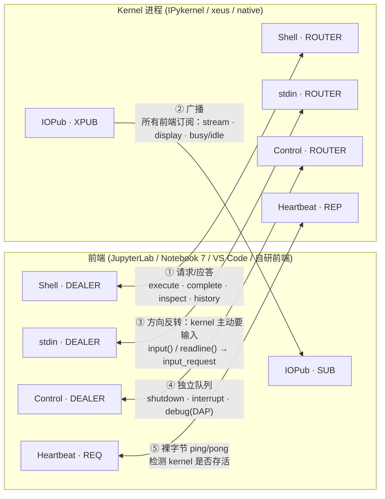
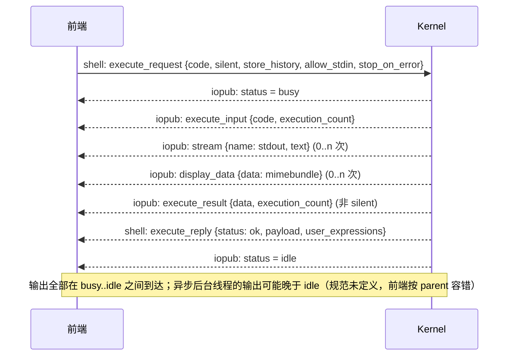
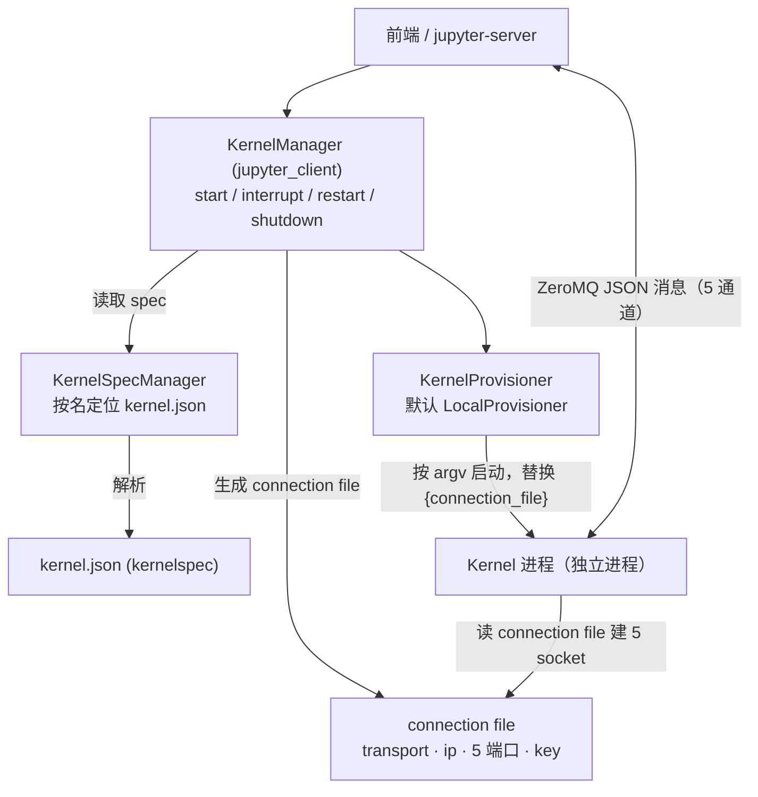
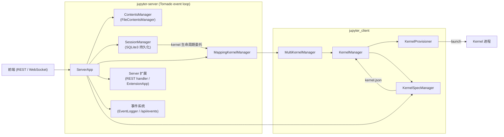
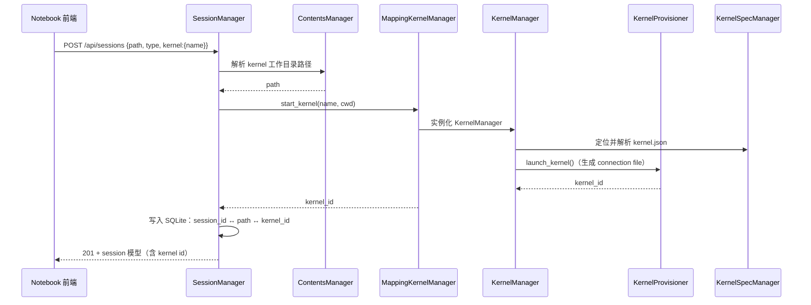
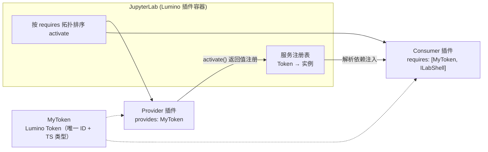
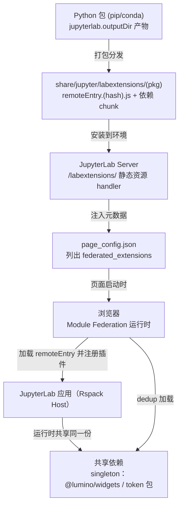
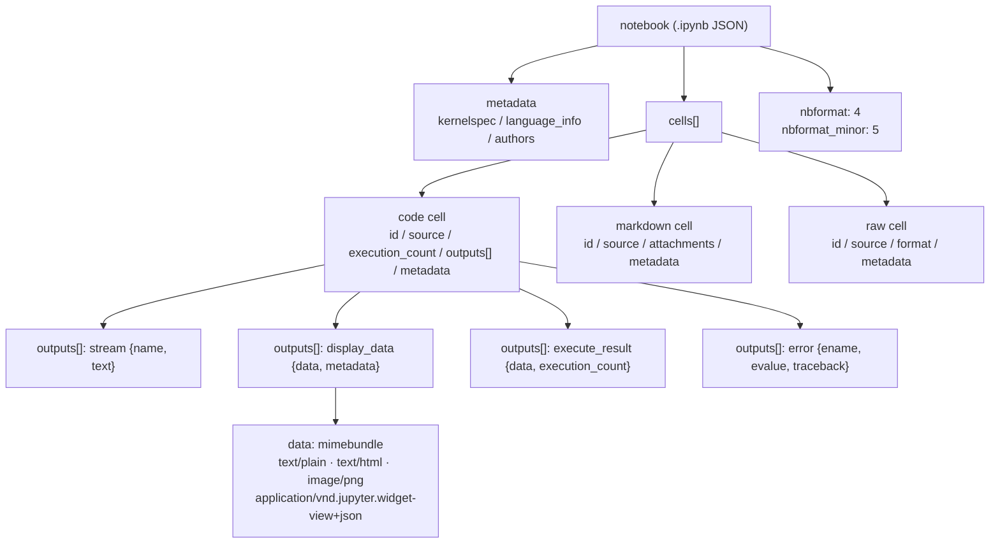
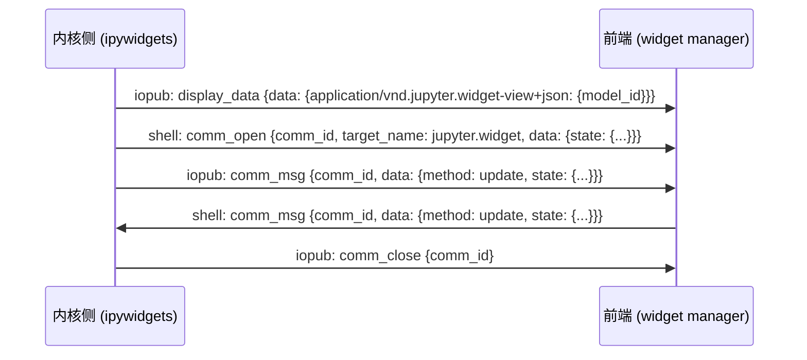

# Jupyter 底层架构深析（开发与架构决策版）

> 面向开发者/架构师的 Jupyter 内部机制图解：**协议 → 内核进程 → 服务端 → 前端扩展体系 → 文档格式 → Widget 协议**，逐层深挖实现机制、扩展点与决策依据。
> 区别于 `jupyter-ai.md`（生态/AI 功能索引），本文回答的是"每一层到底怎么实现、代码加在哪、为什么这么设计"。
>
> 数据依据（均已核实）：Jupyter Messaging Protocol 5.x 官方规范（jupyter-client 文档）、jupyter-server 官方架构/扩展文档与 OpenAPI（api.yaml）、JupyterLab 扩展开发文档（v4.x）、nbformat 官方格式说明。

## 目录

- [〇、分层地图：先定位再看细节](#map)
- [一、协议层：Jupyter Messaging Protocol](#protocol)
  - [1.1 五通道 ZeroMQ Socket 拓扑](#proto-sockets)
  - [1.2 Wire Protocol：一帧消息长什么样](#proto-wire)
  - [1.3 各通道消息类型总表](#proto-msgs)
  - [1.4 一次执行的完整时序](#proto-exec)
  - [1.5 协议版本演进与兼容性陷阱](#proto-versions)
- [二、内核层：Kernel 进程模型](#kernel)
  - [2.1 kernelspec（kernel.json）](#kernel-spec)
  - [2.2 connection file 与 5 端口](#kernel-conn)
  - [2.3 KernelManager / Provisioner 职责链](#kernel-mgmt)
  - [2.4 interrupt / restart / shutdown 语义](#kernel-lifecycle)
  - [2.5 三种 Kernel 实现路线决策表](#kernel-impl)
  - [2.6 Subshell（JEP 91）与并行](#kernel-subshell)
- [三、服务层：jupyter-server 内部](#server)
  - [3.1 内部组件架构](#server-components)
  - [3.2 REST API 端点全表](#server-rest)
  - [3.3 WebSocket 与事件流](#server-ws)
  - [3.4 建 Session / 删 Session 时序](#server-session)
  - [3.5 Server 扩展：两种写法与分发](#server-ext)
  - [3.6 配置与认证](#server-config)
- [四、前端框架层：JupyterLab 扩展体系](#frontend)
  - [4.1 插件系统与依赖注入](#fe-plugin)
  - [4.2 插件类型清单](#fe-types)
  - [4.3 Prebuilt vs Source 决策表](#fe-prebuilt)
  - [4.4 加载机制与依赖去重（Module Federation）](#fe-load)
  - [4.5 `package.json` 的 `jupyterlab` 元数据](#fe-pkg)
  - [4.6 开发工作流](#fe-dev)
- [五、文档与格式层：nbformat](#nbformat)
  - [5.1 `.ipynb` 顶层结构与 Cell 类型](#nb-struct)
  - [5.2 输出类型与 MimeBundle](#nb-output)
  - [5.3 版本演进与 Cell ID](#nb-versions)
  - [5.4 执行/转换管线：nbclient 与 nbconvert](#nb-pipeline)
- [六、Widget 协议层：ipywidgets 与 Comm](#widget)
  - [6.1 Comm 双向通道](#widget-comm)
  - [6.2 Widget 状态同步与 MimeBundle 表示](#widget-state)
- [七、决策速查：往哪一层加代码](#decisions)
- [八、调试底层：工具与抓手](#debug)
- [九、数据说明与参考](#data)

---

<a name="map"></a>

## 〇、分层地图：先定位再看细节

| 层                 | 主要实现                                      | 关键文档 / 规范                      | 扩展方式                       |
| ------------------ | --------------------------------------------- | ------------------------------------ | ------------------------------ |
| **协议**     | `jupyter_client`（Session / KernelManager） | jupyter-client Messaging 5.x         | 按规范实现 kernel / 客户端     |
| **内核**     | `ipykernel` / `xeus` / native kernel      | kernel spec、provisioner API         | 写 kernel 或自定义 Provisioner |
| **服务端**   | `jupyter_server`（Tornado）                 | server 扩展 / Contents API / OpenAPI | Server 扩展 / 自定义 Manager   |
| **前端框架** | `jupyterlab`（Lumino 插件容器）             | 扩展开发文档（v4.x）                 | 前端扩展（prebuilt）           |
| **文档格式** | `nbformat` / `nbconvert` / `nbclient`   | nbformat format description          | preprocessor / exporter        |
| **交互组件** | `ipywidgets`                                | widget 协议（comm）                  | Widget / MimeRenderer          |

**核心心智模型（贯穿全文）**：Notebook 前端 ≠ kernel。kernel 不读也不懂 `.ipynb`——它只接收"一行字符串代码"并返回"输出消息"。文档的保存/加载、cell 的组织、执行结果的落盘，全部由 **jupyter-server** 负责；前端与 kernel 之间只存在 **JSON 消息**。理解这一点，就能解释绝大多数"为什么 Jupyter 是这样"的问题。

---

<a name="protocol"></a>

## 一、协议层：Jupyter Messaging Protocol

这是整个生态的最底层，也是写 kernel、写自研前端、或做协议级调试时唯一需要完全理解的层。当前规范版本 **5.5**（wire 层握手在 5.6 新增注册文件模式）。

<a name="proto-sockets"></a>

### 1.1 五通道 ZeroMQ Socket 拓扑

一个 kernel 进程对**所有**前端只暴露 5 个 ZeroMQ socket（不是 REST）。每个通道职责单一、流量模型不同：



各通道要点（来自规范）：

- **Shell（ROUTER/DEALER）**：唯一承载"用户代码执行"请求的通道。多前端可同时连接同一 kernel（共享变量空间）。
- **IOPub（v5.5 起 XPUB/SUB）**：广播通道，所有输出副作用（stdout/stderr、display、执行结果）都发到这里，协作场景下每个前端都能看到彼此的动态。
- **stdin（ROUTER/DEALER）**：请求/应答方向反转。`execute_request` 里 `allow_stdin=True` 时，`input()` 会触发 kernel 发 `input_request`，由**发起执行的那个前端**应答。
- **Control（ROUTER/DEALER）**：与 Shell 同构但独立 socket，避免排在长任务后。规范建议在独立线程处理。shutdown、interrupt、调试消息都走这里。
- **Heartbeat（REQ/REP）**：纯字节 ping/pong，不解析 JSON。前端靠它判断 kernel 是否假死（busy 但无响应）。

> **架构决策点**：kernel 是多前端共享的单点。一次 `execute_request` 期间 kernel 是串行处理的（busy 状态）；需要"并发执行不同任务"就得用 subshell（2.6）或另起 kernel 进程。

<a name="proto-wire"></a>

### 1.2 Wire Protocol：一帧消息长什么样

逻辑上消息是五段字典：`header / parent_header / metadata / content / buffers`。但**线上格式**（wire protocol）是 ZeroMQ 的多帧字节，Python 端由 `jupyter_client.session.Session` 实现。非 Python 实现必须照此实现：

```text
[ ZMQ identity(ies) … ]         ← 0..N 个路由前缀（IOPub 上此处为 topic，如 execute_result）
[ "<IDS|MSG>" ]                 ← 定界符，标识消息正式开始
[ "baddad42" ]                  ← HMAC 签名（hex）
[ {header} ]                    ← JSON / msgpack / pickle 序列化的 4 个 dict，各自一帧
[ {parent_header} ]
[ {metadata} ]
[ {content} ]
[ <二进制 buffers…> ]           ← 0..N 个裸字节帧（widgets 二进制、并行通信用）
```

- **HMAC 认证**：默认 `hmac-sha256`，签名为 `key + header + parent_header + metadata + content` 的 HMAC hex。把 connection file 里 `key` 置空即关闭签名。
- **`parent_header` 是灵魂**：所有 reply / 输出消息必须带一份"引发它的请求"的 header 副本。前端靠 `parent_header.msg_id` 把 iopub 上的输出路由回对应的 cell 输出区。**这是多前端并发时输出不错位的根本机制。**
- **IOPub topic 约定**（IPython 用）：`kernel.{uuid}.execute_result`、`stream.stdout` 等，但前端通常全量订阅、忽略 topic。

> **给写 kernel 的人**：kernel 必须实现且仅需实现 `execute` 与 `kernel_info`（含配套 busy/idle）。其余全部可选。未知消息类型与未知字段**必须静默容忍**——这是向前兼容的硬性约定。

<a name="proto-msgs"></a>

### 1.3 各通道消息类型总表

| 通道                | 方向模式                            | 主要消息类型                                                                                                                                                                                                                      |
| ------------------- | ----------------------------------- | --------------------------------------------------------------------------------------------------------------------------------------------------------------------------------------------------------------------------------- |
| **Shell**     | 前端请求 → kernel 应答             | `execute`、`complete`、`inspect`、`history`、`is_complete`、`comm_info`、`kernel_info`、`comm_open/comm_msg/comm_close`（双向）、`create/list/delete_subshell`（5.5+）                                          |
| **Control**   | 前端请求 → kernel 应答（独立队列） | `shutdown`（5.4 起）、`interrupt`（5.3 起）、`kernel_info`（5.5 起）、`debug_request/reply`（DAP，5.5 起）                                                                                                                |
| **IOPub**     | kernel 广播 → 所有前端             | `status`（busy/idle/starting）、`execute_input`、`execute_result`、`display_data`、`update_display_data`（5.1）、`stream`、`error`、`clear_output`、`debug_event`、`comm_*`（广播）、`iopub_welcome`（5.5） |
| **stdin**     | kernel 请求 → 前端应答             | `input_request` / `input_reply`                                                                                                                                                                                               |
| **Heartbeat** | 裸字节                              | ping / pong（非 JSON）                                                                                                                                                                                                            |

**几个关键的 content 字段（写客户端/代理时常用）**：

- `execute_request`：`code`、`silent`、`store_history`、`user_expressions`、`allow_stdin`、`stop_on_error`
- `execute_reply`：`status`（ok/error/aborted）、`execution_count`、`payload`（已废弃）、`user_expressions`
- `stream`：`name`（stdout/stderr）、`text`
- `display_data` / `execute_result`：`data`（mimebundle）+ `metadata` + `transient.display_id`（5.1 起）
- `error`：`ename`、`evalue`、`traceback`（list[str]）
- `kernel_info_reply`：`protocol_version`、`implementation`、`language_info`、`banner`、`help_links`、`supported_features`（5.5，取代已废弃的 `debugger` 布尔）

<a name="proto-exec"></a>

### 1.4 一次执行的完整时序



- `execution_count` 是 kernel 内**单调递增**的全局计数器（仅 `store_history=True` 时 +1），同时用于 `In[n]/Out[n]` 与文档里的 `execution_count` 字段。
- 前端想拿"当前计数"而不执行代码：发 `{code:"", silent:true}` 的空请求。
- 想给用户做"输入框"：`execute_request.allow_stdin=True`，然后响应 `input_request`。

<a name="proto-versions"></a>

### 1.5 协议版本演进与兼容性陷阱

| 版本          | 关键变化（对开发者的意义）                                                                                                                                                                                                                                                         |
| ------------- | ---------------------------------------------------------------------------------------------------------------------------------------------------------------------------------------------------------------------------------------------------------------------------------- |
| **5.0** | 消息名去 Python 化（`pyin→execute_input`、`pyerr→error`）；header 增加 `version`；`complete/inspect` 改为传 `code + cursor_pos`（词法责任移到 kernel）；新增 `is_complete`；busy/idle 要求覆盖**所有**请求                                                     |
| **5.1** | `transient.display_id` + `update_display_data`；`comm_info_request`；header `date` 变为必填；`status=aborted` 废弃                                                                                                                                                       |
| **5.2** | `cursor_pos` 统一为 **Unicode 码点偏移**（此前 UTF-16 实现会有 astral-plane 字符漂移 bug）                                                                                                                                                                                 |
| **5.3** | kernel 可声明`interrupt_mode: message`，interrupt 改走 control 消息而非 OS 信号                                                                                                                                                                                                  |
| **5.4** | `shutdown_request` 必须走 control 通道（shell 上发送已废弃）                                                                                                                                                                                                                     |
| **5.5** | IOPub 由 PUB 换成**XPUB** + `iopub_welcome`；新增 `debug_request/reply/debug_event`（DAP 1.39+，含 `dumpCell/debugInfo/inspectVariables/richInspectVariables/copyToGlobals` 扩展）；**subshell**（JEP 91）；`kernel_info` 可走 control；`supported_features` |
| **5.6** | **注册文件（registration file）握手**：kernel 自选端口后向注册地址回报，替代"客户端开端口、kernel 去连"的旧模式（对容器/网络隔离场景重要）                                                                                                                                   |

> **架构陷阱提醒**：协议版本号在 header 的 `version` 里，kernel 在 `kernel_info_reply.protocol_version` 里声明。写客户端要按"能容忍未知字段/未知类型"的原则做，否则升级 kernel 即崩。

---

<a name="kernel"></a>

## 二、内核层：Kernel 进程模型

<a name="kernel-spec"></a>

### 2.1 kernelspec（`kernel.json`）

kernel 的"启动说明书"。存放目录（`jupyter --paths` 可见）：`~/.local/share/jupyter/kernels`、`<sys.prefix>/share/jupyter/kernels` 等，每个子目录一个 kernel。

```json
{
  "argv": ["python", "-m", "ipykernel_launcher", "-f", "{connection_file}"],
  "display_name": "Python 3 (ipykernel)",
  "language": "python",
  "interrupt_mode": "signal",
  "env": {},
  "metadata": {}
}
```

- 必填：`argv`、`display_name`、`language`。可选：`interrupt_mode`（`signal`|`message`）、`env`、`metadata`、`help_links`、`codemirror_mode`。
- `{connection_file}` 占位符会被替换为 connection file 的绝对路径。

<a name="kernel-conn"></a>

### 2.2 connection file 与 5 端口

`KernelManager` 为每次启动生成一个 connection file（默认在 `~/.local/share/jupyter/runtime/kernel-{uuid}.json`），kernel 进程据此自建 5 个 socket：

```json
{
  "transport": "tcp",
  "ip": "127.0.0.1",
  "shell_port": 57501,
  "iopub_port": 57502,
  "stdin_port": 57503,
  "control_port": 57504,
  "hb_port": 57505,
  "key": "a16b5a3d...",
  "signature_scheme": "hmac-sha256",
  "kernel_name": "python3"
}
```

> **架构决策点**：默认 `LocalProvisioner` 在本机起进程、用 TCP 回环。要"远程 kernel / 容器 kernel"，就在 kernel.json 里配自定义 `provisioner`，或走 jupyter-server 的 Gateway（Enterprise Gateway / Kernel Gateway）——前端对 kernel 的访问全部经由 server 代理。

<a name="kernel-mgmt"></a>

### 2.3 KernelManager / Provisioner 职责链



- **KernelSpecManager**：从各路径发现、解析 `kernel.json`。
- **KernelManager**：管理**单个** kernel 的生命周期；维护 5 通道的客户端 socket。
- **KernelProvisioner**：真正"把进程拉起来"的一层。自定义 `KernelProvisionerBase` 可实现容器/远程/按需启动（如 resource-managed 集群）。

<a name="kernel-lifecycle"></a>

### 2.4 interrupt / restart / shutdown 语义

| 操作                | 机制                                                                                             | 说明                                                                                           |
| ------------------- | ------------------------------------------------------------------------------------------------ | ---------------------------------------------------------------------------------------------- |
| **interrupt** | 默认发**SIGINT**；若 `interrupt_mode: message` 则发 control 通道的 `interrupt_request` | 中断当前执行，不杀进程；`Ctrl-C` 语义                                                        |
| **restart**   | 先`shutdown_request{restart:true}`（control）再重启同一 kernel 进程                            | 保留前端侧状态（history、已渲染输出），kernel 变量清空；规范建议"原地重启"，容器内尽量不动容器 |
| **shutdown**  | `shutdown_request`（control，5.4 起）+ 等待超时后 `SIGTERM` → 仍未退出则 `SIGKILL`        | 前端检测到 heartbeat 失效时直接强杀，因为"死进程不会理你"                                      |
| **假死检测**  | heartbeat REQ/REP 超时                                                                           | 前端据此显示 "Kernel Restarting" 之类提示                                                      |

> **架构决策点**：interrupt 对"正在跑 C 扩展/被阻塞的 kernel"可能无效（信号被运行时吞掉）。生产环境需要强终止语义时，考虑 provisioner 层做进程组管理。

<a name="kernel-impl"></a>

### 2.5 三种 Kernel 实现路线决策表

| 路线                     | 实现方式                                    | 语言                 | 依赖               | 适用场景                               | 例子                               |
| ------------------------ | ------------------------------------------- | -------------------- | ------------------ | -------------------------------------- | ---------------------------------- |
| **Wrapper kernel** | 复用 IPykernel 的通信机制，只实现"执行"部分 | Python 壳 + 目标语言 | 需要 Python 运行时 | 目标语言有好的 Python 包装、不想碰协议 | `bash_kernel`、`octave_kernel` |
| **Native kernel**  | 目标语言原生实现协议（含 wire/hmac/socket） | 目标语言             | 无 Python          | 语言社区自己维护、无 Python 场景       | IJulia、IHaskell                   |
| **xeus kernel**    | 基于 C++ 协议实现，只写语言相关部分         | C++/目标语言绑定     | 无 Python，需 xeus | 语言有 C/C++ API，协议层免维护         | xeus-python、xeus-cling            |

> **决策提示**：从零写 kernel，**优先 wrapper**（最快）或 **xeus**（协议零维护）；只有"必须纯目标语言发行"才选 native。协议里 `kernel_info_reply.language_info` 里的 `codemirror_mode`、`pygments_lexer`、`nbconvert_exporter` 都要填，前端高亮/导出依赖它们。

<a name="kernel-subshell"></a>

### 2.6 Subshell（JEP 91）与并行

- **Subshell（协议 5.5）**：在**同一 kernel 进程内**开"并行执行线程"，`header.subshell_id` 区分路由。kernel 需在 `kernel_info_reply.supported_features` 里声明 `"kernel subshells"`，消息：`create_subshell_request/reply`、`list_subshell`、`delete_subshell`。
- **IPython.parallel（ipyparallel）**：走"多 kernel 引擎"模式（engine = 扩展版 IPykernel），配合 comm 或 `apply` 消息分发任务，与 subshell 是两条不同路线。

---

<a name="server"></a>

## 三、服务层：jupyter-server 内部

jupyter-server 是所有前端共用的后端中枢：它**保存/加载文档**（kernel 不碰文档）、**管理 kernel 生命周期**、**暴露 REST/WS API**、**承载扩展**。内核是 Tornado 事件循环。

<a name="server-components"></a>

### 3.1 内部组件架构



各组件职责（来自官方架构文档）：

- **ServerApp**：主应用，Tornado 事件循环 + 所有组件装配 + 配置初始化（Config Manager）。
- **ContentsManager**（默认 `FileContentsManager`）：文件/目录/notebook 的存取。**换存储（DB/S3/对象存储）就继承它**。
- **SessionManager**：一个打开的 notebook = 一个 Session；用 **SQLite3** 存 `session_id ↔ path ↔ kernel_id`（默认内存库，可落盘）。多 notebook 可共享同一 kernel（共享数据）。
- **MappingKernelManager**：server 侧统一管理多个 kernel 的生命周期（interrupt/restart/shutdown），委托给 jupyter_client 的 `MultiKernelManager`。
- **KernelSpecManager / KernelManager / KernelProvisioner**：见 2.3。
- **Server 扩展**：给 REST API 加 handler（3.5）。

<a name="server-rest"></a>

### 3.2 REST API 端点全表

来源：jupyter-server 官方 `api.yaml`（OpenAPI 5.0）。所有路径前缀 `/api`。

| 端点                                      | 方法                              | 作用                                                                  | 关键参数 / 说明                                                                                                                                        |
| ----------------------------------------- | --------------------------------- | --------------------------------------------------------------------- | ------------------------------------------------------------------------------------------------------------------------------------------------------ |
| `/api/`                                 | GET                               | 服务器版本                                                            | 无需认证                                                                                                                                               |
| `/api/status`                           | GET                               | 状态：`started` / `last_activity` / `connections` / `kernels` | 探活、监控                                                                                                                                             |
| `/api/contents/{path}`                  | GET / PUT / PATCH / POST / DELETE | 文件/目录/notebook 读写、改名、建新                                   | `?type=file\|directory`、`?format=text\|base64\|json`、`?content=0\|1`、`?hash=0\|1`；PATCH 传新 `path` 改名；PUT body 含 `type/format/content` |
| `/api/contents/{path}/checkpoints`      | GET / POST                        | 列出 / 创建检查点                                                     | 默认仅保留 1 个                                                                                                                                        |
| `/api/contents/{path}/checkpoints/{id}` | POST / DELETE                     | 恢复 / 删除检查点                                                     |                                                                                                                                                        |
| `/api/resolvePath`                      | GET                               | 路径解析（多 scope）                                                  | `?path=` `?kernel=`                                                                                                                                |
| `/api/kernels`                          | GET / POST                        | 列出 / 启动 kernel                                                    | POST body`{name, path}`                                                                                                                              |
| `/api/kernels/{id}`                     | GET / DELETE                      | 查询 / 杀掉 kernel                                                    |                                                                                                                                                        |
| `/api/kernels/{id}/interrupt`           | POST                              | 中断                                                                  | 返回 204                                                                                                                                               |
| `/api/kernels/{id}/restart`             | POST                              | 重启                                                                  | 返回新 kernel 模型                                                                                                                                     |
| `/api/kernels/{id}/channels`            | **WebSocket**               | kernel 5 通道的 WS 代理                                               | JSON 帧；前端与 kernel 全部经此                                                                                                                        |
| `/api/kernelspecs`                      | GET                               | 列出所有 kernel spec                                                  | `{default, kernelspecs:{}}`                                                                                                                          |
| `/api/sessions`                         | GET / POST                        | 列出 / 创建 session                                                   | POST body`{path, type, kernel:{name}}`；同名返回既有 session                                                                                         |
| `/api/sessions/{id}`                    | GET / PATCH / DELETE              | 查询 / 改名 / 删除                                                    | **DELETE 连 kernel 一起杀**                                                                                                                      |
| `/api/terminals`                        | GET / POST                        | 终端管理                                                              |                                                                                                                                                        |
| `/api/terminals/{id}`                   | GET / DELETE                      | 终端操作                                                              |                                                                                                                                                        |
| `/api/config/{section}`                 | GET / PATCH                       | 读写配置段                                                            | 运行时改配置                                                                                                                                           |
| `/api/me`                               | GET                               | 当前用户身份 + 权限                                                   | `?permissions={"contents":["read",...]}`                                                                                                             |
| `/api/spec.yaml`                        | GET                               | 当前 API 的 OpenAPI 规范                                              | 可自省生成客户端                                                                                                                                       |

<a name="server-ws"></a>

### 3.3 WebSocket 与事件流

- **kernel 通道代理**：前端浏览器里没有 ZeroMQ，所有 kernel 消息都通过 `/api/kernels/{id}/channels` 这条 WebSocket 转发（JSON 帧内带 `channel` 字段区分 shell/iopub/stdin/control/hb）。这就是"浏览器里跑 Jupyter"的本质。
- **终端**：`POST /api/terminals` 后连 `/api/terminals/websocket/{name}`。
- **事件流（jupyter-server 2.x，JEP 59）**：`/api/events` WebSocket 广播结构化事件（kernel 启停、内容变更等），前端 EventManager（`IEventManager`）订阅，是做遥测/审计的官方抓手。

<a name="server-session"></a>

### 3.4 建 Session / 删 Session 时序

**创建（点 "New Notebook" 或打开已有 notebook 触发）**：



**删除（关 kernel / 关 notebook）**：前端 `DELETE /api/sessions/{id}` → SessionManager 取 SQLite 记录 → 交给 MappingKernelManager 走"interrupt（可选）→ shutdown_request(control) → SIGTERM → SIGKILL"逐级降级 → 清理 5 端口与 connection file → 删 SQLite 记录 → 返回 204。

<a name="server-ext"></a>

### 3.5 Server 扩展：两种写法与分发

**写法 A：函数式（最小）**

```python
# myextension/__init__.py
from jupyter_server.base.handlers import JupyterHandler
import tornado

class MyHandler(JupyterHandler):
    @tornado.web.authenticated
    def get(self):
        self.finish({"hello": "world"})

def _jupyter_server_extension_points():
    # 声明模块：jupyter-server 据此发现扩展
    return [{"module": "myextension"}]

def _load_jupyter_server_extension(serverapp):
    # 把 handler 挂进 Tornado WebApp
    serverapp.web_app.add_handlers(".*$", [(r"/myext", MyHandler)])
```

**写法 B：`ExtensionApp` 类（配置化、可当独立 CLI 启动）**

```python
from jupyter_server.extension.application import ExtensionApp

class MyExtensionApp(ExtensionApp):
    name = "myext"                 # → 产生 `jupyter myext` 命令
    default_url = "/myext"
    handlers = [("/myext", MyHandler)]          # 或 initialize_handlers() 里 extend
    # static_paths / template_paths / settings 可选
    async def _start_jupyter_server_extension(self):  # 事件循环启动后跑异步任务（2.15+）
        ...

def _jupyter_server_extension_points():
    return [{"module": "myextension.app", "app": MyExtensionApp}]
```

**分发与自动启用**：`jupyter_server_config.d/` 下的 JSON 决定安装即启用：

```json
{ "ServerApp": { "jpserver_extensions": { "myextension": true } } }
```

```text
myextension/
├── myextension/
│   ├── __init__.py
│   └── app.py
├── jupyter-config/jupyter_server_config.d/myextension.json
└── setup.py          # data_files 把上述 JSON 拷到 etc/jupyter/jupyter_server_config.d
```

> **最佳实践**：handler 每个方法都加 `@tornado.web.authenticated`（确保走 server 认证）；需要模板用 `ExtensionHandlerJinjaMixin` + `ExtensionAppJinjaMixin`；mixin 必须写在基类**之前**。

<a name="server-config"></a>

### 3.6 配置与认证

- **配置分层**：CLI 参数 > `jupyter_server_config.py` > `jupyter_server_config.d/*.json` > 默认值。路径由 `jupyter --paths` 给出。
- **认证**：默认 token 认证（URL 里带 `?token=` 或 `Authorization: token ...`）；`--ServerApp.password` 设密码；生产部署（JupyterHub/K8s）通常关掉 server 内建认证、由前面网关处理。
- **安全边界提醒**：`/api/contents` 默认禁止路径穿越，但 kernel 是**任意代码执行**的，多租户安全必须依赖隔离（容器/进程组），而不是 server 的权限检查。`/api/me` 的 `permissions` 机制用于细粒度授权查询。

---

<a name="frontend"></a>

## 四、前端框架层：JupyterLab 扩展体系

JupyterLab 本质是 **Lumino 插件容器** + 一堆"插件"，连菜单、状态栏、与 server 的通信本身都是插件。

<a name="fe-plugin"></a>

### 4.1 插件系统与依赖注入



最小插件（TS）：

```typescript
import { JupyterFrontEnd, JupyterFrontEndPlugin } from '@jupyterlab/application';
import { ILabShell } from '@jupyterlab/application';
import { ICommandPalette } from '@jupyterlab/apputils';

const plugin: JupyterFrontEndPlugin<void> = {
  id: 'my-extension:plugin',          // 全局唯一，惯例 <包名>:<插件名>
  autoStart: true,
  requires: [ILabShell, ICommandPalette],   // 必须依赖，缺失则报错不激活
  activate: (app: JupyterFrontEnd, shell: ILabShell, palette: ICommandPalette) => {
    const command = 'my-extension:hello';
    app.commands.addCommand(command, { execute: () => console.log('hi') });
    palette.addItem({ command, category: 'My Ext' });
  },
};
export default plugin;
```

**依赖注入（Provider-Consumer）要点**：

- **Token** 是服务标识，`Lumino Token` 实例（带 TypeScript 接口做编译期类型检查）。用 token 而非字符串，是为了避免标识冲突 + 类型安全。
- `provides` 的插件在 `activate` 里**返回服务实例**，注册到 token 下；`requires`/`optional` 的插件拿到服务作为 `activate` 参数。
- 容器按依赖**拓扑排序激活**：provider 一定先于 consumer。
- **token 要发布到独立 npm 包**（如 `@jupyterlab/filebrowser` 导出 token，`filebrowser-extension` 实现它）——这样能整体换掉某个服务的实现，而不动依赖它的扩展。
- **`requires` vs `optional`**：`optional` 缺服务时传 `null`、扩展照常跑（适合"有状态栏就加指示器"这类弱耦合）。

<a name="fe-types"></a>

### 4.2 插件类型清单

| 类型                                     | 说明                                                      | 关键接口 / 元数据                                                                                                                       |
| ---------------------------------------- | --------------------------------------------------------- | --------------------------------------------------------------------------------------------------------------------------------------- |
| **Application plugin**             | 基本单元：命令、面板、菜单、注册 widget                   | `JupyterFrontEndPlugin`，`jupyterlab.extension`                                                                                     |
| **MIME renderer plugin**           | 声明式渲染某 mime 类型（notebook 输出 / 文件）            | `IRenderMime.IExtension`，`jupyterlab.mimeExtension`；`setData()` 可回写数据                                                      |
| **Theme plugin**                   | 换主题（CSS 变量、字体、图标）                            | `ThemeManager`，`jupyterlab.themePath`（一个扩展只能一个 theme）                                                                    |
| **Service Manager plugin**（4.4+） | 替换核心服务：contents / kernels / sessions / terminals… | `IServiceManager`、`IContentsManager`、`IKernelManager` 等 token，`ServiceManagerPlugin<T>`（`activate` 首个参数为 `null`） |

核心可注入 token 备忘：`ILabShell`、`ICommandPalette`、`IMainMenu`、`IStatusBar`、`IRenderMimeRegistry`、`ILayoutRestorer`、`ISettingRegistry`、`IServiceManager`、`IContentsManager`、`IKernelManager`、`ISessionManager`、`IEventManager`、`ITranslator` 等。

<a name="fe-prebuilt"></a>

### 4.3 Prebuilt vs Source 决策表

| 维度       | **Prebuilt（推荐，3.0+）**                           | Source（已废弃）                                                                    |
| ---------- | ---------------------------------------------------------- | ----------------------------------------------------------------------------------- |
| 安装       | `pip install` / `conda`，无需 Node.js                  | `jupyter labextension install`，**需重编译 JupyterLab**，要 Node.js、耗内存 |
| 加载       | 运行时浏览器动态加载（module federation）                  | 编译进应用 bundle                                                                   |
| 发布       | PyPI / conda，copy 到`share/jupyter/labextensions/<pkg>` | npm                                                                                 |
| 多用户系统 | 系统级装一份，用户各自覆盖                                 | 只有管理员能装                                                                      |
| 体积       | 依赖各自打包，可能偏大                                     | 依赖去重后更小                                                                      |
| 版本兼容   | 需按 semver 对上 JupyterLab；同名时**prebuilt 优先** | 同左                                                                                |

> **决策**：新项目一律 prebuilt（官方模板 `jupyterlab/extension-template` via `copier` 默认即是）。source 路线仅历史遗留。

<a name="fe-load"></a>

### 4.4 加载机制与依赖去重（Module Federation）



- **预编译扩展用 Rspack 的 Module Federation**：`remoteEntry.<hash>.js` 是入口，构建时把依赖打成 chunk。
- **`sharedPackages`** 控制依赖去重，三个开关：
  - `bundled`：依赖是否打进自己的包（provider 应打，consumer 可不打）
  - `singleton`：是否强制与其它扩展共用**同一份**（**凡涉及 token 的包必须 singleton**，否则"两个 token 实例"= 服务对不上，这是最常见的扩展 bug）
  - `strictVersion`：是否强制校验版本区间
- **Lumino widgets 必须全局单例**（`@lumino/widgets` singleton）——这是 Lumino 跨包通信的硬前提。

<a name="fe-pkg"></a>

### 4.5 `package.json` 的 `jupyterlab` 元数据

```json
{
  "name": "my-extension",
  "main": "lib/index.js",
  "jupyterlab": {
    "extension": true,                     // 或 "lib/foo"（默认导出插件的模块路径）
    "mimeExtension": false,                // 或模块路径
    "themePath": "style/theme.css",        // 主题专用
    "outputDir": "myextension/labextension",  // prebuilt 产物目录
    "schemaDir": "schema",                 // 插件设置 JSON Schema 目录
    "disabledExtensions": ["@jupyterlab/filebrowser-extension:share-file"],
    "sharedPackages": {
      "@my-org/token-pkg": { "bundled": false, "singleton": true }
    },
    "discovery": {                          // 声明伴随包（kernel / server 扩展）
      "kernel": [{ "kernel_spec": { "language": "^python" }, "managers": ["pip", "conda"] }],
      "server": { "base": { "name": "my-server-ext" }, "managers": ["pip"] }
    }
  }
}
```

- **设置系统**：`schemaDir/<plugin名>.json` 定义默认值与 JSON Schema；用户覆盖在 `overrides.json` / Settings UI；插件 id 必须符合 `<包名>:<插件名>` 才能挂上设置。
- **`disabledExtensions`**：可禁用其它扩展/插件（如替换内建实现时）。
- **`discovery`**：告诉扩展管理器"我这个前端扩展还需要装哪个 kernel / server 扩展"，实现前端+后端联动安装。
- 发布 PyPI 时加 trove 分类器：`Framework :: Jupyter :: JupyterLab :: 4`、`… :: Extensions :: Prebuilt` 等（扩展管理器靠它发现）。

<a name="fe-dev"></a>

### 4.6 开发工作流

```text
copier copy https://github.com/jupyterlab/extension-template my-extension   # 脚手架
cd my-extension
pip install -e .                      # 或 jupyter-builder develop . --overwrite
jupyter lab --dev-mode --extensions-in-dev-mode    # 调试时直接加载
# 改 TS 后：jlpm build（或 tsc -w）→ 刷新浏览器即可（prebuilt 无需重编 Lab）
```

- 构建：`jupyter-builder build` 产出 `outputDir`（含 `remoteEntry.<hash>.js`、依赖 chunk、拷贝的 package.json、schema、theme）。
- 多应用兼容：Notebook 7 与 JupyterLab 用同一底座，写扩展时尽量只依赖 `@jupyterlab/application`、`notebook` 等跨应用 API。
- 测试：`@jupyterlab/testutils` + jest（需要把 `@jupyterlab/*` 转译成 commonjs）。

---

<a name="nbformat"></a>

## 五、文档与格式层：nbformat

`.ipynb` 是 JSON 文档，官方 schema（`nbformat.v4.schema.json`）用于校验。**kernel 不感知此格式**——文档是 server/前端的事。

<a name="nb-struct"></a>

### 5.1 `.ipynb` 顶层结构与 Cell 类型



- **顶层**：`metadata`、`nbformat`、`nbformat_minor`、`cells`。
- **三种 cell**：`code`（执行 + outputs）、`markdown`（渲染文本 + attachments）、`raw`（nbconvert 专用透传，`metadata.format` 指定目标格式，其它格式导出时剔除）。
- 磁盘上多行字符串**可以是 list[str]**（读回时 join），API 层（Python/JS）总是还原成单字符串——手写解析器要兼容两种形态。
- **Cell ID（4.5 起强制）**：1–64 位，`[A-Za-z0-9_-]`，文档内唯一。用于跨工具/协作场景稳定引用 cell（详见 JEP 62）。

**代码 cell 实例（含执行时间戳，展示协议→文档的映射）**：

```json
{
  "cell_type": "code",
  "id": "a1b2c3",
  "execution_count": 7,
  "metadata": {
    "execution": {
      "iopub.execute_input": "2026-08-13T09:00:00.000Z",
      "iopub.status.busy": "2026-08-13T09:00:00.000Z",
      "shell.execute_reply": "2026-08-13T09:00:00.120Z",
      "iopub.status.idle": "2026-08-13T09:00:00.121Z"
    }
  },
  "source": "print(1)",
  "outputs": [
    { "output_type": "stream", "name": "stdout", "text": "1\n" }
  ]
}
```

<a name="nb-output"></a>

### 5.2 输出类型与 MimeBundle

| output_type        | 关键字段                                    | 来源协议消息       |
| ------------------ | ------------------------------------------- | ------------------ |
| `stream`         | `name`(stdout/stderr)、`text`           | `stream`         |
| `display_data`   | `data`(mimebundle)、`metadata`          | `display_data`   |
| `execute_result` | `data`、`metadata`、`execution_count` | `execute_result` |
| `error`          | `ename`、`evalue`、`traceback`        | `error`          |

**MimeBundle 约定**（贯穿协议 + 文档 + 前端渲染三端）：

- 同一条输出可带**多个 mime 表示**，前端按能力挑选渲染；`text/plain` 必须始终提供。
- `application/json` 是**解包后的 JSON**（不是双重序列化的字符串）；`…+json` 后缀的 mime 也是 JSON。
- 图片元数据放 `metadata`（如 `{"image/png": {"width": 640}}`）。
- **自定义输出** = 自定义 mime 类型 + 前端 MIME renderer 插件（4.2）。这是"kernel 想吐任意可视化"的正规扩展路径。

<a name="nb-versions"></a>

### 5.3 版本演进与 Cell ID

- 兼容性规则：**向后兼容的改动 → 加 `nbformat_minor`**（新增字段、新 cell/output 类型——未知类型会被保留但不渲染）；**不兼容 → 升 `nbformat` 主版本**。
- 历史上 backport：`attachments`（4.1）、`+json` mime 解包（4.2）都被 backport 到 4.0，保证 4.0 校验器能吃 4.4 文件。
- **metadata 命名空间**：官方字段放 `metadata.jupyter.*`（`source_hidden`、`outputs_hidden`）；执行时间戳放 `metadata.execution.*`；**自定义字段必须用足够唯一的命名空间**（如 `metadata.kaylees_md.foo`）避免冲突。

<a name="nb-pipeline"></a>

### 5.4 执行/转换管线：nbclient 与 nbconvert

```
nbclient.ExecutePreprocessor
        │  逐 cell 走 1.4 的协议时序，把结果写回 .ipynb 内存对象
        ▼
nbconvert:  preprocessors（改内存） → exporters（按模板产出） → postprocessors（文件后处理）
        │  例：HTML/Latex/Markdown/script(nbconvert_exporter)
        ▼
输出文件 / nbviewer
```

- **nbclient**：headless 执行（papermill 依赖它），本质是"读 .ipynb → 起 kernel → 逐 cell 执行 → 把 `execute_reply`/iopub 输出落回 outputs → 保存"。
- **nbconvert**：`preprocessor → exporter(template) → postprocessor` 三段管线；HTML exporter 就是 nbviewer 的渲染后端。
- **jupytext**：.ipynb ↔ .py/.md 双向（对 git review 友好），本质也是 nbformat 模型与文本格式的转换。

> **架构决策点**：要"批量/定时执行 notebook 出报表"，组合就是 papermill（参数化）+ nbclient（执行）+ nbconvert（导出）；要在导出前改内容（藏 cell、注入版权头）写 preprocessor。

---

<a name="widget"></a>

## 六、Widget 协议层：ipywidgets 与 Comm

Widget 是"前端 JS 对象 ↔ 内核 Python 对象"的双端同步，建立在**协议层的 comm** 之上，是构建交互式 UI（滑块联动图表等）的底层机制。

<a name="widget-comm"></a>

### 6.1 Comm 双向通道

Comm = 协议提供的对称双向通道：任何一方可发起 `comm_open`（带 `target_name`），收发 `comm_msg`，`comm_close` 拆除。对端按 `target_name` 找构造函数；找不到必须立即回 `comm_close` 防状态不一致。**每对 comm 自行定义 `data` 里的消息格式。**



> 规范提示：comm handler 也要设 parent header 并发布 busy/idle（因为 comm 可能执行任意用户代码）。

<a name="widget-state"></a>

### 6.2 Widget 状态同步与 MimeBundle 表示

- **在文档里的表示**：输出 `data` 里是 `application/vnd.jupyter.widget-view+json`，值为 `{"model_id": "..."}`——**文档只存引用不存二进制状态**，重开文档时由前端 widget manager 重新实例化。
- **内核侧状态**：comm_open 的 state 含 `_model_module`、`_model_module_version`、`_model_name`、`_view_module`、`_view_name` + 业务字段。前端据此加载对应 JS 模型/视图。
- **同步**：`comm_msg` 里 `{"method":"update","state":{...}}` 双向推进；大块二进制（图像/音频 buffer）走协议 `buffers` 帧。
- **扩展路径**：自定义 widget = 前端 JS（`@jupyter-widgets/base` 模型/视图）+ 内核 Python（`ipywidgets.Widget` 子类，序列化器控制 buffer）。配合 `jupyterlab.discovery.kernel` 让扩展管理器自动装 Python 侧包。
- **轻量替代**：仅需"展示交互"不写 Python 侧，可用**自定义 mime + MIME renderer 插件**（4.2）——只读渲染，无双向通道。

---

<a name="decisions"></a>

## 七、决策速查：往哪一层加代码

| 我想…                                     | 切入点                                            | 涉及的包 / 接口                                        |
| ------------------------------------------ | ------------------------------------------------- | ------------------------------------------------------ |
| 加 UI（面板/命令/右键菜单/编辑器扩展）     | **JupyterLab 前端扩展**                     | TS + Lumino；`@jupyterlab/application`、`notebook` |
| 渲染新的输出类型 / 文件类型                | **MIME renderer 插件**                      | `IRenderMime`                                        |
| 换皮肤主题                                 | **Theme 插件**                              | CSS +`themePath`                                     |
| 加后端 REST API / 数据服务                 | **Server 扩展**                             | Python；`JupyterHandler` / `ExtensionApp`          |
| 前端+后端联合能力（如 AI 聊天 + provider） | **双层扩展**：前端插件 + server 扩展        | `discovery.server` 联动安装                          |
| 让 kernel 支持新语言                       | **写 kernel**                               | wrapper / native / xeus（2.5）                         |
| 自定义 kernel 启动/远程/容器               | **KernelProvisioner**                       | `jupyter_client.provisioning`                        |
| 换文档存储（DB/S3/对象存储）               | **自定义 ContentsManager**                  | `jupyter_server.contents`                            |
| notebook 批量执行/转换/出报告              | **nbclient + nbconvert**（papermill）       | preprocessor / exporter                                |
| 前端↔内核自定义双向通道                   | **自定义 Comm**                             | 协议 comm_open/msg/close                               |
| 外部 LLM agent 读写执行 notebook           | **MCP server**（`jupyter-mcp-server` 等） | 走 REST API + nbformat 模型                            |
| 给 server 加遥测/审计                      | **事件系统** `/api/events`                | `EventLogger`（JEP 59）                              |

**AI 扩展的典型嵌入方式（呼应 `jupyter-ai.md`）**：Jupyter AI = 前端扩展（聊天面板、`%ai` magic UI）+ server 扩展（LLM provider、REST 端点）；`jupyterlite/ai`、`thread-notebook`、`notebook-intelligence`、`jupyter-studio` 同理都是"前端 + 后端"双层。外部 agent 路径则走 MCP server / ACP（Frontier Agents）——它们的底层同样只是 REST + nbformat + 协议时序。

---

<a name="debug"></a>

## 八、调试底层：工具与抓手

| 场景                            | 做法                                                                                                                                                                |
| ------------------------------- | ------------------------------------------------------------------------------------------------------------------------------------------------------------------- |
| 看 kernel 是否活着 / 假死       | `/api/status`、heartbeat、`/api/kernels/{id}` 的 `execution_state`                                                                                            |
| 抓协议消息                      | 打开 connection file（`jupyter --paths` 的 runtime 目录），用 `jupyter_client.session.Session` 实现或自写解析；浏览器侧抓 `/api/kernels/*/channels` WebSocket |
| 手动驱动 kernel                 | `jupyter console`（连本地 kernel）、`jupyter run`                                                                                                               |
| 看已注册扩展                    | `jupyter server extension list`、`jupyter labextension list`                                                                                                    |
| 看配置/路径                     | `jupyter --paths`、`jupyter server --generate-config`                                                                                                           |
| 检查 notebook 是否合法          | `nbformat.validate()`                                                                                                                                             |
| 排查 token 对不上（扩展不激活） | 检查`sharedPackages` 的 `singleton` 是否覆盖所有 token 依赖包                                                                                                   |
| server 扩展没加载               | 确认`_jupyter_server_extension_points` + `jupyter_server_config.d` JSON + `jupyter server extension list`                                                     |

---

<a name="data"></a>

## 九、数据说明与参考

- 协议：jupyter-client Messaging in Jupyter（spec 5.x，wire + 注册文件握手 5.6）。
- 服务端：jupyter-server Architecture / Server Extensions 文档 + 官方 `api.yaml`（OpenAPI v5）。
- 前端：JupyterLab v4.x 扩展开发文档（plugin/token/prebuilt/module federation/sharedPackages）。
- 文档格式：nbformat format description（4.x，cell id 4.5）。
- 图使用 Mermaid（flowchart / sequenceDiagram），GitHub / GitLab / VS Code 原生渲染。
