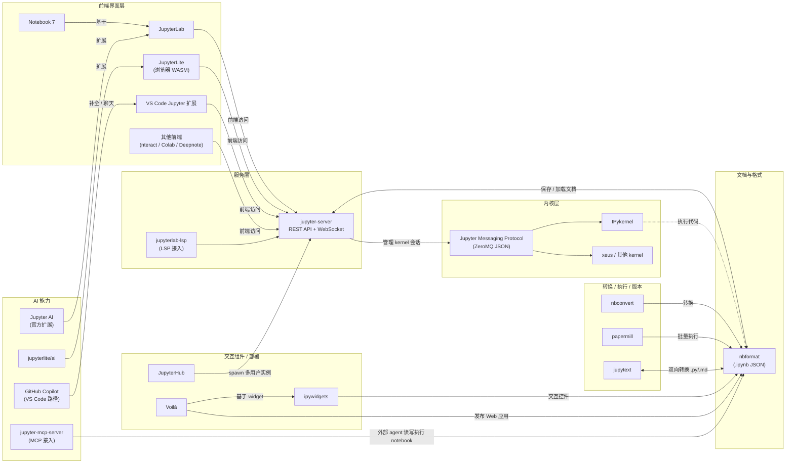
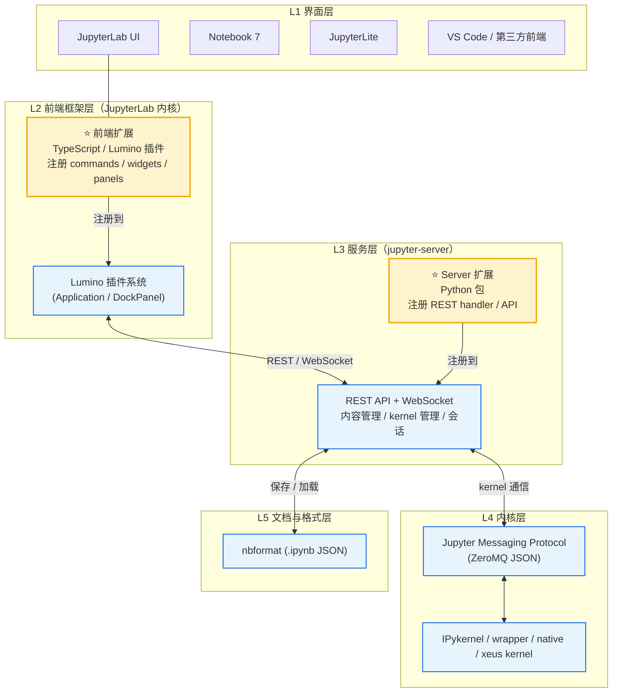

# Jupyter 生态与架构图

> Jupyter 生态关系图 + 分层架构图（Mermaid，GitHub 可直接渲染）。
> 数据依据：`jupyter-ai.md` 生态分层与 Jupyter 官方架构文档。

## 目录

- [一、Jupyter 生态关系图](#eco)
- [二、Jupyter 分层架构图（含 JupyterLab Extension 嵌入方式）](#arch)
- [三、JupyterLab Extension 嵌入机制说明](#how-extension)

---

## 一、Jupyter 生态关系图

---

## 二、Jupyter 分层架构图（含 JupyterLab Extension 嵌入方式）

---

## 三、JupyterLab Extension 嵌入机制说明

**两类扩展，对应两层**（图中 ⭐ 高亮）：

| 扩展类型 | 语言 | 嵌入点 | 能力 | 安装方式 |
|---|---|---|---|---|
| **前端扩展**（JupyterLab Extension） | TypeScript | 注册到 JupyterLab 的 Lumino 插件系统（Application 生命周期） | 新增命令、侧边栏/面板、右键菜单、编辑器扩展、自定义 widget | `pip install` / `conda`（prebuilt / federated 扩展，运行时由 JupyterLab 加载，无需重新构建）；源码扩展则需 `jlpm build` |
| **Server 扩展**（jupyter-server Extension） | Python | 注册到 jupyter-server 的 REST 端点与生命周期 | 后端 API、数据服务、认证、内容提供 | 同为 `pip install`，通过 entry point 自动发现 |

**嵌入流程（以自建扩展为例）**：
1. 用 `copier` 模板（`jupyterlab/copier-templates`）或 `jupyter labextension create` 生成骨架
2. 前端扩展在 `src/index.ts` 中导出 `plugin`，通过 `JupyterFrontEnd` 注册命令、加 widget 到 `ILayoutRestorer` / 侧边栏
3. Server 扩展在 Python 包中实现 `ServerExtension`（或 `load_jupyter_server_extension`），在 `jupyter_server_config` 注册 handler
4. 打包发布到 PyPI / conda；用户 `pip install` 后 `jupyter labextension list` 可见；JupyterLab 启动时自动加载联邦扩展

**典型 AI 扩展的嵌入示例**：Jupyter AI = 前端扩展（聊天面板、`%ai` magic UI）+ server 扩展（LLM provider 后端、REST 端点）；同理 jupyterlite/ai、thread-notebook、notebook-intelligence 都是"前端 + 后端"双层嵌入。

---

## 数据说明

- 架构分层依据 Jupyter 官方架构文档（docs.jupyter.org/projects/architecture）与 `jupyter-ai.md` 生态调查。
- 图使用 Mermaid v10+ 语法（`flowchart`），GitHub / GitLab / VS Code 均原生渲染。
