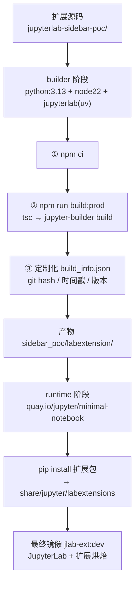

# Docker 中开发 JupyterLab 扩展（定制化 build 方案）

> 一套可复用的方案：在 Docker 里跑 JupyterLab + 你的扩展，核心是**定制化多阶段构建**（`build-extension.sh` 驱动）与**宿主机热更新**（挂载 labextension）。
> 本方案以 `jupyterlab-sidebar-poc` 为示例扩展，换任何 prebuilt 扩展只需改构建参数。

## 目录

- [一、为什么用 Docker + 定制化 build](#why)
- [二、构建管线](#pipeline)
- [三、目录结构](#layout)
- [四、两种模式](#modes)
  - [A. 定制化构建镜像（多阶段，扩展烘焙进镜像）](#mode-a)
  - [B. Dev 热更新（宿主机 build + 挂载）](#mode-b)
- [五、定制化 build 说明](#custom-build)
- [六、命令速查](#commands)
- [七、常见问题](#faq)

---

<a name="why"></a>
## 一、为什么用 Docker + 定制化 build

- **可复现**：镜像 tag 固定（`quay.io/jupyter/minimal-notebook:2026-07-28` + 扩展版本），团队/CI 环境一致。
- **隔离**：不污染系统 Python / node；多语言 kernel、多套扩展环境互不干扰。
- **定制化 build**：把「npm 依赖 → tsc → jupyter-builder(rspack) → 打包进 JupyterLab」整条链固化成一个脚本（`build-extension.sh`），想插自定义步骤（版本戳、签名、产物校验、发通知）就在脚本里加。
- **热更新**：prebuilt 扩展改完前端只需重编 labextension + 浏览器刷新，无需重建镜像或重编 JupyterLab。

**权衡**：首次 `docker build` 会拉较大镜像（~1GB+）。日常迭代用模式 B（宿主机 build + 挂载），只有要「出一个自包含镜像」时才跑模式 A。

---

<a name="pipeline"></a>
## 二、构建管线



`Dockerfile` 两个阶段：

| 阶段 | 基础镜像 | 干什么 |
|---|---|---|
| `builder` | `python:3.13-slim` + node 22 | 跑 `build-extension.sh`：`npm ci` → `build:prod`（rspack 产出 remoteEntry）→ 写 `build_info.json` |
| `runtime` | `quay.io/jupyter/minimal-notebook:<tag>` | `pip install` 扩展 Python 包；hatchling 的 shared-data 自动把 labextension 装进 `$CONDA_DIR/share/jupyter/labextensions/sidebar-poc` |

---

<a name="layout"></a>
## 三、目录结构

```text
jupyterlab-docker-dev/
├── Dockerfile                 # 多阶段定制化构建（builder + runtime）
├── docker-compose.yml         # dev：挂载 labextension 热更新
├── Makefile                   # build / up / down / logs / build-ext / watch
├── .dockerignore              # 精简 build context
├── notebooks/                 # 挂载到容器 /home/jovyan/work（notebook 落这里）
└── scripts/
    ├── build-extension.sh     # ★ 定制化构建脚本（唯一的构建入口）
    └── dev-watch.sh           # 宿主机热更新 watch（tsc + jupyter-builder watch）
```

---

<a name="modes"></a>
## 四、两种模式

<a name="mode-a"></a>
### A. 定制化构建镜像（扩展烘焙进镜像）

```bash
# 在仓库根目录
make build                 # docker build -f jupyterlab-docker-dev/Dockerfile -t jlab-ext:dev .
docker run -it --rm -p 8888:8888 -e JUPYTER_TOKEN=devtoken jlab-ext:dev
# 打开 http://localhost:8888/lab  （token: devtoken）
```

产物自包含：任何人拉这个镜像就是「装好扩展的 JupyterLab」，无需 node / venv。

### B. Dev 热更新（宿主机 build + 挂载）

```bash
# 1) 首次：建镜像（含扩展）+ 起容器
make up

# 2) 日常改代码：宿主机重建 labextension（挂载目录会同步进容器）
make build-ext            # 一次性重建
# 或
make watch                # 常驻 watch，改动自动重建

# 3) 浏览器刷新 http://localhost:8888/lab 即可看到变化
```

`docker-compose.yml` 把宿主机 `jupyterlab-sidebar-poc/sidebar_poc/labextension` 挂到容器
`/home/jovyan/.local/share/jupyter/labextensions/sidebar-poc`（user 级 labextensions，优先于镜像内烘焙的副本）。

---

<a name="custom-build"></a>
## 五、定制化 build 说明

唯一构建入口是 `scripts/build-extension.sh`（Dockerfile 和宿主机 `make build-ext` 都调它）：

```text
[1/4] npm ci                          # 装前端依赖（锁版本，可复现）
[2/4] npm run build:prod              # tsc → jupyter-builder build（rspack 模块联邦）
[3/4] 写入 build_info.json            # ★ 定制化步骤：git hash / 时间戳 / JupyterLab 版本
[4/4] 校验产物                        # 列出 static/ 产物
```

**如何加自己的定制步骤**：在脚本 `[3/4]` 前后插入即可，例如：

- 往产物里注入**构建签名 / 许可证清单**
- 构建后跑**冒烟测试**（`jupyter labextension list` 校验）
- 失败即中止（脚本已 `set -euo pipefail`），保证不产出坏镜像
- 扩展新的 prebuilt 依赖、加 loader 等，改扩展自己的 `package.json` 即可

`build_info.json` 会落在 labextension 里，JupyterLab 前端可读取它来显示「当前跑的是哪个版本/哪个 git commit」——这是排查"改了半天没生效"类问题的利器。

---

<a name="commands"></a>
## 六、命令速查

| 命令 | 作用 |
|---|---|
| `make build` | 定制化构建镜像（多阶段，扩展烘焙） |
| `make up` | 启动 dev 容器（首次会 build） |
| `make down` / `make logs` | 停止 / 看日志 |
| `make build-ext` | 宿主机重建 labextension（挂载进容器热更新） |
| `make watch` | 宿主机热更新 watch |
| `docker run -it --rm -p 8888:8888 -e JUPYTER_TOKEN=devtoken jlab-ext:dev` | 直接跑烘焙镜像 |

换扩展：改 `docker-compose.yml` / `Makefile` 里的 `EXT_SRC`、`EXT_NAME`，或在 `docker build` 时传
`--build-arg EXT_SRC=xxx --build-arg EXT_NAME=xxx`。

---

<a name="faq"></a>
## 七、常见问题

- **本机 `docker` 是 podman？** 本方案基于标准 `docker` 语法，podman 完全兼容（本机已验证 `docker`=podman 5.8）。`docker-compose` 若为 podman-compose，个别高级字段可能不支持；必要时退回 `docker run`。
- **改前端不生效？** 确认 `make build-ext` 有跑、且 `labextension/static/` 时间戳更新；看 `build_info.json` 的 hash/时间戳；浏览器强刷（⌘⇧R）。
- **端口/token**：默认 8888 / `devtoken`（`JUPYTER_TOKEN` 环境变量，对应 `IdentityProvider.token`，别再配 `ServerApp.token`）。
- **扩展与 JupyterLab 版本不匹配**：runtime 基础镜像 tag 里 JupyterLab 版本要 ≥ 扩展要求的 `^4.2`；升级 JupyterLab 记得同步 `--build-arg JL_STACK`。
- **权限**：docker-stacks 默认 `jovyan`(uid 1000)，挂载目录写不进时用 `--user root` 或把目录 chown 成 1000。

## 参考

- 对应扩展：`../jupyterlab-sidebar-poc/`（uv + Python 3.13 + JupyterLab 4.6）
- 踩坑记录：`../dev-lessons/`（TS 版本、pyproject 命名、builder 迁移等）
- 架构背景：`../jupyter-architecture.md` 第四章（prebuilt 扩展 / Module Federation）
