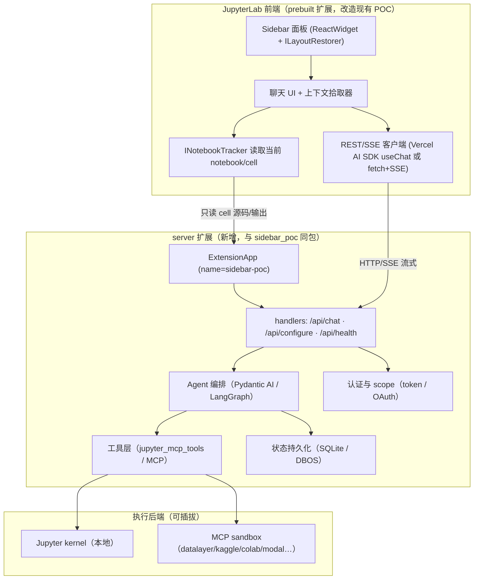
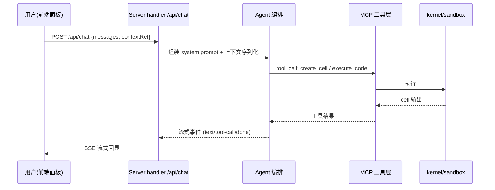
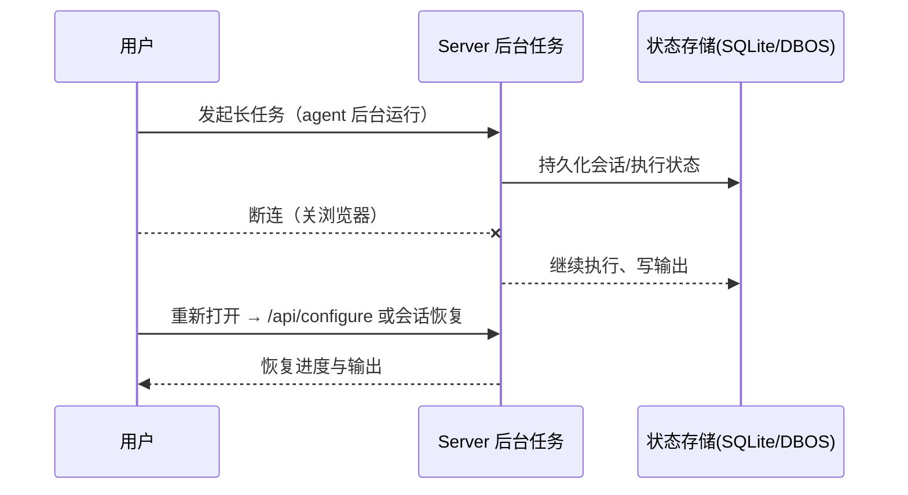

# jupyterlab-sidebar-poc → 目标场景扩展设计文档

> 目标场景：**Hosted JupyterLab AI 扩展** —— 在 JupyterLab 里提供 AI 聊天面板，能引用当前 notebook/kernel 上下文、由 server 侧 agent 执行代码与管理 notebook；notebook 状态常驻服务端，前端断连不影响执行。
> 本文把 `jupyterlab-sidebar-poc`（已验证可运行的左侧栏 prebuilt 扩展）作为骨架，给出演进到目标场景的设计。
>
> 日期：2026-08-19 ｜ 前置调研：[datalayer-products-research.md](../datalayter-components/datalayer-products-research.md) ｜ [jupyter-ai-extension-plan.md](../jupyter-ai-extension-plan.md) ｜ [jupyter-architecture.md](../jupyter-architecture.md) ｜ [jupyterlab-extension-pitfalls.md](../dev-lessons/jupyterlab-extension-pitfalls.md)

---

## 0. 文档定位与核心结论

**定位**：一份"从现有 POC 出发、以托管化为目标"的扩展设计。它回答三个问题：做什么（场景）、怎么搭（架构）、先做什么（里程碑）。

**核心结论（TL;DR）**：

1. **双端扩展是硬前提**：现有 POC 只有前端；目标场景必须加一个**同名 server 扩展**（`sidebar_poc` 的 `ExtensionApp`），因为 LLM key、kernel 执行、权限、状态都必须留在服务端。
2. **前端继续沿用 POC 的模式**：`ReactWidget` + `ILayoutRestorer` + prebuilt 打包不变；新增的是"面板从 demo 计数器 → 聊天/上下文 UI"，以及 `INotebookTracker` 接线。
3. **"hosted" = 三件事**：状态存 server（断连续跑）、权限 scope 化（OAuth/token）、执行后端可插拔（MCP sandbox 抽象）。这三件决定了它"托管"而不是"本地 demo"。
4. **工具层不重复造轮子**：直接复用 `jupyter_mcp_server` / `jupyter_mcp_tools`（或 `jupyter_ai_tools`），自研的部分只有：面板 UX、上下文序列化、agent 编排接线、权限与状态。
5. **先跑通最小闭环再托管化**：M0→M2 在本地把"聊天 + 执行"跑通（对齐 Datalayer jupyter-ai-agents 的本地用法），M3→M4 才做托管三件套。

---

## 1. 目标场景与用户故事

### 1.1 一句话场景

> 用户在一个**托管/云端 JupyterLab** 里打开右侧面板，用自然语言让 AI 读写当前 notebook、执行代码、解释报错；关掉浏览器或 agent 会话后，服务端的长任务继续跑，重新打开还能看到结果。

### 1.2 用户故事（按优先级）

| 编号 | 角色       | 故事                                                                                               | 优先级 |
| ---- | ---------- | -------------------------------------------------------------------------------------------------- | ------ |
| US1  | 数据科学家 | 打开侧边栏，输入"用 matplotlib 画个示例图"，AI 在当前 notebook 里新建 cell、装依赖、执行、回显结果 | P0     |
| US2  | 数据科学家 | 选中若干 cell 后问"解释这段代码"，AI 引用所选 cell 上下文回答                                      | P0     |
| US3  | 数据科学家 | 让 AI 修复某个报错 cell（引用 traceback 上下文）                                                   | P1     |
| US4  | 平台管理员 | 每个用户的 agent 只能访问权限内的 notebook；给 agent 的 token 按 scope 授权、可单独吊销            | P1     |
| US5  | 数据科学家 | 发起一个耗时计算后关掉浏览器；回来能看到服务端还在跑、输出已持久化                                 | P2     |
| US6  | 平台管理员 | 在控制面看到 agent 的工具调用与 kernel 执行日志（可观测）                                          | P2     |

### 1.3 非目标（本阶段明确不做）

- 不做多用户实时协同编辑（复用 Jupyter RTC 生态即可，不重造）。
- 不做 VS Code / CLI / SaaS 四端全覆盖（但架构上 server 侧独立，天然支持后续加 surface）。
- 不做 checkpoint 变更管理、`@-mention` 完整拾取器（这些在 `jupyter-ai-extension-plan.md` 的主蓝图里，本文聚焦"托管化 + 聊天 + 工具执行"的最小但有代表性的闭环）。

---

## 2. 现状盘点（基于 sidebar-poc 与调研）

### 2.1 POC 已验证的事实

- **能跑**：prebuilt 前端扩展在 JupyterLab 4.6.x 左侧栏注入 `ReactWidget`，`ILayoutRestorer` 可恢复（已在截图环境验证）。
- **打包链路**：`npm run build` → `jupyter-builder` 产出 `sidebar_poc/labextension`；`pip install -e .` + `jupyter labextension develop .` 注册。
- **已避开的坑**：TS ~5.8 + `skipLibCheck`；`pyproject [project].name = "sidebar-poc"` 与包目录一致；`_jupyter_labextension_paths()` 齐备（详见 `dev-lessons/`）。

### 2.2 POC 与目标场景的差距

| 维度             | 现状（POC）     | 目标（hosted AI 扩展）                       |
| ---------------- | --------------- | -------------------------------------------- |
| 层               | 只有前端        | 前端 +**server 扩展**                  |
| 面板内容         | 计数器/输入回显 | 聊天 + 上下文引用 + 执行状态                 |
| 与 notebook 交互 | 无              | `INotebookTracker` 读 cell / kernel 上下文 |
| 后端能力         | 无              | agent 编排、工具执行、权限、状态持久化       |
| 状态位置         | 浏览器内存      | **服务端**（断连续跑）                 |
| 认证             | 无              | token / OAuth scope                          |

### 2.3 可复用的 Datalayer 参考点（来自调研）

- 样板：`jupyter-ai-agents` 的 `ExtensionApp` + `APIHandler` + Vercel AI 流式协议 + `ServerConnection.makeSettings()`。
- 工具层：`jupyter_mcp_server` / `jupyter_mcp_tools`（notebook 读写/执行工具，含 RTC 感知的 `collaborative_tool`）。
- 托管参考：hosted MCP endpoint、OAuth 2.1 scope（`notebooks:read/write`、`code:execute`、`data:read`）、DBOS durable execution、MCP sandbox variants。

---

## 3. 总体架构（双端）



**架构原则**：

- **前端薄、后端厚**：前端只做 UI/渲染与上下文收集；一切会碰 kernel / 文件 / LLM key / 权限的逻辑都在 server。
- **server 扩展是唯一事实源**：notebook 状态、执行结果、agent 会话都存在 server；前端只是它的一个渲染面（未来可加 VS Code/CLI surface 而不改 server）。
- **工具执行走统一抽象**：本地 kernel 与远端 sandbox 都是"执行后端"，通过 MCP 工具层路由。

---

## 4. 前端设计（改造现有 POC）

### 4.1 保留不变的

- `package.json` 结构、`jupyterlab.outputDir`、`sharedPackages.react/react-dom singleton`、`@jupyter/builder` 构建链路。
- `tsconfig.json`（strict + `moduleResolution: bundler` + `skipLibCheck`）。
- `pyproject.toml` 打包与 `_jupyter_labextension_paths()`。
- `ReactWidget` + `ILayoutRestorer` 的侧边栏接入方式（`app.shell.add(widget, 'left', { rank })`）。

### 4.2 需要新增/修改的

| 模块       | 职责                                                       | 关键技术                                                                                                             | 改动文件                                |
| ---------- | ---------------------------------------------------------- | -------------------------------------------------------------------------------------------------------------------- | --------------------------------------- |
| 面板重构   | 从 demo 计数器 → 聊天布局（消息列表 + 输入框 + 流式渲染） | React hooks；`ReactWidget.create(<ChatApp/>)`                                                                      | `src/index.tsx`（或拆 `src/chat/`） |
| 上下文收集 | 引用当前 notebook / 选中 cell / 输出                       | `INotebookTracker`（`app` 的 `pluginRegistry` 获取或 `requires`）；`INotebookTracker.currentWidget?.model` | `src/context.ts`                      |
| API 客户端 | 调`/api/chat`，SSE/流式解析                              | `ServerConnection.makeSettings()` 取 baseUrl/token（沿用 jupyter-ai-agents 做法）；手写 fetch+ReadableStream 解析  | `src/client.ts`                       |
| 认证处理   | 401 → 提示登录 / 无权限                                   | server 返回结构化错误码，前端弹窗                                                                                    | `src/client.ts`                       |
| 配置视图   | 选择模型 / provider / 工具开关（可选）                     | 读取`/api/configure`                                                                                               | `src/config.tsx`                      |

### 4.3 前端状态模型（草案）

```ts
interface ChatState {
  messages: ChatMessage[];      // role: user/assistant/tool
  streaming: boolean;
  context: ContextAttachment[]; // { type: 'notebook'|'cell'|'output', ref }
  error: { code: string; message: string } | null;
}
```

上下文序列化规则（对齐 `jupyter-ai-extension-plan.md` 的 `@notebook` 设计，先做最简版）：

- 整本 notebook → 标题 + 每 cell 编号/类型/源码 + 输出摘要（截断）。
- 单个 cell / 输出 → 仅该 cell 源码 + 输出 mimebundle 摘要。

---

## 5. 后端 server 扩展设计

### 5.1 包结构（新增，与前端同包 `sidebar_poc`）

```text
sidebar_poc/
├── __init__.py            # 保留 _jupyter_labextension_paths()；新增 _jupyter_server_extension_points()
├── extension.py           # SidebarPocExtensionApp（ExtensionApp + Launcher configurable）
├── handlers/
│   ├── base.py            # 公共 APIHandler 基类（JSON 错误、认证检查）
│   ├── chat.py            # POST /api/chat —— 流式聊天（Vercel AI 协议）
│   ├── configure.py       # GET /api/configure —— 模型/provider/工具清单
│   └── health.py          # GET /api/health —— 存活/就绪探针（托管用）
├── agents/
│   ├── chat_agent.py      # Pydantic AI 聊天 agent（挂 MCP toolset）
│   └── system_prompt.py   # 提示词模板
└── utils.py               # create_model_with_provider（多 provider 封装）
```

### 5.2 ExtensionApp 要点（抄 jupyter-ai-agents 的样板）

```python
class SidebarPocExtensionApp(ExtensionAppJinjaMixin, ExtensionApp):
    name = "sidebar_poc"                 # 与前端插件 id 前缀一致
    extension_url = "/sidebar_poc"
    load_other_extensions = True
    static_paths = [...]                  # 若需要挂前端静态资源
    template_paths = [...]

    def initialize_settings(self):
        # 存 server 连接信息：self.serverapp.connection_url / self.serverapp.token
        # 惰性创建 chat agent（缺 key 时 warning 而不是崩）
        # 初始化 MCP server 连接（同进程 jupyter_mcp_server 或独立）
```

- 注册方式：`pyproject.toml` 加 `jupyter-config/server-config`（`etc/jupyter/jupyter_server_config.d`）→ 自动注册 server 扩展（对齐 Datalayer `jupyter-ai-agents` 的做法）。

### 5.3 工具层选型（关键决策）

| 选项                                                                                                              | 说明                                                                      | 建议                         |
| ----------------------------------------------------------------------------------------------------------------- | ------------------------------------------------------------------------- | ---------------------------- |
| **A. 依赖 `jupyter_mcp_server` 作为同进程 server 扩展，再 `MCPServerStreamableHTTP` 接回本地 `/mcp`** | 与 Datalayer jupyter-ai-agents 完全同栈；工具全、RTC 感知、sandbox 可插拔 | ✅**首选**             |
| B. 直接 import`jupyter_mcp_tools` 的函数集                                                                      | 更轻，但要自己管理 MCP 生命周期                                           | 备选                         |
| C. 依赖`jupyter_ai_tools`（nb_toolkit）                                                                         | 官方 Jupyter AI 的工具层，`collaborative_tool` RTC 感知                 | 备选（若走 jupyter-ai 生态） |

### 5.4 聊天协议：Vercel AI SDK（对齐 Datalayer）

- 前端 `useChat`（或手写 SSE 客户端）→ `POST /api/chat`。
- 后端：`VercelAIAdapter`（pydantic-ai 提供）把 `Agent` 转成流式 handler；注意 jupyter-ai-agents 用 `TornadoRequestAdapter` 把 Tornado Request 适配成 Starlette Request——这是 Tornado 与 pydantic-ai 共存的关键样板。
- 流式消息类型：text / tool-call / reasoning / citations。

---

## 6. 关键数据流

### 6.1 聊天 + 执行（US1）



### 6.2 断连续跑（US5，托管关键）



---

## 7. hosted 特有问题设计（托管三件套）

### 7.1 状态存 server（断连续跑）

- 会话/执行状态落 server：本地开发用 **SQLite**，生产可选 **DBOS durable execution**（对齐 agent-runtimes）。
- notebook 状态本身由 `jupyter-server` + RTC（`jupyter-collaboration`）承载，扩展只存"agent 会话 + 长任务"。
- 后台任务用 `asyncio` task + 持久化心跳；前端重连时按 session id 恢复。

### 7.2 权限 scope 化

- 认证：本地/token（`ServerConnection` 透传）→ 托管/OAuth 2.1（浏览器授权，agent 拿 scope 受限 token，可单独吊销）。
- Scope 对齐 Datalayer：`notebooks:read` / `notebooks:write` / `code:execute` / `data:read`。
- 每个工具调用前做一次鉴权（server 侧），前端不承担权限决策。

### 7.3 执行后端可插拔

- 通过 MCP sandbox 抽象路由：`jupyter / datalayer / kaggle / colab / modal …`（对齐 `jupyter-mcp-server` 的 `--sandbox-variant`）。
- 前端/agent 无需知道代码跑在哪；切换后端不改上层逻辑。

### 7.4 可观测与部署

- 工具调用 / kernel 执行打 OpenTelemetry spans（对齐 jupyter-mcp-server 的 hooks）。
- `health` 探针给托管控制面用；部署参考 Datalayer plane 服务切分 + helm-charts。

---

## 8. 复用 vs 自研边界（明确画线）

| 能力                            | 决策                                                        | 理由                               |
| ------------------------------- | ----------------------------------------------------------- | ---------------------------------- |
| notebook 工具（读写/执行 cell） | **复用** `jupyter_mcp_tools` / `jupyter_ai_tools` | 避免重复造轮子；社区维护           |
| MCP server 生命周期             | **复用** `jupyter_mcp_server`（同进程 server 扩展） | Datalayer 已验证模式               |
| Agent 编排                      | **自研**（薄封装：Pydantic AI / LangGraph 之上）      | 要可控的上下文注入与流式协议       |
| 面板 UX / 上下文序列化          | **自研**                                              | 这是产品差异化点（@notebook 引用） |
| 状态持久化                      | **自研**（SQLite → DBOS 抽象）                       | 绑定具体产品需求                   |
| 权限 / scope                    | **自研**（对接 Jupyter auth 与 OAuth）                | 平台相关                           |

---

## 9. 目录结构规划（目标态）

```text
jupyterlab-sidebar-poc/
├── package.json / tsconfig.json / pyproject.toml     # 沿用现有
├── src/                      # 前端（重构后）
│   ├── index.tsx             # 插件入口（保留）
│   ├── chat/
│   │   ├── ChatApp.tsx       # 聊天面板主体
│   │   ├── messages.ts       # 消息类型与渲染
│   │   └── stream.ts         # SSE 流式解析
│   ├── context.ts            # notebook/cell 上下文收集与序列化
│   └── client.ts             # ServerConnection + /api/* 客户端
├── style/index.css           # 沿用
├── sidebar_poc/              # 后端（新增）
│   ├── __init__.py
│   ├── extension.py
│   ├── handlers/  (base/chat/configure/health)
│   └── agents/
├── jupyter-config/server-config/   # 新增：自动注册 server 扩展
└── docs/
    └── DESIGN.md             # 本文
```

---

## 10. 里程碑与验收

| 里程碑                       | 内容                                                                                              | 验收标准                                                            |
| ---------------------------- | ------------------------------------------------------------------------------------------------- | ------------------------------------------------------------------- |
| **M0**（现状，已完成） | 左侧栏 ReactWidget 面板                                                                           | 截图环境已验证                                                      |
| **M1**                 | 加 server 扩展：`ExtensionApp` + `/api/health` + `/api/configure`；前端 `client.ts` 打通  | `jupyter lab` 起来后前端能调到 `/api/configure`，显示模型列表   |
| **M2**                 | 聊天闭环：`/api/chat`（Vercel AI 协议）→ Pydantic AI agent → MCP 工具执行 cell → SSE 回显    | 输入"画个 matplotlib 图"，notebook 里出现 cell 并执行、面板流式回显 |
| **M3**                 | 上下文与工具打磨：`INotebookTracker` 引用、报错修复（US2/US3）；多 provider 配置                | US1–US3 可演示                                                     |
| **M4**                 | 托管三件套：状态持久化（SQLite）、权限 scope、后台长任务断连续跑（US4/US5）；OpenTelemetry（US6） | 断连后任务继续、重连可恢复；scope 生效；日志可见                    |

> 依赖关系：M0→M1→M2→M3→M4 顺序推进，每步可运行可验证。

---

## 11. 风险与开放问题

| 风险/问题                                        | 影响         | 缓解                                                                          |
| ------------------------------------------------ | ------------ | ----------------------------------------------------------------------------- |
| Tornado 与 pydantic-ai（Starlette）的协议适配    | 阻塞 M2      | 照抄 jupyter-ai-agents 的`TornadoRequestAdapter` + `VercelAIAdapter` 组合 |
| 同进程跑 MCP server 的资源/版本冲突（pycrdt 等） | 影响稳定性   | 参考 Datalayer 的`datalayer_pycrdt` 兼容方案；必要时独立进程跑 MCP          |
| 长任务在 server 进程内重启后丢失                 | US5          | 先 SQLite 持久化；生产评估 DBOS / 任务队列                                    |
| 多租户安全（scope 逃逸、工具越权）               | 托管上线前提 | 每个工具调用服务端鉴权；安全评审后进入 M4                                     |
| 前端 bundle 增大（React 生态）                   | 加载体验     | 保持`sharedPackages` singleton；按需拆模块                                  |

**待决策**：① 后端 agent 框架最终选 Pydantic AI（Datalayer 同栈）还是 LangGraph（jupyter-ai 同栈）；② 工具层走 `jupyter_mcp_tools` 还是 `jupyter_ai_tools`；③ 托管认证先做 token 版还是直接上 OAuth 2.1。

---

## 参考

- 调研：`../datalayter-components/datalayer-products-research.md`（第八节 = hosted 扩展参考清单）
- 蓝图：`../jupyter-ai-extension-plan.md`（AI 类扩展主蓝图；本文是"托管化 + 最小闭环"子集）
- 架构：`../jupyter-architecture.md` ｜ 踩坑：`../dev-lessons/jupyterlab-extension-pitfalls.md`
- 上游样板：`github.com/datalayer/jupyter-ai-agents`、`github.com/datalayer/jupyter-mcp-server`
